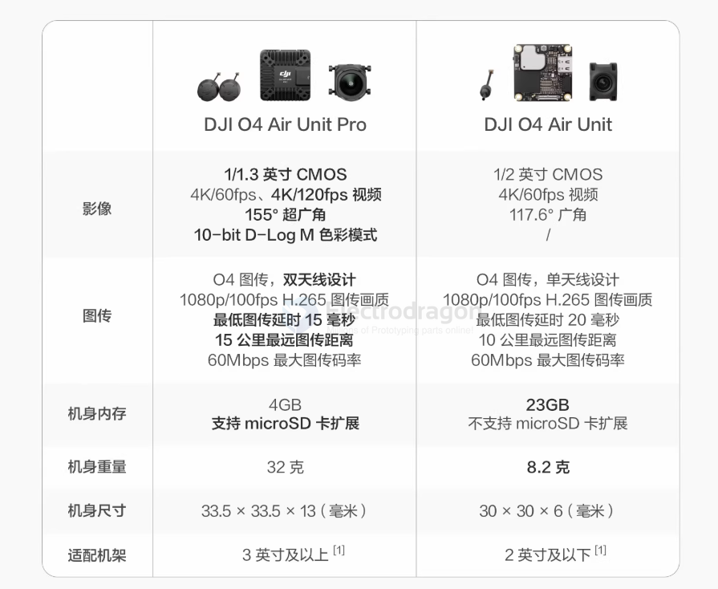
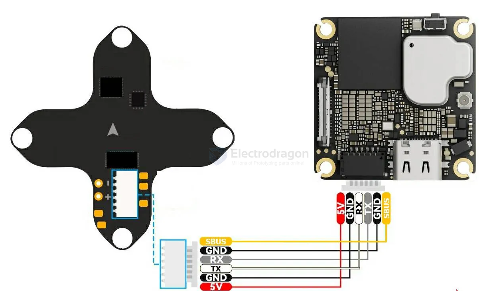

# DJI-dat

## video transmission system 

- [[DJI-digital-camera-dat]]

- DJI-O3 

- DJI-O3-Pro

- DJI-O4

- DJI-O4-Pro

- [[X12-dat]]

- [[ELRS-dat]]

## Key Differences

| Spec                         | **DJI O4 (Standard)**                         | **DJI O4 Pro**                                            |
| ---------------------------- | --------------------------------------------- | --------------------------------------------------------- |
| **Image Sensor**             | 1/2-inch CMOS                                 | 1/1.3-inch CMOS (larger, better in low light)             |
| **Max Recording**            | 4K/60fps                                      | 4K/120fps                                                 |
| **Field of View (FOV)**      | ~117.6°                                       | ~155° ultra-wide                                          |
| **Latency**                  | ~20-24 ms (race mode)                         | ~15 ms (race mode)                                        |
| **Transmission Range (FCC)** | Up to 10 km                                   | Up to 15 km                                               |
| **Transmission Range (CE)**  | ~6 km                                         | ~8 km                                                     |
| **Antenna**                  | Single antenna                                | Dual antenna (better signal stability)                    |
| **Storage**                  | 23 GB built-in, no SD                         | 4 GB built-in + microSD slot                              |
| **Weight**                   | ~8.2 g (camera + unit)                        | ~32 g (camera + unit)                                     |
| **Best Use Case**            | Lightweight builds (2-inch racing, freestyle) | Cinematic FPV, 3-inch+ builds, higher image quality needs |

## 3. Wiring Table: O4 → X12

- [[X12-dat]]

| **O4 Pin**               | **Wire Function**               | **Connect to on X12**                                                                      |
| ------------------------ | ------------------------------- | ------------------------------------------------------------------------------------------ |
| Pin 1 (Red, VCC)         | Power (3.7–13.2V)               | `VBAT` pad (from 2S battery). Don’t use 5V pad.                                            |
| Pin 2 (Black, GND)       | Ground                          | Any `GND` pad on X12                                                                       |
| Pin 3 (Gray, RX)         | O4 RX (expects data from FC TX) | Connect to `TX` pad of a free UART (e.g. TX1)                                              |
| Pin 4 (White, TX)        | O4 TX (sends data to FC RX)     | Connect to `RX` pad of same UART (e.g. RX1)                                                |
| Pin 5 (Black, GND)       | Ground                          | Extra GND (optional, can join same pad as Pin 2)                                           |
| Pin 6 (Yellow, SBUS/HDL) | DJI remote signal               | Connect to `SBUS` pad (if available) or `RX` of a free UART configured for serial receiver |

---

## 4. Betaflight Setup

1. **Ports Tab**  
   - Enable MSP on the UART you wired O4 to (e.g. UART1).  
   - If using DJI controller via SBUS, set the SBUS UART as “Serial RX.”  

2. **Configuration Tab**  
   - Enable “OSD” and “Serial RX” (if using DJI controller).  

3. **Receiver Tab**  
   - Set “Serial-based receiver” → SBUS (or DJI HDL depending on firmware).  

4. **Disable internal VTX**  
   - Since O4 already provides HD video transmission, disable or ignore the X12’s built-in OpenVTX to avoid interference.  

## Using DJI O4 

### Option 1: O4 for Video Only (Recommended)
- **O4 Air Unit**
  - Connect `VCC (9–12V)` → X12 9V pad  
  - Connect `GND` → X12 GND pad  
- **ELRS PWM Receiver**
  - Handles all control inputs (8 channels → FC or servos)  
- **Result:**  
  - O4 = HD video transmission  
  - ELRS = full radio control ✅

---

### Option 2: O4 for Video + Control
- **O4 Air Unit**
  - `VCC` → 9V pad on FC  
  - `GND` → GND pad on FC  
  - `SBus Out` → RX pad (UART) on FC  
- **Result:**  
  - O4 provides both video and RC link  
  - No ELRS receiver needed  

---

### Option 3: Mixing O4 + ELRS PWM
- **Possible but not recommended**  
  - FC can only use **one main RX input**  
  - PWM receivers bypass advanced FC features  
  - Can cause conflicts between DJI link and ELRS link  

---

### ✅ Best Practice
- **Use ELRS PWM Receiver** for **control**  
- **Use DJI O4 Air Unit** for **HD video** only  

## Using a Phone to View DJI O3 or O4

### DJI O3 Air Unit

- **Direct phone connection:** ❌ Not supported
  - O3 outputs **digital HD FPV** via DJI protocol.  
  - Requires **DJI FPV Goggles (V2, Goggles 2, or Integra)** to decode and view live video.  
- **Indirect phone viewing:** ✅ Possible
  - Connect phone/tablet to **DJI FPV Goggles via USB-C**.
  - Use **DJI Fly app / DJI Assistant 2** for:
    - Live video streaming (slightly higher latency)
    - Firmware updates
    - OSD / settings view
  - **Phone alone cannot replace goggles**.

---

### DJI O4 Air Unit

- **Direct phone connection:** ❌ Not supported
  - O4 also outputs **digital HD FPV** via its own DJI protocol.
  - Requires **DJI Goggles 3 / Goggles 2 / N3** to decode the signal.  
- **Indirect phone viewing:** ✅ Possible
  - Connect phone/tablet to **DJI Goggles 3 via USB-C**.
  - Use DJI Fly app for spectator mode, recording, or monitoring.
  - **Phone alone cannot replace goggles**.

## O3 VS O4 

| Spec                         | **DJI O3 Air Unit**                                    | **DJI O4 (Standard)**                                                |
| ---------------------------- | ------------------------------------------------------ | -------------------------------------------------------------------- |
| **Image Sensor**             | 1/1.7-inch CMOS                                        | 1/2-inch CMOS (slightly smaller)                                     |
| **Max Recording**            | 4K/60fps                                               | 4K/60fps (same)                                                      |
| **Field of View (FOV)**      | ~155°                                                  | ~117.6°                                                              |
| **Latency**                  | ~28 ms (in ideal conditions)                           | ~20–24 ms (lower, smoother)                                          |
| **Transmission Range (FCC)** | Up to 10 km                                            | Up to 10 km                                                          |
| **Transmission Range (CE)**  | ~6 km                                                  | ~6 km                                                                |
| **Transmission Bitrate**     | Up to 50 Mbps                                          | Up to 60 Mbps (more bandwidth)                                       |
| **Antenna**                  | Single antenna                                         | Single antenna                                                       |
| **Storage**                  | ~20 GB built-in, no SD card slot                       | ~23 GB built-in, no SD card slot                                     |
| **Weight**                   | Heavier (~36 g total with camera + unit)               | Very lightweight (~8.2 g total)                                      |
| **Best Use Case**            | General FPV, cinematic flying, works on 3-inch+ frames | Ultra-light builds, 2-inch racing drones, weight-sensitive freestyle |

## Activation Details

**Purpose of Activation**

- Registers the Air Unit with DJI servers.
- Enables firmware updates.
- Links the Air Unit to your DJI account.
- Ensures anti-counterfeit verification and proper functionality.

## Technical Notes

- **Video-only use does not bypass DJI GEO restrictions.**
- The O4 cannot be used standalone on a phone to circumvent restrictions.
- Only **authorized exemptions** granted by aviation authorities allow legal operation in restricted areas.

Without activation:

- The O4 may **not function properly**  
- Video transmission or OSD features may be **disabled**  
- You cannot perform **firmware updates**  

## googles 

### DJI Goggles N3 

https://www.dji.com/cn/goggles-n3/specs

| Frequency Band | Regulatory Region | Power (dBm) | Power (Watts)       |
| :------------- | :---------------- | :---------- | :------------------ |
| 2.4 GHz        | FCC               | <30 dBm     | <1 W                |
| 2.4 GHz        | CE/SRRC/MIC       | <20 dBm     | <0.1 W (100 mW)     |
| 5.1 GHz        | CE                | <23 dBm     | <0.1995 W (~200 mW) |
| 5.1 GHz        | FCC               | <21 dBm     | <0.1259 W (~126 mW) |
| 5.8 GHz        | FCC               | <33 dBm     | <1.995 W (~2 W)     |
| 5.8 GHz        | SRRC              | <30 dBm     | <1 W                |
| 5.8 GHz        | CE                | <14 dBm     | <0.0251 W (~25 mW)  |

- [[DJI-goggles-dat]]

## ref 

- [[quadcopter-dat]] - [[goggles-dat]]