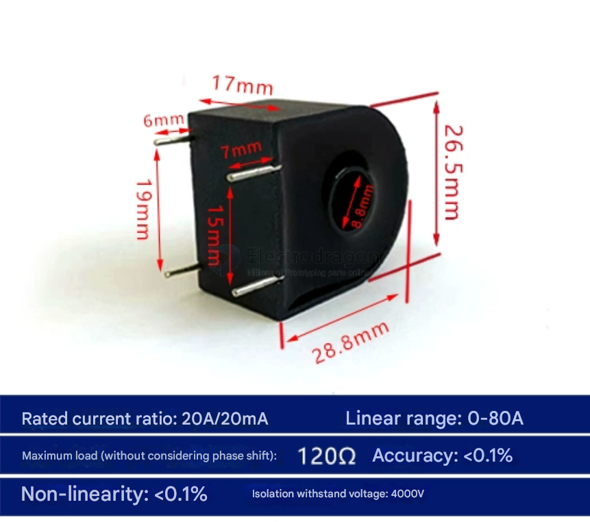
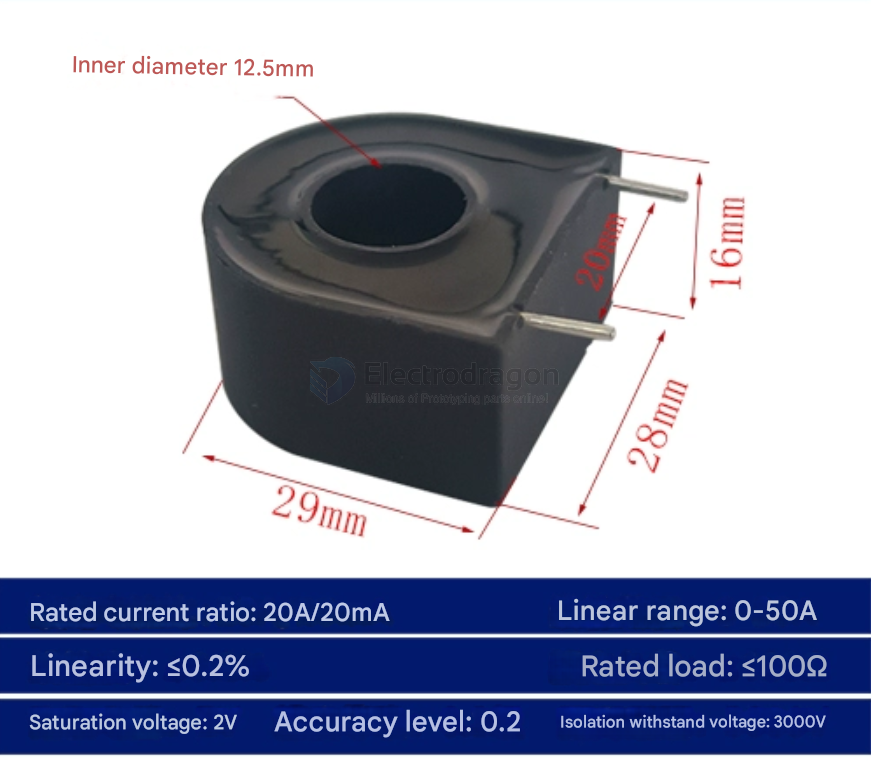

# EDCT-dat

## ED-CT2020

ED-CT2020C 1000/1 20A/20mA

specs == 20A/20mA ratio 1000:1

## ED-CTM

ED-CTM-200-X 1000/1 20A/20mA

ED-CTM-200-Z1 1000/1 20A/20mA

## ref 

- [[current-transformer-dat]]

- [[EDCT]] - [[current-transformer]]