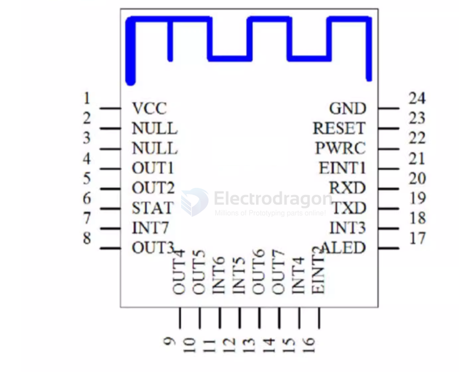
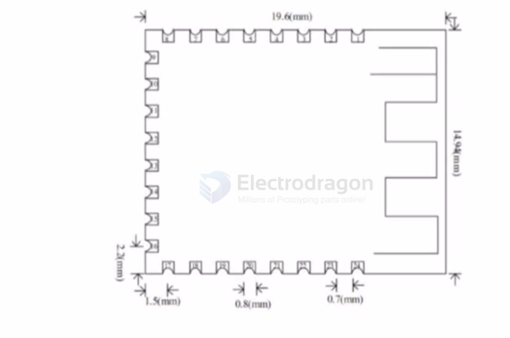

# EY-23A

The EY-23A module has clear advantages: it supports SPP for PC Bluetooth communication and BLE 5.0 for mobile apps or WeChat mini programs. It can work with an EY-34 as a master to form master-slave communication with EY-23A as slaves. In EY-34 multi-connect mode, one EY-34 can connect to up to seven EY-23A slave modules simultaneously.

## EY-23A — Bluetooth 3.0 SPP + BLE 5.0

Features:

- Role: Slave only
- Module size: 20 × 15 × 1.8 mm (L × W × H)
- Bluetooth: Bluetooth 3.0 SPP + BLE 5.0
- SMT reflow temperature: < 260 °C
- Operating current: 6.5 mA
- Deep sleep current: < 10 µA
- Transmit power: 4 dBm (max)
- Receive sensitivity: -96 dBm

SPP throughput:

- Up to 16 KB/s (Android, Windows)
- When connected to Android or PC via Bluetooth, downstream throughput can reach 16 KB/s without packet loss. Upstream SPP rate is about 8 KB/s.

BLE throughput:

- Up to 4 KB/s (Android, iOS)
- When connected via BLE to iOS or Android, throughput is about 4 KB/s. The module supports continuous send/receive at 38400 baud; higher baud rates cannot be sent continuously without adding delays between packets.

## AT Commands

Common AT commands supported by the module:

- AT+VERSION
- AT+PIN
- AT+NAME
- AT+BAUD
- AT+DEFAULT
- AT
- AT+LADDR
- AT+VER

(Examples: AT+NAME333 to set the device name)

## References

- [[EY-dat]]