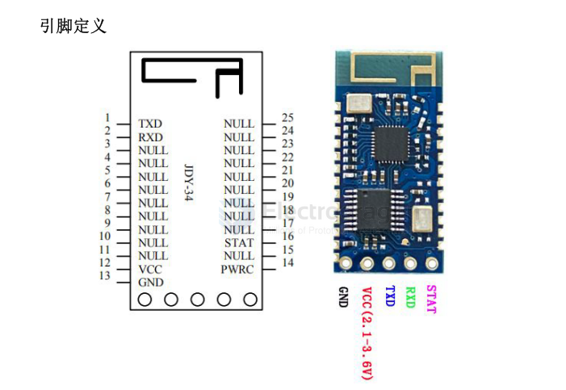
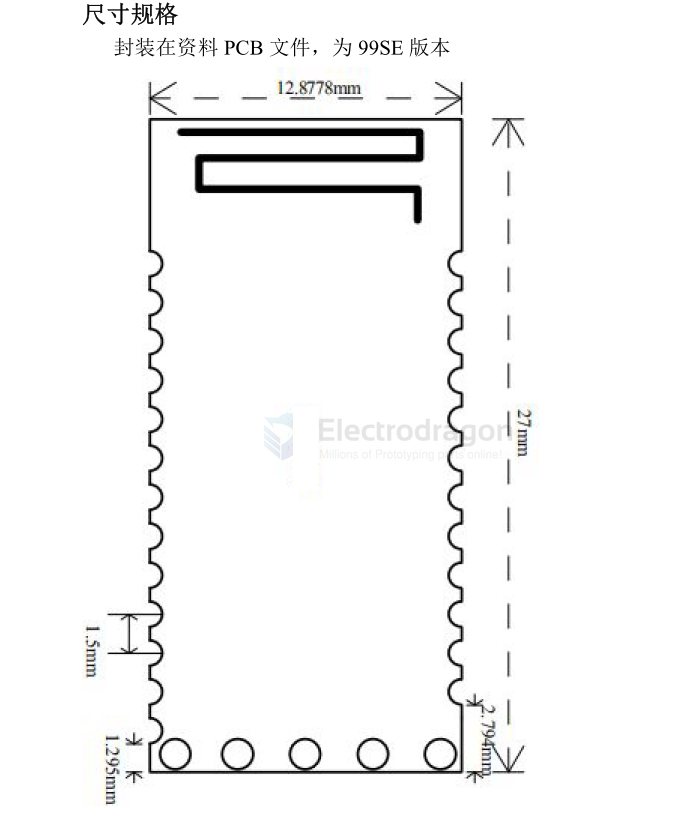

# EY-34-dat

The EY-34 transparent-transmission module is based on Bluetooth BLE 4.2 and Bluetooth 3.0 standards. It supports BLE and SPP operating simultaneously, and SPP supports multi-connection as well as master/slave operation at the same time—there is no need to separately configure the module as master or slave.

In multi-connect mode SPP supports up to 7 SPP peer connections (Android or PC) plus 1 iOS phone. BLE also supports connections from Android or iOS devices.

In master mode the module can connect to any SPP slave devices on the market (including EY-30, EY-31, EY-32, EY-33, printers, etc.). The communication interface is a standard UART. You can configure working mode, baud rate, BLE UUID, pairing PIN and other parameters via AT commands.

Main advantage: high-speed communication. When connected via SPP to a phone or PC the module supports data transfer up to 40 KB/s and multi-connection functionality.

## pins 

- 12 VCC: power supply (2.1–3.6 V)
- 13 GND: ground
- 14 PWRC: When the module is connected, hold this pin LOW to enter AT-command mode. When the module is not connected, the pin level does not matter — the module will be in AT-command mode regardless.
- 15 NULL
- 16 STAT: low when not connected, high when connected. Connect the STAT signal to the MCU through a diode (or equivalent protection) as required by your design.

## SCH 

## ref 

- [[EY-dat]]