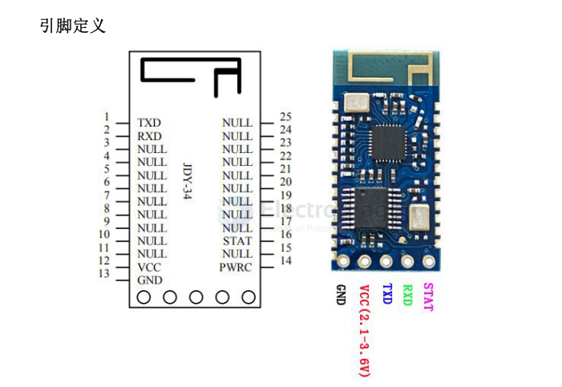
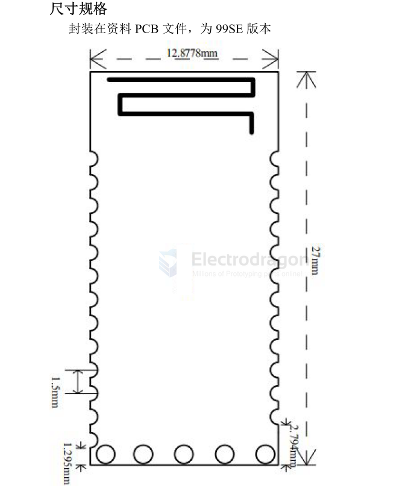
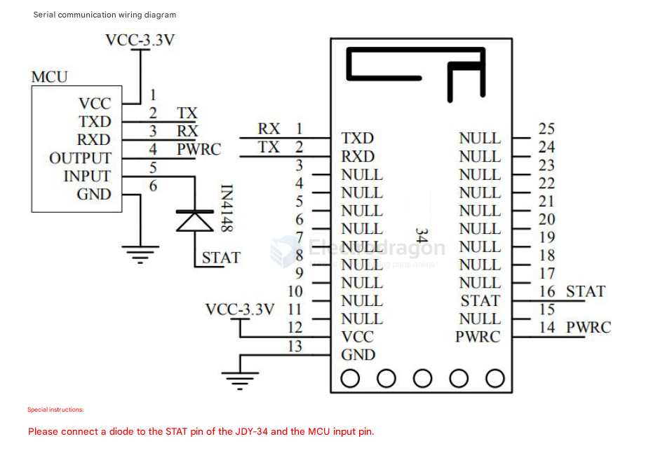
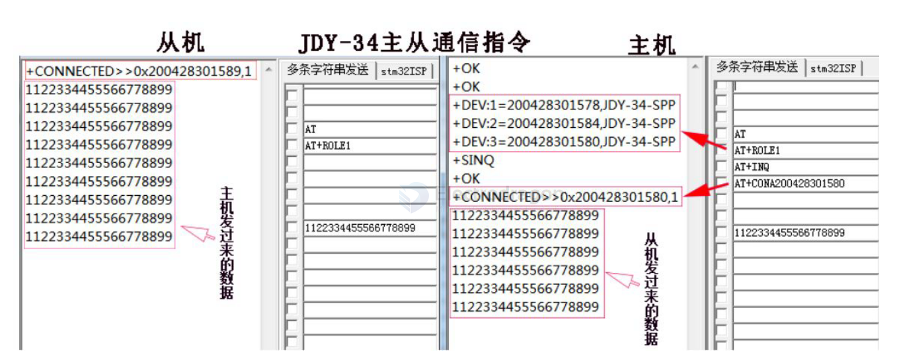

# EY-34-dat

- [[bluetooth-dat]]

- Supports SPP Host mode
- Simultaneous Host and Slave operation
- Supports multiple connections
- `SPP` communication speed: 40 KB/s; 
- `BLE` communication speed: 14 KB/s
- SPP Host supports connections with up to 7 devices
- Slave mode supports connections with up to 8 Hosts


The EY-34 transparent-transmission module is based on Bluetooth BLE 4.2 and Bluetooth 3.0 standards. It supports BLE and SPP operating simultaneously, and SPP supports multi-connection as well as master/slave operation at the same time—there is no need to separately configure the module as master or slave.

In multi-connect mode SPP supports up to 7 SPP peer connections (Android or PC) plus 1 iOS phone. BLE also supports connections from Android or iOS devices.

In master mode the module can connect to any SPP slave devices on the market (including EY-30, EY-31, EY-32, EY-33, printers, etc.). The communication interface is a standard UART. You can configure working mode, baud rate, BLE UUID, pairing PIN and other parameters via AT commands.

Main advantage: high-speed communication. When connected via SPP to a phone or PC the module supports data transfer up to 40 KB/s and multi-connection functionality.


## pins 





- 12 VCC: power supply (2.1–3.6 V)
- 13 GND: ground
- 14 PWRC: When the module is connected, hold this pin LOW to enter AT-command mode. When the module is not connected, the pin level does not matter — the module will be in AT-command mode regardless.
- 15 NULL
- 16 STAT: low when not connected, high when connected. Connect the STAT signal to the MCU through a diode (or equivalent protection) as required by your design.


## SCH 




## boards 

- [[NBL1064-dat]]

## usage 

### Mode selection

1. For multi-connected printer products, use:

	`AT+BTMODE0`

2. For high-speed transparent transmission with only a phone app or a PC Bluetooth connection, use:

	`AT+BTMODE1`

3. For EY-34 master/slave communication, use:

	`AT+BTMODE1`

### Master/slave communication example

Configure both the master and slave as:

`AT+BTMODE1`

Then follow this sequence:

1. The master sends `AT+INQ` to search for slave devices.
2. After a slave is found, send `AT+CONA` followed by the slave MAC address through UART to connect.
3. After the connection is established, the `STAT` pin goes HIGH.
4. The UART also prints connection information, indicating that the link is active.
5. Once connected, transparent data transmission can begin.



When the slave is connected, it outputs:

```text
+CONNECTED>>0x200428301589,1
```

Meaning:


- `200428301589` is the master MAC address.
- `1` is the current master ID.

When the master sends `AT+INQ`, the search results may look like this:

```text
+DEV:1=200428301578,JDY-34-SPP
+DEV:2=200428301584,JDY-34-SPP
+DEV:3=200428301580,JDY-34-SPP
+SINQ
```

This means that 3 slave devices were found, along with their MAC addresses and broadcast names.

If the master chooses to connect to slave `200428301580`, send:

`AT+CONA200428301580`

After the master connects successfully, it outputs:

```text
+CONNECTED>>0x200428301580,1
```

Meaning:

- `200428301580` is the slave MAC address.
- `1` is the slave ID.

### Master binding example

In `AT+ROLE1` mode, the master can bind to a slave by sending `AT+BAND` followed by the slave MAC address.

Example:

`AT+BAND112233445566`

After the master connects to a bound slave, it will keep reconnecting to that same slave as long as the slave remains within range. The master will try to maintain the connection continuously.

To connect the master to a different slave, first clear the current binding with `AT+CLRBAND`, then bind or connect to the new device.


## ref 

- [[EY-dat]]