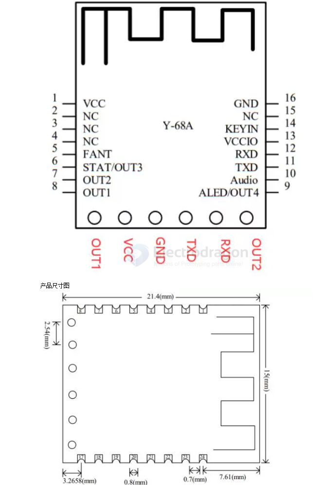

# EY-68A-dat

EY-68A为蓝牙5.1音频+BLE双模蓝牙模块， 支持同时手机音乐播放与BLE透传，音频支持串口控制与按键控制，通信距离60米，BLE支持16位与128 UUID，BLE所有UUID都支持串口配置，UUID的参数用户可以任意配置

- EY-68A 产品参数
- 型号 EY-68A
- 工作频段 2.4G
- 发射功率 4db（最大）
- 通信接口 UART
- 工作电压 2.4V-5.5V
- 工作温度 -40℃-80℃
- 天线 内置PCB天线
- 接收灵敏度 -96dbm
- 传输距离 60米
- 主从支持 从机
- 模块尺寸 21.4*15*3mm（长宽高）
- 蓝牙版本 BLE5.1（兼容BLE4.0、BLE4.2、BLE5.0）
- 指令参数保存 参数配置掉电数据有保存
- SMT焊接温度 <250℃
- 串口向手机发 6KByte/S（实测速率）
- 手机向串口发 12KByte/S（实测速率）
- 安卓MTU支持 ≤247 byte
- 苹果MTU支持 ≤185byte
- 工作电流 12MA到20MA， 需要睡眠直接断电
- 睡眠功能 不支持睡眠

size == 21.4 x 15 

## ref 

