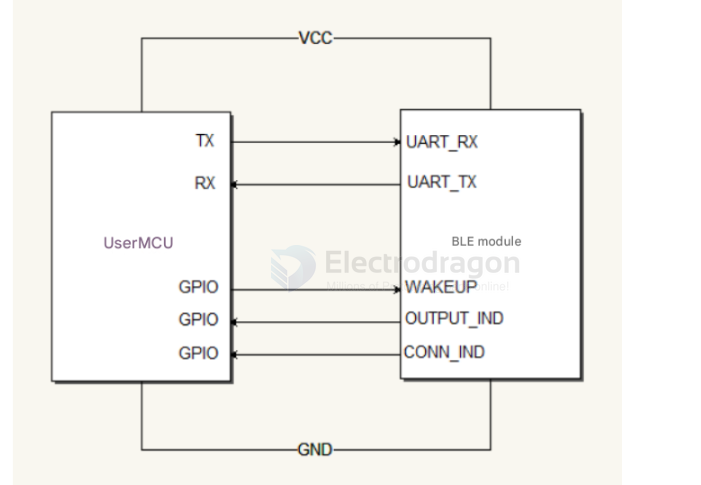

# EYGC4-dat

EYGC40 is a low-power Bluetooth (BLE) module based on a cost-effective System-on-Chip (SoC). It supports Bluetooth 4.0.

## Overview

- Voltage range: 2.0 V to 3.6 V (typical 3.3 V)
- Frequency range: 2402 MHz to 2480 MHz (programmable)
- Modulation: GFSK
- Data rate: 1 Mbps
- Operating temperature: -30 °C to 85 °C
- Dimensions: 18.8 mm × 15.1 mm
- Antenna impedance: 50 Ω
- Antenna: PCB antenna (on-board)

## Applications

- 2.4 GHz low-power Bluetooth systems
- Mobile phone accessories
- Sports and leisure equipment
- Consumer electronics
- Human-computer interaction devices (keyboard, mouse, remote)
- USB transceiver dongles
- Healthcare and medical devices

## Electrical and RF Specifications

| Parameter | Value |
|---|---:|
| Supply voltage | 2.0 V – 3.6 V (typical 3.3 V) |
| Operating frequency | 2402 MHz – 2480 MHz (programmable) |
| Frequency accuracy | ±20 ppm |
| Modulation | GFSK |
| Data rate | 1 Mbps |
| Max TX power | 7.9 dBm (programmable) |
| RX sensitivity | -94 dBm |
| Sleep current | 8 μA |
| RX current | 12 mA |
| TX current | 20 mA (at 7.9 dBm) |
| Typical range | 100 m (open space) |
| Operating temperature | -30 °C – 85 °C |
| Size | 18.8 mm × 15.1 mm |

## Pin Definitions

| No. | Pin | Type | Description |
|---:|---|---|---|
| 1 | VCC | Power | Power input, 2.0 V – 3.6 V (typ. 3.3 V) |
| 2 | GND | Ground | Connect to GND |
| 3 | UART_RX | Digital I/O | UART receive |
| 4 | UART_TX | Digital I/O | UART transmit |
| 5 | OUTPUT_IND | Digital I/O | Data output indicator: outputs a 460 μs low pulse before UART data is sent |
| 6 | CONN_IND | Digital I/O | Connection status indicator: HIGH after reset, LOW when a BLE connection is established |
| 7 | WAKEUP | Digital I/O | WAKE pin: in low-power mode pull this low to enable UART communication (see note) |
| 8 | GPIO0 | Digital I/O | Configurable as input or output |
| 9 | GPIO1 | Digital I/O | Configurable as input or output |
| 10 | GND | Ground | Connect to GND |
| 11 | GND | Ground | Connect to GND |

## Schematic

## Indicator & Wake Behavior

- After reset, the module's `CONN_IND` pin outputs a HIGH level. When a Bluetooth connection is established, `CONN_IND` goes LOW.
- After a connection is established, when the module receives a BLE data packet, `OUTPUT_IND` will first output a 460 μs low pulse to notify the external MCU that data will be sent, and then the module transmits the data over UART.
- In low-power mode the external MCU must pull `WAKEUP` low for at least 10 μs to wake the BLE module before sending UART data.

## AT Commands

Notes:
- All commands and responses use ASCII.
- Each command must end with <CR><LF> (carriage return + line feed) unless otherwise noted.
- If a command is accepted the module responds with the appropriate reply (OK or the requested data); otherwise it responds with: ERROR<CR><LF>.

1) Mode switch (command/transparent modes)

- Default after power-up: transparent (data) mode. To enter command mode after power-up, send: AT+MODE=0<CR><LF>.

Examples:
- Query current mode: Send: AT+MODE<CR>
  - Response: +MODE:<para><CR><LF>
    - para = 0 (command mode) or 1 (transparent/data mode)
- Query supported parameters: Send: AT+MODE?<CR>
  - Response: +MODE:<para><CR><LF>
    - para = 0,1
- Set mode: Send: AT+MODE=<para><CR>
  - para = 0 or 1
  - OK<CR><LF> on success; ERROR<CR><LF> on failure

2) Advertising (scan) enable

- Default: advertising enabled.

Examples:
- Query current advertising state: Send: AT+SCAN<CR>
  - Response: +SCAN:<para><CR><LF>
    - para = 0 (advertising disabled) or 1 (advertising enabled)
- Query supported parameters: Send: AT+SCAN?<CR>
  - Response: +SCAN:0,1<CR><LF>
    - (0 = disable advertising; 1 = enable advertising). This setting only applies when the module is not connected.
- Set advertising state: Send: AT+SCAN=<para><CR>
  - para = 0 or 1
  - OK<CR><LF> on success; ERROR<CR><LF> on failure

3) Connection interval (link interval)

- Supported range: 10 ms to 2000 ms, in 10 ms increments. Changes take effect immediately.

Examples:
- Query current interval: Send: AT+LINKINV<CR>
  - Response: +LINKINV:<para><CR><LF> (current interval in ms)
- Query supported parameters: Send: AT+LINKINV?<CR>
  - Response: +LINKINV:<para><CR><LF>
- Set interval: Send: AT+LINKINV=<para><CR>
  - para = multiple of 10 (ms)
  - OK<CR><LF> on success; ERROR<CR><LF> on failure

4) UART baud rate

- Default: 9600, 8N1.
- Supported baud rates: 9600, 19200, 38400, 57600, 115200.

Examples:
- Query current baud: Send: AT+UART<CR>
  - Response: +UART:<para><CR><LF> (current baud)
- Query supported rates: Send: AT+UART?<CR>
  - Response: +UART:<para><CR><LF>
- Set baud: Send: AT+UART=<para><CR>
  - para = 9600,19200,38400,57600,115200
  - OK<CR><LF> on success; ERROR<CR><LF> on failure

5) TX power configuration

- Ten levels available:

| Level | TX Power (dBm) |
|---:|---:|
| 0 | -19.5 dBm |
| 1 | -16.0 dBm |
| 2 | -13.3 dBm |
| 3 | -9.6 dBm |
| 4 | -5.0 dBm |
| 5 | -3.1 dBm |
| 6 | 0.0 dBm |
| 7 | 3.3 dBm |
| 8 | 6.3 dBm |
| 9 | 7.9 dBm (default) |

Examples:
- Query current power: Send: AT+RFPW<CR>
  - Response: +RFPW:<para><CR><LF>
- Query supported values: Send: AT+RFPW?<CR>
  - Response: +RFPW:<para><CR><LF>
- Set power level: Send: AT+RFPW=<para><CR>
  - para = 0..9
  - OK<CR><LF> on success; ERROR<CR><LF> on failure

6) Module name

- Default name: GCBT40. Maximum length: 18 bytes. Changes take effect after reboot.

Examples:
- Query name: Send: AT+NAME<CR>
  - Response: +NAME:<para><CR><LF>
- Set name: Send: AT+NAME=<para><CR>
  - para = new name (up to 18 bytes)
  - OK<CR><LF> on success; ERROR<CR><LF> on failure

7) Advertising interval

- Supported values: 100, 200, 500, 1000, 2000 (ms). Range: 100 ms to 2000 ms. Changes while advertising take effect immediately.

Examples:
- Query current advertising interval: Send: AT+ADVT<CR>
  - Response: +ADVT:<para><CR><LF>
- Query supported values: Send: AT+ADVT?<CR>
  - Response: +ADVT:<para><CR><LF>
- Set advertising interval: Send: AT+ADVT=<para><CR>
  - para = 100,200,500,1000,2000
  - OK<CR><LF> on success; ERROR<CR><LF> on failure

8) Query MAC address

- Send: AT+GMAC<CR>
  - Response: +GMAC:<para><CR><LF> (MAC address)

9) Low-power (standby) modes

- Default: normal mode.

Examples:
- Query standby mode: Send: AT+STBY<CR>
  - Response: +MODE:<para><CR><LF>
    - 0 = normal mode
    - 1 = low-power mode
- Query supported parameters: Send: AT+STBY?<CR>
  - Response: +MODE:<para><CR><LF> (para = 0,1,2)
- Set standby mode: Send: AT+STBY=<para><CR>
  - para = 0,1,2
  - Mode 2 = deep sleep: after wake the module auto-resets and mode returns to the previous 0 or 1
  - OK<CR><LF> on success; ERROR<CR><LF> on failure

10) RF test (single-carrier transmit)

- Send: AT+TEST=P,C<CR>
  - P = TX power level (0..9)
  - C = channel index; frequency = 2402 + C*2 MHz
  - OK<CR><LF> on success; ERROR<CR><LF> on failure

11) Restore factory defaults

- Send: AT+DEFA<CR>
  - Response: OK<CR><LF>
  - The module will automatically reboot after this command

## BLE Services and Characteristics (Commands)

Below is a concise, developer-friendly summary of the module's BLE services and characteristics. All UUIDs are 16-bit.

### 1. Data Services (Service UUID: 0xFF10)

| Characteristic | UUID | Properties | Length | Function |
|---|---:|---|---:|---|
| Bluetooth data channel | 0xFF11 | Write | 20 bytes | Data written here is forwarded to the UART output |
| UART data channel | 0xFF12 | Notify | 20 bytes | Data from UART is sent to the connected mobile device via notifications |

### 2. Configuration Service (Service UUID: 0xFF20)

| Characteristic | UUID | Properties | Function / Notes |
|---|---:|---|---|
| Connection interval config | 0xFF21 | Write | Configure connection interval; supported in multiples of 10 ms. Write the corresponding value to set. On success the status channel returns OK; otherwise ERROR. Query: send '=' to read current config (reply via status channel). Send '?' to query supported values. |
| Rename module | 0xFF22 | Write | Set module name (max 18 characters). Reboot required to apply. |
| UART baud rate config | 0xFF23 | Write | Supported baud rates: 9600, 19200, 38400, 57600, 115200. Query: send '=' to read current value; send '?' to read supported values. |
| TX power config | 0xFF24 | Write | Power levels 0–9 (see table below). Default is level 9 (7.9 dBm). Query: '=' current, '?' supported. |
| Low-power mode enable | 0xFF25 | Write | 0 = normal mode, 1 = low-power mode. Query supported values with '?'. |
| Advertising/connection interval | 0xFF26 | Write | Supports multiples of 10 ms. Write value to set. Query: '=' current, '?' supported. |
| Status reply (operation result) | 0xFF2F | Notify | Returns status for configuration operations. Query replies return the requested data; config operations return OK or ERROR. |

TX power levels mapping (level -> dBm):

| Level | TX Power (dBm) |
|---:|---:|
| 0 | -19.5 dBm |
| 1 | -16.0 dBm |
| 2 | -13.3 dBm |
| 3 | -9.6 dBm |
| 4 | -5.0 dBm |
| 5 | -3.1 dBm |
| 6 | 0.0 dBm |
| 7 | 3.3 dBm |
| 8 | 6.3 dBm |
| 9 | 7.9 dBm (default) |

### 3. GPIO Control Service (Service UUID: 0xFF50)

| Characteristic | UUID | Properties | Function |
|---|---:|---|---|
| GPIO0 output control | 0xFF51 | Write | Write 0 or 1 to set GPIO0 output |
| GPIO0 mode control | 0xFF52 | Write | 0 = input mode, 1 = output mode |
| GPIO0 status | 0xFF53 | Read | Read GPIO0 state: 0 = low, 1 = high |
| GPIO1 output control | 0xFF54 | Write | Write 0 or 1 to set GPIO1 output |
| GPIO1 mode control | 0xFF55 | Write | 0 = input mode, 1 = output mode |
| GPIO1 status | 0xFF56 | Read | Read GPIO1 state: 0 = low, 1 = high |
| Data storage | 0xFF58 | Read/Write | Read or write up to 18 bytes for persistent storage (retained after power loss) |
| GPIO status notification | 0xFF5F | Notify | Notifies external device of GPIO status changes |

## 4. Device Information Service (Service UUID: 0x180A)

| Characteristic | UUID | Properties | Length | Default / Notes |
|---|---:|---|---:|---|
| Module MAC address | 0x2A23 | Read | 8 bytes | Default: 0000xxxxxxxxxxxx (hex); physical address of the module |
| Module model | 0x2A24 | Read | 15 bytes | Default: EYGC40 |
| Software version | 0x2A28 | Read | 4 bytes | Software/firmware version |
| Manufacturer | 0x2A29 | Read | 10 bytes | Default: "BLE Module" |

## Notes and Usage Tips

- Use the `OUTPUT_IND` pulse to synchronize reads from UART if the host MCU sleeps or polls.
- Before sending UART data while the module is in low-power mode, pull `WAKEUP` low for at least 10 μs.
- After changing configuration values that require a reboot (for example the module name), cycle power or issue a software reboot to apply changes.