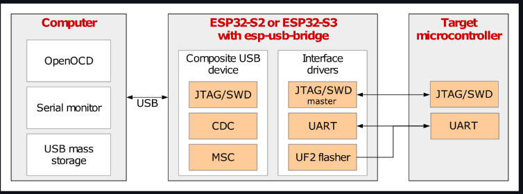

# ESP-prog-dat

- [[ESP32-S3-dat]]

- [[JTAG-dat]] - [[openOCD-dat]]

- [[ESPLink-dat]]

JTAG == TCK,TMS,TDI,TDO

https://www.electrodragon.com/product/esp-prog-board-for-esp8266-esp32/

- [[DPR1109-dat]] 

- kit - [[NWI1186-dat]]

## ESP USB Bridge 

The ESP USB Bridge is an ESP-IDF project utilizing an ESP32-S2 or an ESP32-S3 chip to create a bridge between a computer (PC) and a target microcontroller (MCU). It can serve as a replacement for USB-to-UART chips (e.g. CP210x) or a debugger.

- [[ESP-IDF-dat]]

The ESP USB Bridge provides a JTAG device. The following command can be used to connect to an ESP32 target MCU.

    idf.py openocd --openocd-commands "-f board/esp32-bridge.cfg"

- [[openocd-dat]]

## ref 

[ESP USB Bridge](https://github.com/espressif/esp-usb-bridge)

[esp32-c3 get-started](https://docs.espressif.com/projects/esp-idf/en/latest/esp32c3/get-started/)

[esp32-c3](https://www.espressif.com/zh-hans/products/socs/esp32-c3)

- [[espressif-dat]] - [[espressif]]

