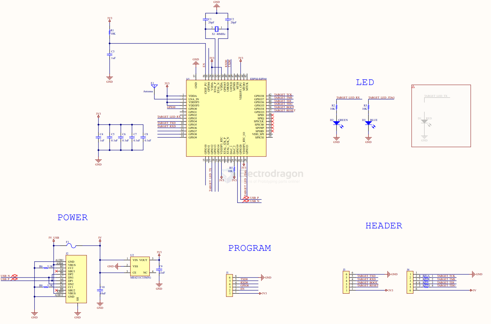

# ESPLink-dat

- [[espressif]]

JTAG Debugging with ESPLink

ESPLink supports JTAG debugging for ESP series chips, making it easy to diagnose system crashes. The following instructions use ESP32-S2 as an example.

Openocd 安装

    $git clone https://github.com/espressif/openocd-esp32.git
    $cd openocd-esp32
    $./bootstrap
    $./configure --enable-cmsis-dap
    $make -j
    $sudo make install

Attach to ESP32-S3

    pi@raspberrypi:~/oss/openocd-esp32 $ sudo ./src/openocd -s /home/pi/oss/openocd-esp32/tcl -f tcl/interface/esp_usb_bridge.cfg -f tcl/target/esp32s2.cfg

Sample output:

    Open On-Chip Debugger  v0.11.0-esp32-20220411-5-g03cd2031 (2022-04-25-09:45)
    Licensed under GNU GPL v2
    For bug reports, read
            http://openocd.org/doc/doxygen/bugs.html
    Info : only one transport option; autoselect 'jtag'
    Info : esp_usb_jtag: VID set to 0x303a and PID to 0x1002
    Info : esp_usb_jtag: capabilities descriptor set to 0x30a
    adapter speed: 4000 kHz
    Warn : Transport "jtag" was already selected
    Info : Listening on port 6666 for tcl connections
    Info : Listening on port 4444 for telnet connections
    Info : esp_usb_jtag: serial (84F703D20134)
    Info : esp_usb_jtag: Device found. Base speed 750KHz, div range 1 to 1
    Info : clock speed 750 kHz
    Info : JTAG tap: esp32s2.cpu tap/device found: 0x120034e5 (mfg: 0x272 (Tensilica), part: 0x2003, ver: 0x1)
    Info : esp32s2: Debug controller was reset.
    Info : esp32s2: Core was reset.
    Info : starting gdb server for esp32s2 on 3333
    Info : Listening on port 3333 for gdb connections

Debug

Once attached successfully, you can open another terminal window to operate using either GDB or Telnet. Examples are provided below:

Debug with Gdb

    $xtensa-esp32s2-elf-gdb -ex 'target remote 127.0.0.1:3333' ./build/blink.elf
    (gdb) info reg
    (gdb) s
    (gdb) continue

Debug with telnet
    $telnet localhost 4444
    >reset
    >halt
    >reg
    >step
    >reg pc
    >resume

## schematic 

## firmware 

# how to flash

/home/pi/.espressif/python_env/idf4.4_py3.9_env/bin/python ../esp-idf/components/esptool_py/esptool/esptool.py -p (PORT) -b 460800 --before default_reset --after hard_reset --chip esp32s2  write_flash --flash_mode dio --flash_size detect --flash_freq 40m 0x1000 bootloader.bin 0x8000 partition-table.bin 0x10000 bridge.bin

    -p (PORT) 
    -b 460800 
    --before default_reset 
    --after hard_reset 
    --chip esp32s2  write_flash 
    --flash_mode dio 
    --flash_size detect 
    --flash_freq 40m 
    0x1000 bootloader.bin 
    0x8000 partition-table.bin 
    0x10000 bridge.bin

## ref 

- https://github.com/Edragon/ESPLink

- [[esplink]]