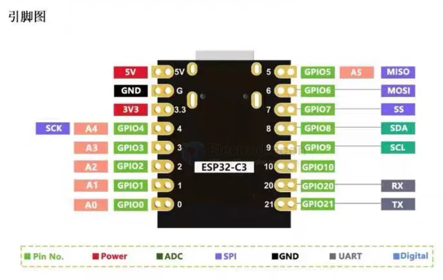
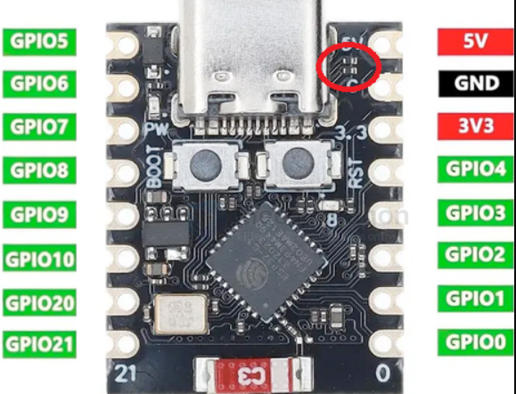
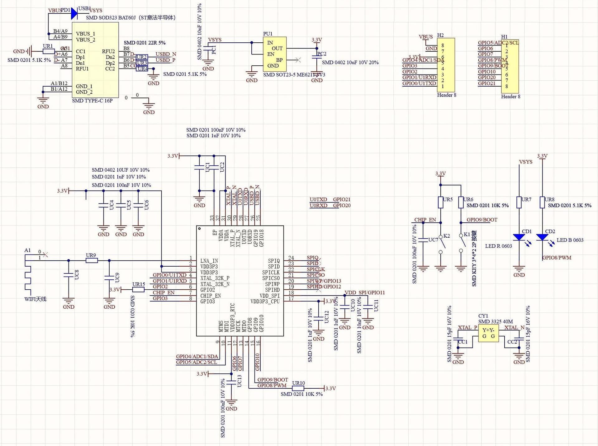

# ESP32-C3-supermini-dat

- [[ESP32-C3-dat]]

## pin definitions 

H2

- VBUS
- 3V3
- GPIO4/ADC1/SD
- GPI03
- GPIO2
- GPIO1 / U1RXD
- GPIOO / U1TXD

H1

- GPIO5/ADC2/SCL
- GPI06
- GPI07
- GPIO8/PWM
- GPIO9/BOOt
- GPI010
- GPIO20
- GPIO21

## SCH 

## ref 

