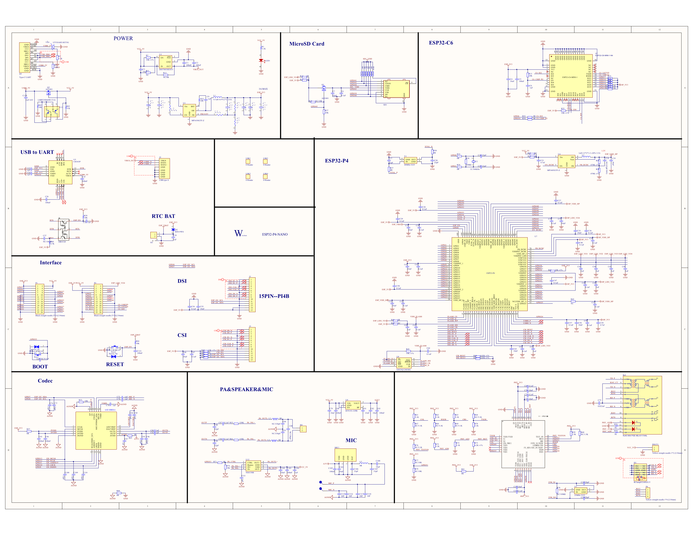

# ESP32-P4-dat

- [[ESP32-P4-SDK-dat]] - [[ESP-SDK-dat]] - [[SDK-dat]]

## info 

The ESP32-P4 is a high-performance microcontroller in Espressif's ESP32 series, aimed at advanced applications that require robust processing power and efficient communication. Here are its most significant features:

### **1. High-Performance Processor**
- **Dual-Core Tensilica Processor**: The ESP32-P4 features a powerful dual-core Tensilica processor running at up to **400 MHz**, making it suitable for compute-intensive tasks.
- **AI Acceleration**: Supports applications in artificial intelligence (AI) and machine learning (ML), thanks to its enhanced processing capabilities.

### **2. Advanced Memory Architecture**
- **Large On-Chip RAM**: Includes **up to 768 KB SRAM**, enabling efficient data handling for complex applications.
- **External Memory Support**: Compatible with external Flash and PSRAM for scalable memory requirements.

### **3. Peripheral Integration**
- **Rich Peripheral Set**:
  - Multiple SPI, UART, I2C, and I2S interfaces for versatile communication.
  - High-speed USB OTG support for USB-based applications.
  - CAN bus for industrial and automotive applications.
  - ADCs and DACs for analog input/output.
- **Motor Control**: Enhanced features for motor control applications, such as PWM and quadrature encoders.

### **4. Connectivity**
- **No Wi-Fi or Bluetooth**: Unlike other ESP32 modules, the ESP32-P4 focuses on standalone performance and peripheral expansion rather than wireless communication.
- **Custom Connectivity Options**: It can work alongside wireless-enabled modules like ESP32-S3 to add advanced processing without duplicating Wi-Fi or Bluetooth.

### **5. Power Efficiency**
- **Low Power Modes**: Optimized for ultra-low-power applications with multiple sleep modes.
- **Dynamic Frequency Scaling**: Reduces power consumption during less demanding tasks.

### **6. Security**
- **Integrated Security Features**:
  - Hardware Cryptographic Accelerators.
  - Secure Boot and Flash Encryption.
  - Support for Secure OTA (Over-the-Air) updates.

### **7. Development Ecosystem**
- Fully supported by Espressif's **ESP-IDF** development framework.
- Compatibility with FreeRTOS for real-time applications.

### **8. Target Applications**
- Ideal for industrial automation, robotics, motor control, edge computing, and AI/ML applications.
- Works as a companion processor to wireless-enabled ESP32 devices for offloading compute-heavy tasks.

The ESP32-P4’s performance-oriented design sets it apart, catering to applications where processing power and versatile peripherals are more critical than wireless connectivity. 

本产品是一款基于ESP32-P4的多媒体开发板，并集成ESP32-C6，支持Wi-Fi6和BLE5无线连接。它提供丰富的人机交互接口，包括MIPI-CSI(集成图像信号处理器ISP)、MIPI-DSI、SPI、I2S、I2C、LEDPWM、MCPWM、RMT、ADC、UART和TWAI等。此外，支持USB OTG2.0HS，并板载4OPINGPIO扩展接口，兼容部分树莓派PicoHAT扩展板，实现更广泛的应用适配。ESP32-P4采用400MHz双核RISC-V处理器，支持最大32MBPSRAM，具备USB2.0、MIPI-CSI/DSI和H.264编码等外设，满足低成本、高性能和低功耗的多媒体开发需求。此外，ESP32-P4集成数字签名外设和专用密钥管理单元，确保数据与操作安全。ESP32-P4-WIFI6专为高性能和高安全应用设计，满足嵌入式系统在人机交互、边缘计算和IO扩展等方面的需求。

## review 1 

Personal impressions:

- This chip is neither outstanding nor lacking—somewhere in the middle.
- MIPI only supports 2 lanes.
- For Wi-Fi, you need to add a C6 module.
- Currently does not support Arduino.

Advantages:

- Mainly depends on future ecosystem development.
- Currently, there are quite a few comprehensive ESP-IDF examples, but individual module tests are still relatively few.

## SCH

   
## ref 

- [[ESP32-P4]] - [[ESPressif]]

- [[esp-dat]]