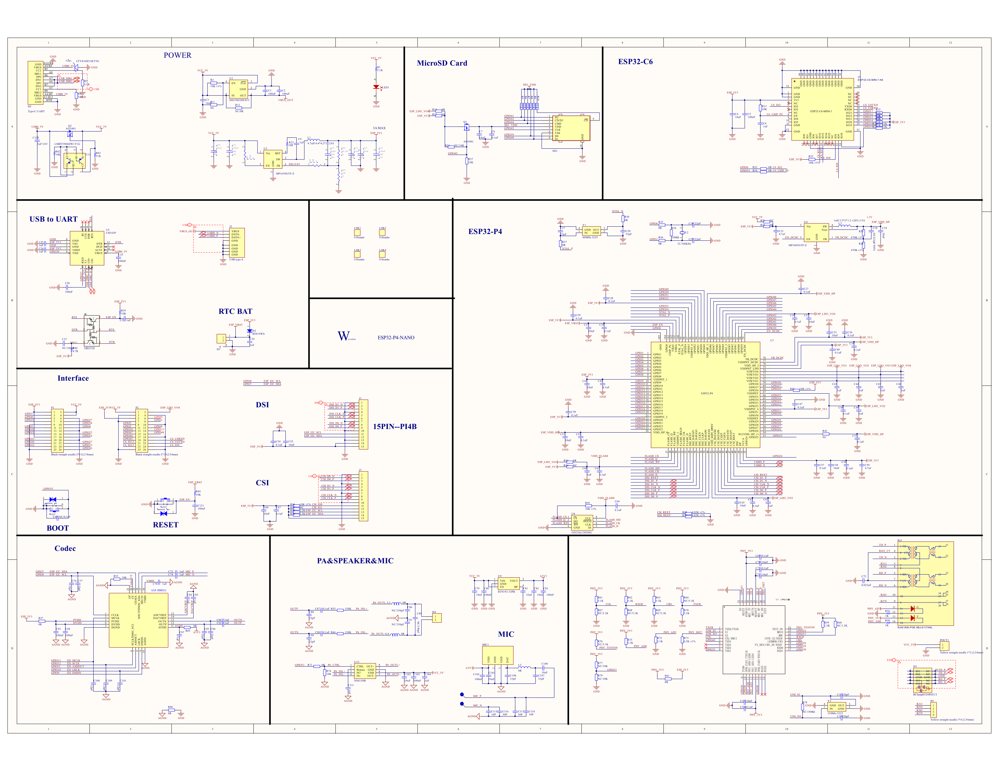
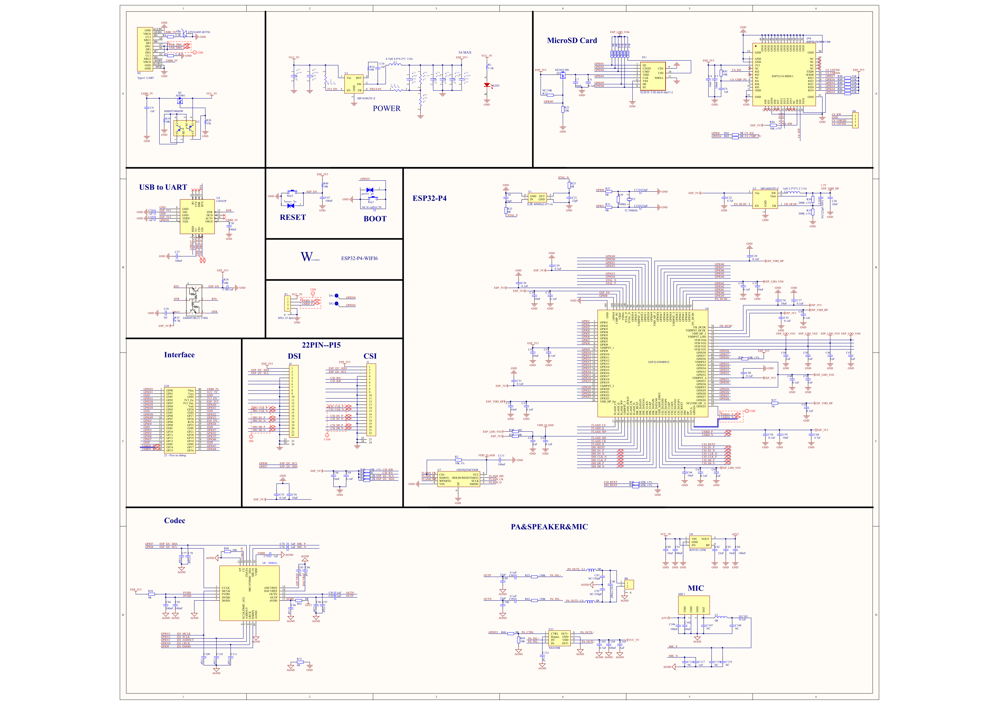

# ESP32-P4-dat

- [[ESP32-P4-SDK-dat]] - [[ESP-SDK-dat]] - [[SDK-dat]]

## info 

The **ESP32-P4** is Espressif’s high-performance, non-wireless SoC. It is designed for applications that require heavy computation, high-resolution displays, and complex user interfaces. Unlike the C6, the P4 is a "pure" microcontroller that focuses on raw power and I/O.

### Comparison: ESP32-C6 vs. ESP32-P4

| Feature | ESP32-C6 (Connectivity) | ESP32-P4 (Performance) |
| :--- | :--- | :--- |
| **Max Clock Speed** | 160 MHz | **400 MHz** |
| **Cores** | Single HP + Single LP | **Dual HP + Single LP** |
| **Wi-Fi / Bluetooth** | **Integrated (Wi-Fi 6)** | **None** (Requires external chip) |
| **MIPI DSI / CSI** | No | **Yes** |
| **Video Encoding** | No | **Yes (H.264)** |
| **GPIO Count** | ~30 | **55** |

### 1. High-Performance Dual RISC-V Cores
The P4 is the "muscle" of the ESP32 family. It moves away from the lower clock speeds of the C-series:
* **Dual-Core HP CPU:** Two RISC-V cores running at **up to 400 MHz**.
* **AI & DSP Extensions:** Includes support for specialized instructions that accelerate neural network processing and signal processing tasks.
* **LP Core:** A separate low-power RISC-V core (up to 40 MHz) for background monitoring.

### 2. Multimedia & Display Powerhouse
This is where the P4 is unique. It is the first ESP32 to feature dedicated hardware for modern screens and cameras:
* **MIPI-DSI & MIPI-CSI:** Native support for high-speed mobile industry processor interfaces. This allows you to connect high-resolution LCDs and camera sensors directly.
* **H.264 Video Encoder:** A hardware-based video encoder for recording or streaming video without taxing the main CPU.
* **Pixel Processing Accelerator (PPA):** A dedicated engine for image blending, scaling, and color space conversion (essential for smooth GUIs).

### 3. Massive I/O & Connectivity (Wired)
Since it lacks Wi-Fi, it provides professional-grade wired and peripheral options:
* **USB 2.0 OTG:** High-speed USB support for connecting thumb drives, keyboards, or acting as a high-speed device.
* **Ethernet MAC:** Integrated support for wired networking.
* **55+ Programmable GPIOs:** Significantly more than the ~22–30 found on the C-series or S-series.
* **SDIO 3.0 Host:** For high-speed communication with SD cards or external Wi-Fi chips (like an ESP32-C6).

### 4. Advanced Security & Memory
* **HP SRAM:** A massive **768 KB** of internal RAM, plus support for up to **32 MB of external PSRAM**.
* **Trusted Execution Environment (TEE):** Hardware-level separation of secure and non-secure code execution.

The ESP32-P4’s performance-oriented design sets it apart, catering to applications where processing power and versatile peripherals are more critical than wireless connectivity. 

本产品是一款基于ESP32-P4的多媒体开发板，并集成ESP32-C6，支持Wi-Fi6和BLE5无线连接。它提供丰富的人机交互接口，包括MIPI-CSI(集成图像信号处理器ISP)、MIPI-DSI、SPI、I2S、I2C、LEDPWM、MCPWM、RMT、ADC、UART和TWAI等。此外，支持USB OTG2.0HS，并板载4OPINGPIO扩展接口，兼容部分树莓派PicoHAT扩展板，实现更广泛的应用适配。ESP32-P4采用400MHz双核RISC-V处理器，支持最大32MBPSRAM，具备USB2.0、MIPI-CSI/DSI和H.264编码等外设，满足低成本、高性能和低功耗的多媒体开发需求。此外，ESP32-P4集成数字签名外设和专用密钥管理单元，确保数据与操作安全。ESP32-P4-WIFI6专为高性能和高安全应用设计，满足嵌入式系统在人机交互、边缘计算和IO扩展等方面的需求。

## review 1 

Personal impressions:

- This chip is neither outstanding nor lacking—somewhere in the middle.
- MIPI only supports 2 lanes.
- For Wi-Fi, you need to add a C6 module.
- Currently does not support Arduino.

Advantages:

- Mainly depends on future ecosystem development.
- Currently, there are quite a few comprehensive ESP-IDF examples, but individual module tests are still relatively few.

## HDK 

- [[ES8311-dat]]

- [[DSI-dat]] - [[CSI-dat]]

- [[display-dat]] - [[audio-dat]]

## SCH

SCH 2 

   
## ref 

- [[ESP32-P4]] - [[ESPressif]]

- [[esp-dat]]