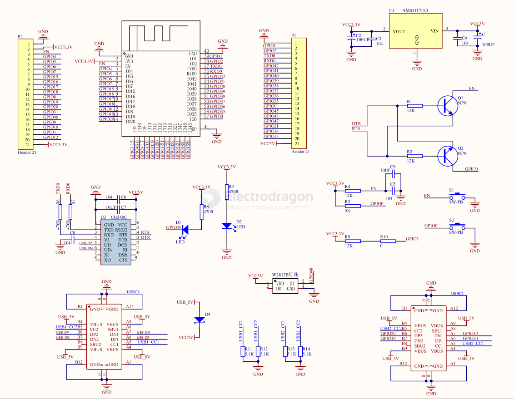
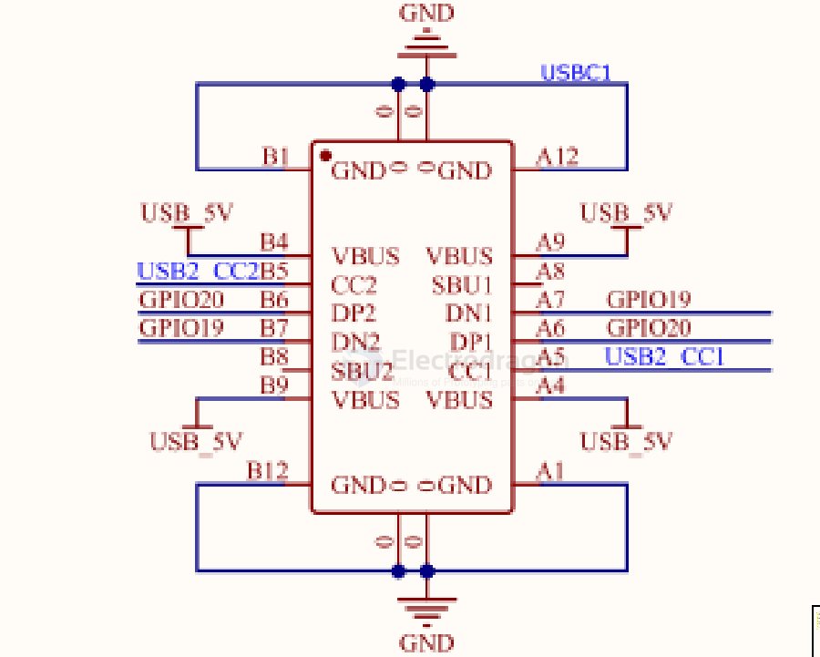
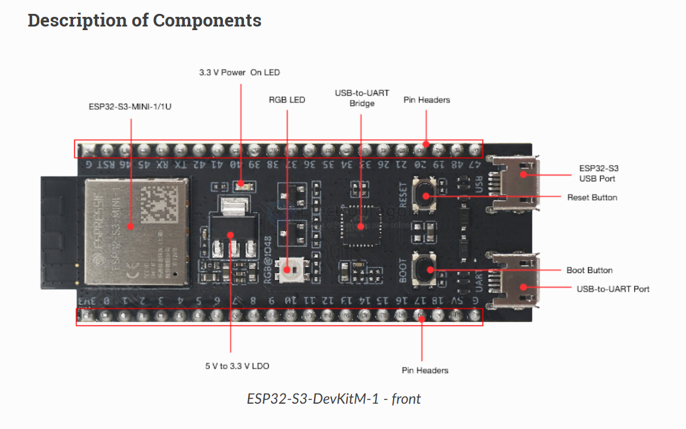
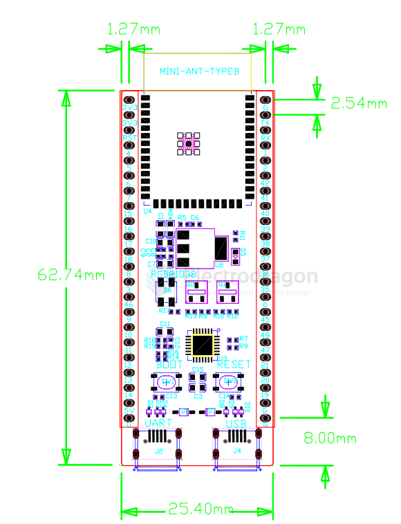
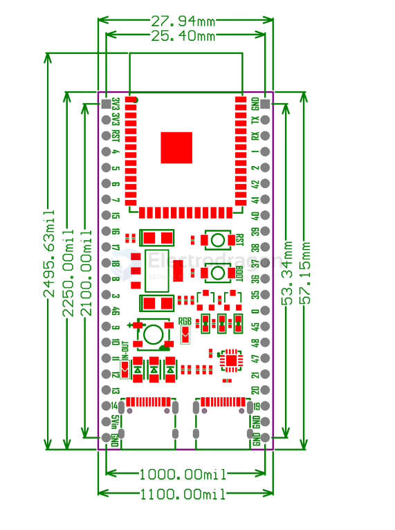
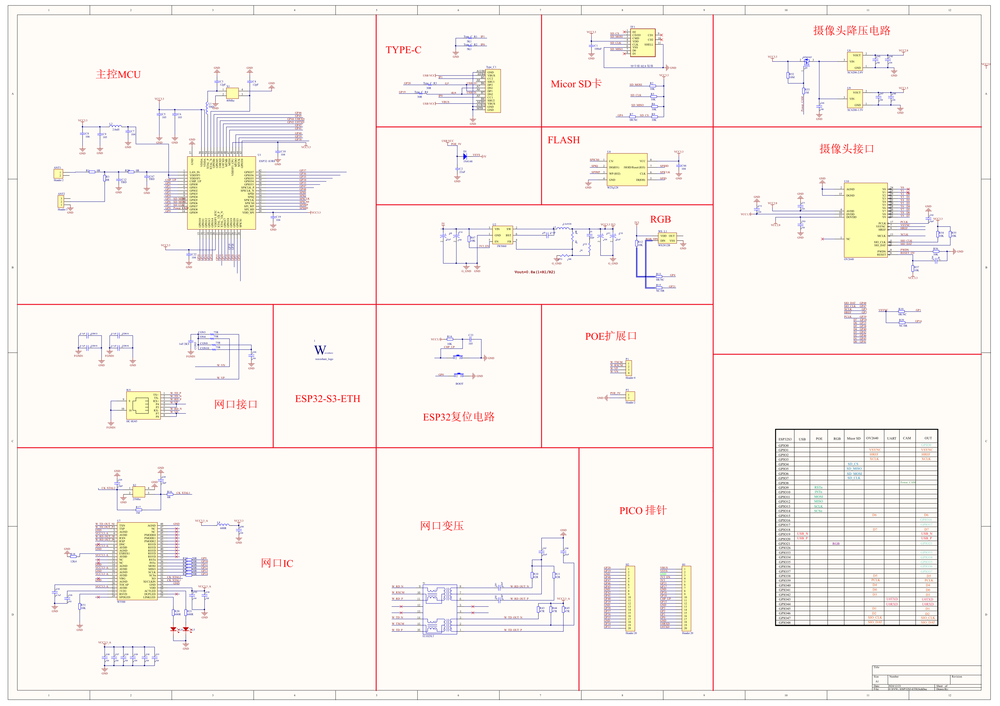

# ESP32-S3-Board-DAT

- [[ESP32-S3-APP-dat]]

- [[peripherals-dat]]

- [[NWI1243-dat]] - [[NWI1249-dat]]

## Cloned Core Board SCH 

- [[NWI1243-dat]]

IO35 == LED
IO48 == WS2812 

## peripharals 

- [[WS2812-dat]], - [[USB-dat]]

## USB OTG 

IO19, IO20, CC1 CC2 pull-down 

## dev board 

###  official ESP32-S3-DevKitM-1

- pin = 2x22 = 44 pins 
- available GPIOs = 44 - 5 = 39 pins 

###  official ESP32-S3-DevKitC-1

2x22, pitch pitch == 22.86 / 25.4 mm  

https://docs.espressif.com/projects/esp-dev-kits/en/latest/esp32s3/esp32-s3-devkitc-1/index.html

https://docs.espressif.com/projects/esp-dev-kits/zh_CN/latest/esp32s3/esp32-s3-devkitc-1/user_guide_v1.1.html#id11

WV-V 

## Other DEV board for reference 

ESP32-S3-ETH plus

- [[W5500-dat]] - [[ws2812-dat]] - [[OV2640-dat]]

## ref 

- [[ESP32-S3-Board]] - [[ESP32-S3]] - [[espressif]]

- [[esp32-devkitc-dat]] - [[NWI1100-dat]]

- [[espressif-dat]]

- [[Arduino-ESP32-dat]]

- [[m]]