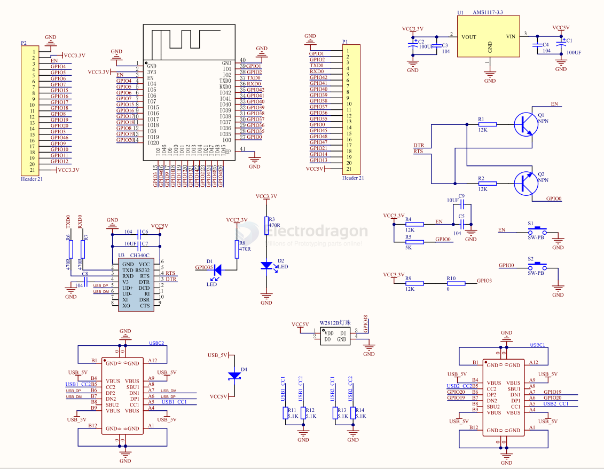
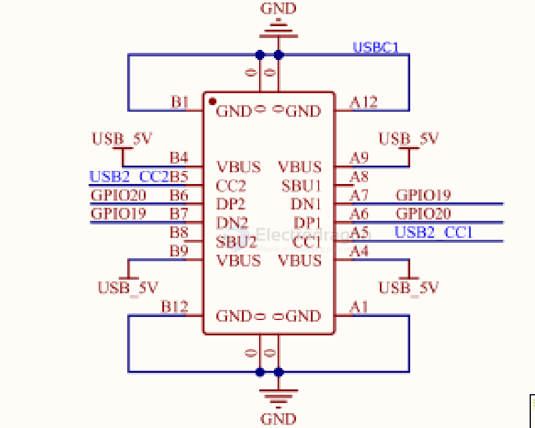
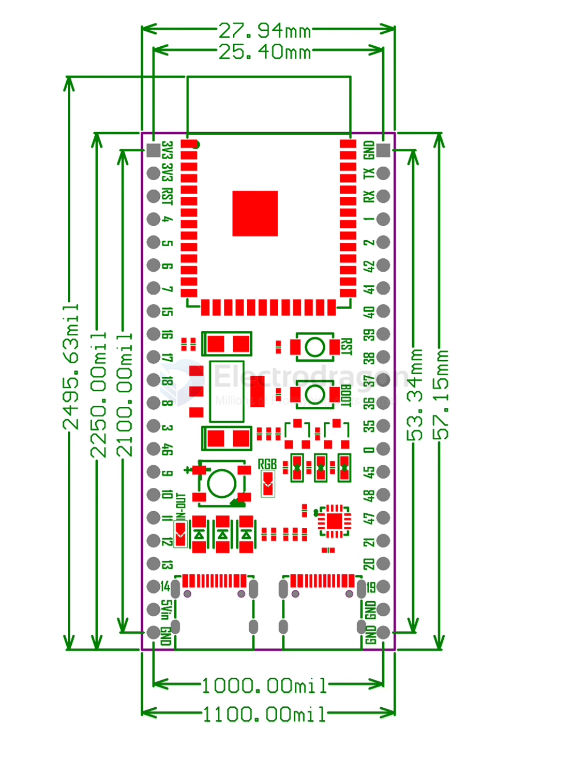
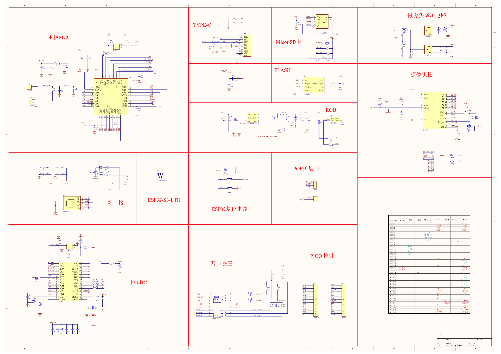

# ESP32-S3-Board-DAT

- [[ESP32-S3-board-dat]] - [[ESP32-S3-chip-dat]] - [[ESP32-S3-module-dat]]

- [[ESP32-S3-APP-dat]]

- [[peripherals-dat]]

- [[NWI1243-dat]] - [[NWI1249-dat]] - [[ESP32-S3-DevKitC-1-dat]] - [[ESP32-S3-board-dat]] - [[ESP32-S3-board-WV-dat]]

## Cloned Core Board SCH 

- [[NWI1243-dat]]

IO35 == LED
IO48 == WS2812 

## peripharals 

- [[WS2812-dat]], - [[USB-dat]]

## USB OTG 

IO19, IO20, CC1 CC2 pull-down 

## Other DEV board for reference 

ESP32-S3-ETH plus

- [[W5500-dat]] - [[ws2812-dat]] - [[OV2640-dat]]

## app boards 

- [[IDD1013-dat]]

## ref 

- [[ESP32-S3-Board]] - [[ESP32-S3]] - [[espressif]]

- [[esp32-devkitc-dat]] - [[NWI1100-dat]]

- [[espressif-dat]]

- [[Arduino-ESP32-dat]]

- [[m]]