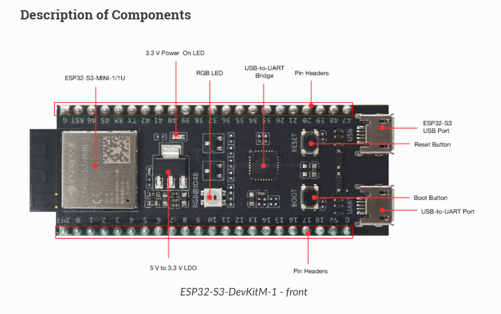
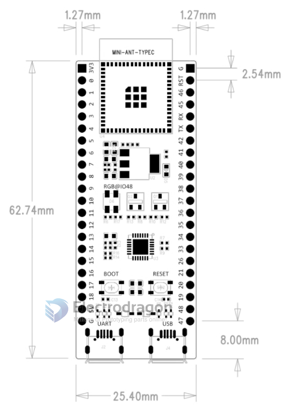
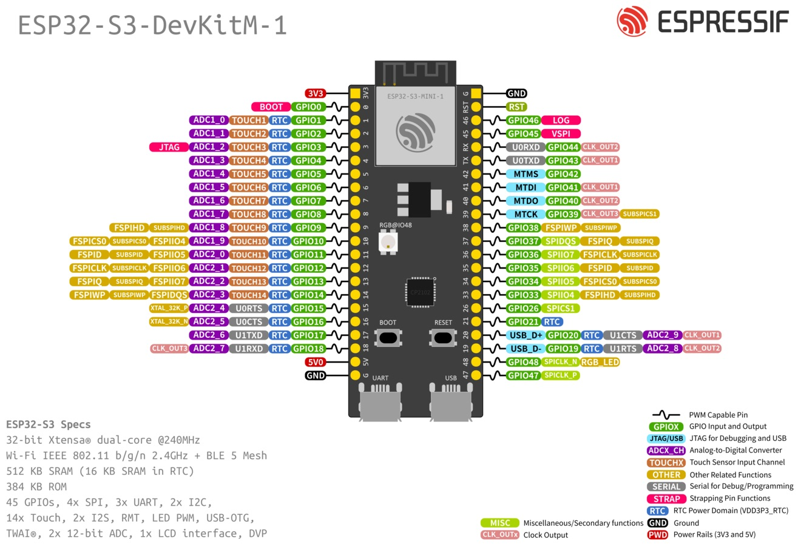

# ESP32-S3-DevKitC-1-dat

- [[ESP32-S3-DevKitC-1-dat]] - [[ESP32-S3-board-dat]]

###  official ESP32-S3-DevKitM-1

- pin = 2x22 = 44 pins 
- available GPIOs = 44 - 5 = 39 pins 

###  official ESP32-S3-DevKitC-1

2x22, pitch pitch == 22.86 / 25.4 mm  

https://docs.espressif.com/projects/esp-dev-kits/en/latest/esp32s3/esp32-s3-devkitc-1/index.html

https://docs.espressif.com/projects/esp-dev-kits/zh_CN/latest/esp32s3/esp32-s3-devkitc-1/user_guide_v1.1.html#id11

## pins 

left == 22 pin 

| L      |
| ------ |
| 3V3    |
| GPIOO  |
| GPI01  |
| GPI02  |
| GPI03  |
| GPI04  |
| GPI05  |
| GPI06  |
| GPI07  |
| GPI08  |
| GPI09  |
| GPIO10 |
| GPIO11 |
| GPI012 |
| GPI014 |
| GPI013 |
| GPI015 |
| GPI016 |
| GPI017 |
| GPI018 |
| 5V0    |
| GND    |

right == 22 pin 

- GND
- RST
- GPI046 - LOG
- GPI045 - VSPI
- UORXD GPI044 CLK_0UT2
- UOTXD GPI043 CLK_OUT1
- MTMS GPI042
- MTDI GPIO41 CLK_OUT1
- MTDO GPIO40 CLK_OUT2
- MTCK GPI039 CLK_OUT3SUBSPICS1
- GPI038 FSPIWP SUBSPIWP
- GPI037 SPIDQS FSPIQ SUBSPIQ
- GPI036 SPI107 FSPICLK SUBSPICLK
- GPI035 SP1106 FSPID SUBSPID
- GPIO34 SPII05 FSPICSO SUBSPICSO
- GPI033 SPI104 FSPIHDSUBSPIHD
- GPI026 SPICS1
- GPI021 RTC
- USB_D+ GPIO20 RTC U1CTS ADC2_9 CLK_OUT1
- USB_D- GPIO19 RTC U1RTS ADC2_8 CLK_OUT2
- GPIO48 SPICLK_N RGB_LED
- GPI047 SPICLK_P

## ref 

