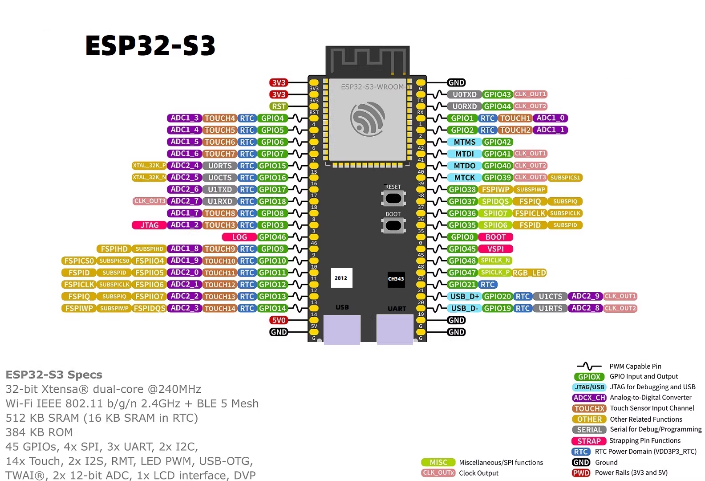

# ESP32-S3-board-VCC-dat

- [[ESP32-S3-board-dat]]

## hardware 

- 100 mil == 2.54 mm 
- 1000 mil == 25.4mm 
- 1100 mil == 27.94 mm

- USB：ESP32-S3直连USB
- CH343P-USB转TTL按键：RST和BOOT
- RGB灯 : WS2812(GPI048)

## ref 

- [[ESP32-S3-board-VCC-dat]] - [[ESP32-S3-board-WV-dat]] - [[ESP32-S3-board-dat]]