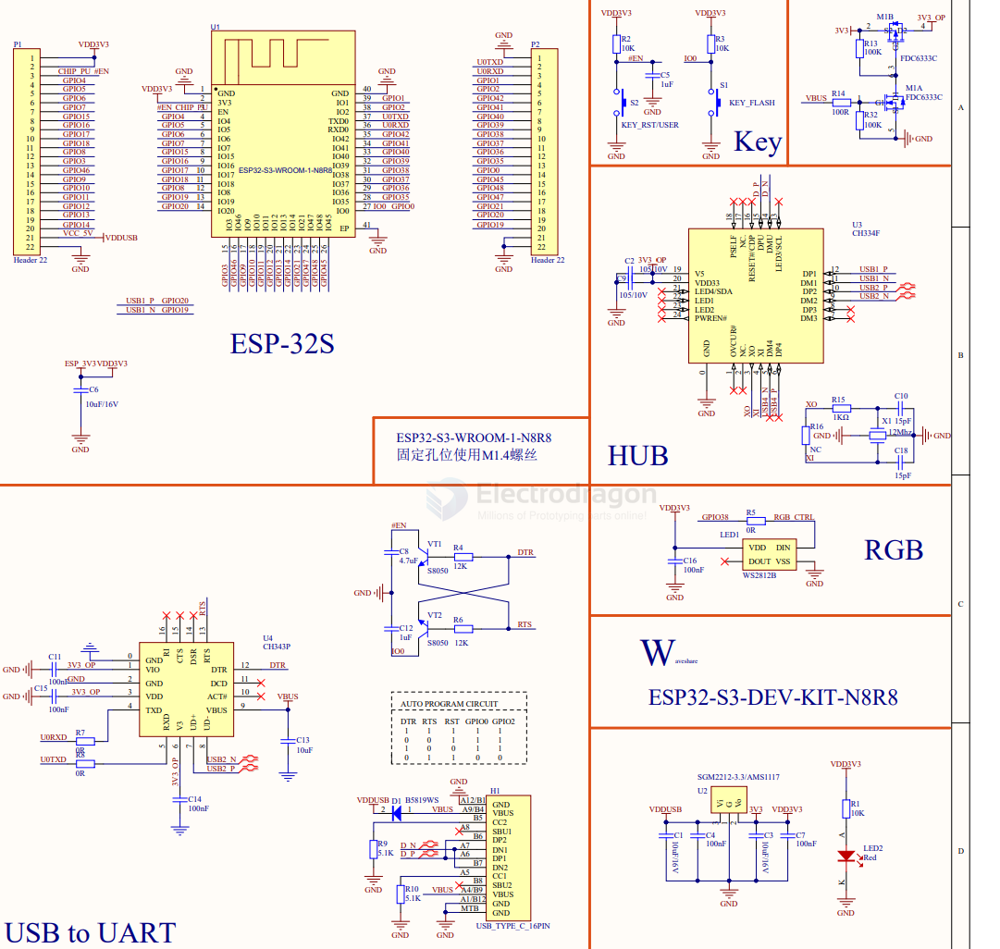

# ESP32-S3-board-WV-dat

- [[ESP32-S3-module-dat]]

- [[NWI1243-dat]] - [[NWI1249-dat]] - [[ESP32-S3-DevKitC-1-dat]] - [[ESP32-S3-board-dat]] - [[ESP32-S3-board-WV-dat]]

- [[ESP32-S3-board-VCC-dat]] - [[ESP32-S3-board-dat]]

## WV-V 

RGB LED == GPIO38 

## full pin definitions 

- 3V3
- 3V3
- RST
- GPI04
- GPIO5
- GPI06
- GPI07
- GPI015
- GPI016
- GPI017
- GPI018
- GPI08
- GPI03
- GPI046
- GPI09
- GPI01O
- GPI011
- GPI012
- GPI013
- GPI014 
- 5V0
- GND

- GND
- UOTXD GPI043 CLK_OUT1
- UORXD GPIO44 CLK_0UT2
- GPI01 RTC TOUCH1 ADC1_0
- GPI02 RTC TOUCH2 ADC1_1
- MTMS GPIO42
- MTDI GPI041 CLK_OUT1
- MTDO GPI040 CLK_0UT2
- MTCK GPI039 CLK_0UT3 SUBSPICSI
- GPI038 FSPIWP SUBSPIWP RGBLED
- GPI037 SPIDQS FSPIQ SUBSPIQ
- GPI036 SPII07 FSPICLK SUBSPICLK
- GPI035 SPII06 FSPID SUBSPID
- GPIOO BOOT
- GPI045 VSPI
- GPI048 SPICLK_N
- GPIO47 SPICLK_P
- GPI021 RTC
- USB_D+ GPI020 RTC U1CTS ADC2_9 CLK_OUT1
- USB_D- GPI019 RTC U1RTS ADC2_8 CLK_OUT2
- GND
- GND

## simplified pin definitions 

left side copy 

    3V3
    3V3
    RST
    4 
    5
    6
    7
    15
    16
    17
    18
    8
    3
    46
    9
    10
    11
    12
    13
    14
    5V
    GND 

right side copy

    GND
    UOTXD
    UORXD
    1
    2
    42
    41
    40
    39
    38
    37
    36
    35
    O
    45
    48
    47
    21
    20
    19
    GND
    GND

## SCH 

## ref 

- [[ESP32-S3-board-WV]] - [[ESP32-S3-board]]