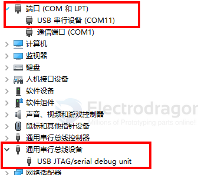
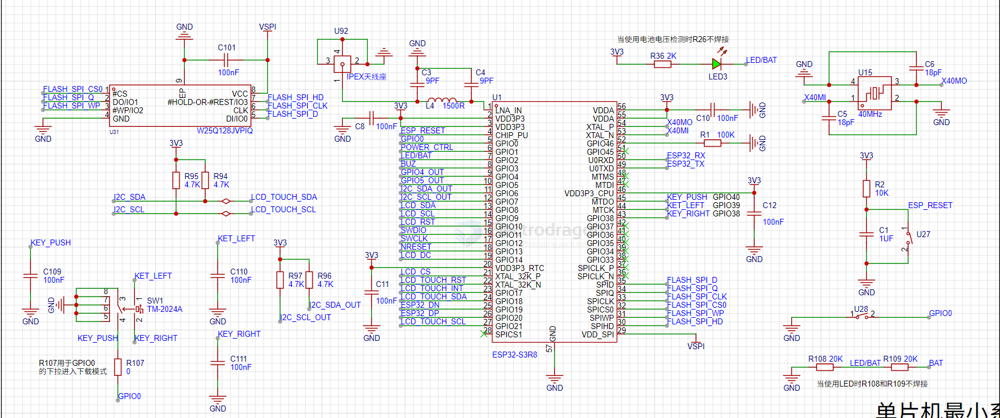

# ESP32-S3-dat 

- [[ESP32-S3-chip-DAT]] 


- [[ESP32-S3-SDK-dat]] - [[ESP32-SDK-dat]] - [[ESP-SDK-dat]] 


- [[ESP32-S3-HDK-dat]] 

- [[ESP32-S3-module-DAT]] - [[ESP32-S3-WROOM-1-dat]] - [[ESP32-S3-board-dat]]

- [[ESP32-S3-app-DAT]] 


## board 

- [[ESP32-S3-Board-DAT]]

- [[NWI1243-dat]] - [[NWI1249-dat]]


## interface 

- [[interface-dat]] - [[I2S-dat]] - [[PDM-dat]] - [[sensor-microphone-dat]] - [[sensor-microphone-I2S-dat]]

- [[camera-dat]]


## pins 

The ESP32-S3 features a **GPIO Matrix**. This internal switching fabric allows you to route almost any internal peripheral signal (like I2S, PWM, or UART) to almost any physical GPIO pin (GPIO 0 through 48).

* **I2S0:** Can be mapped to any available GPIO.
* **I2S1:** Can also be mapped to any available GPIO.


## built-in USB JTAG 

- [[JTAG-dat]]




## IDF list 

- ESP32-S3 chip (via builtin USB-JTAG)
- ESP32-S3 chip (via builtin USB-JTAG)
- ESP32-S3 chip (via ESP-PROG)
- ESP32-S3 chip (via ESP-PROG-2)
- Custom board


### ✅ Supported Features

The **ESP32-S3** includes a **USB Serial/JTAG Controller**, meaning:

- ✅ Built-in **USB JTAG debugging** — no need for an external debugger.
- ✅ **USB Serial** for logs and communication.
- ✅ **USB DFU / flashing support**.
- ✅ All over a single USB connection.

---

### 🔌 Hardware Connections

Make sure the native USB pins are used:

| Function     | GPIO Pin |
|--------------|----------|
| USB D+       | GPIO19   |
| USB D−       | GPIO20   |

> ⚠️ These pins must not be remapped or disabled in software if using USB JTAG.

---

### 🧰 Setup for Debugging with OpenOCD

1. **Install ESP-IDF** (v4.4 or later recommended, v5.x best).
2. **Connect ESP32-S3 to your PC via USB** (native USB, not UART).
3. Run OpenOCD with:

```bash
openocd -f interface/esp_usb_jtag.cfg -f board/esp32s3.cfg
```

Use GDB, VS Code, or Eclipse for debugging.


## S2 / S3 modules 

- [[ESP-12K-dat]] - [[NWI1226-dat]]


## min. Core 




## ref 


- [[ESP32-S3-dat]] - [[ESP32-P4-dat]] - [[ESP32-C6-dat]]

https://docs.espressif.com/projects/esp-hardware-design-guidelines/en/latest/esp32s3/schematic-checklist.html

https://docs.espressif.com/projects/esp-hardware-design-guidelines/en/latest/esp32s3/esp-hardware-design-guidelines-en-master-esp32s3.pdf

- [[ESP32-S3]] - [[ESP32-I2S-dat]]