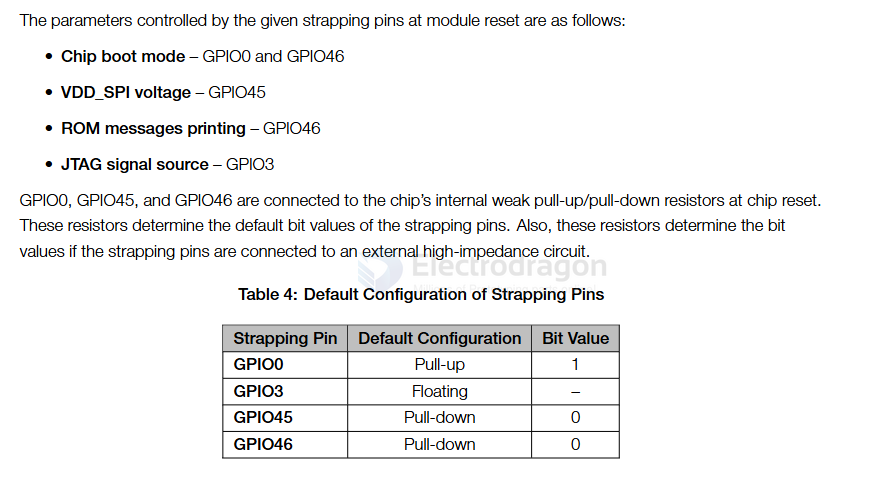
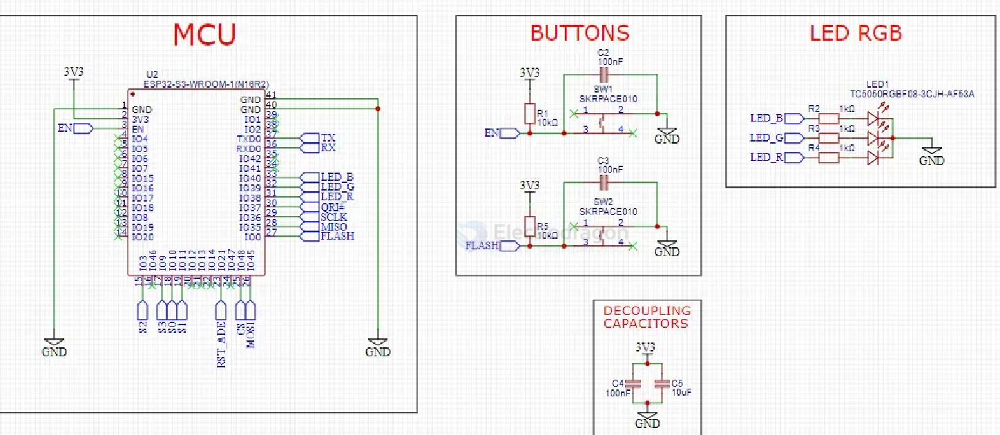
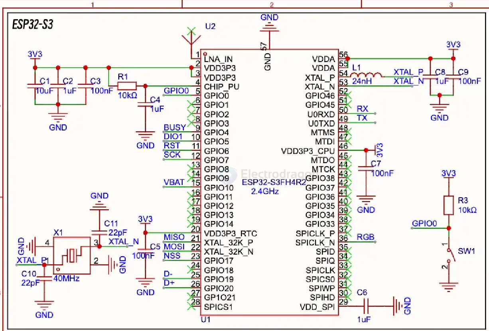
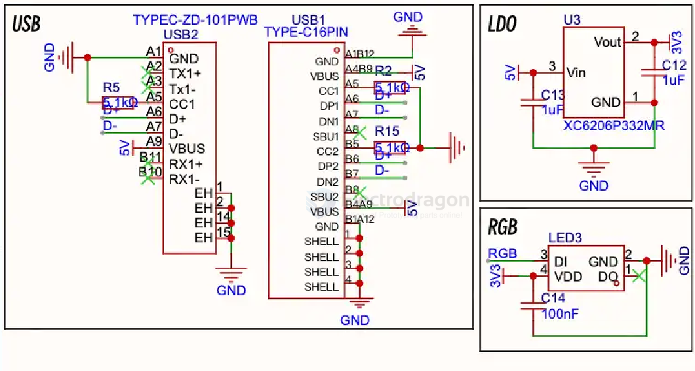
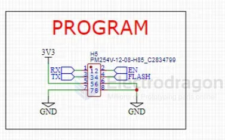

# ESP32-S3-HDK-dat

- [[ESP32-S3-WROOM-1-dat]] - [[ESP32-S3-module-dat]] - [[ESP32-S3-chip-dat]]

- [[ESP32-S3-board-dat]]

- [[ESP32-HDK-dat]] - [[ESP32-S3-HDK-dat]] - [[ESP32-C3-HDK-dat]]

## strap pins 

## build 

- [[SPI-dat]] - [[serial-dat]] - [[ESP32-S3-HDK-dat]] - [[74HC4067-dat]] - [[LED-RGB-dat]]

w/ module 

w/o module 

### common periperhals 

### program 

## app 

- [[SX1281-dat]] - [[semtech-dat]]

## ref 

- [[ESP32-S3-dat]]
