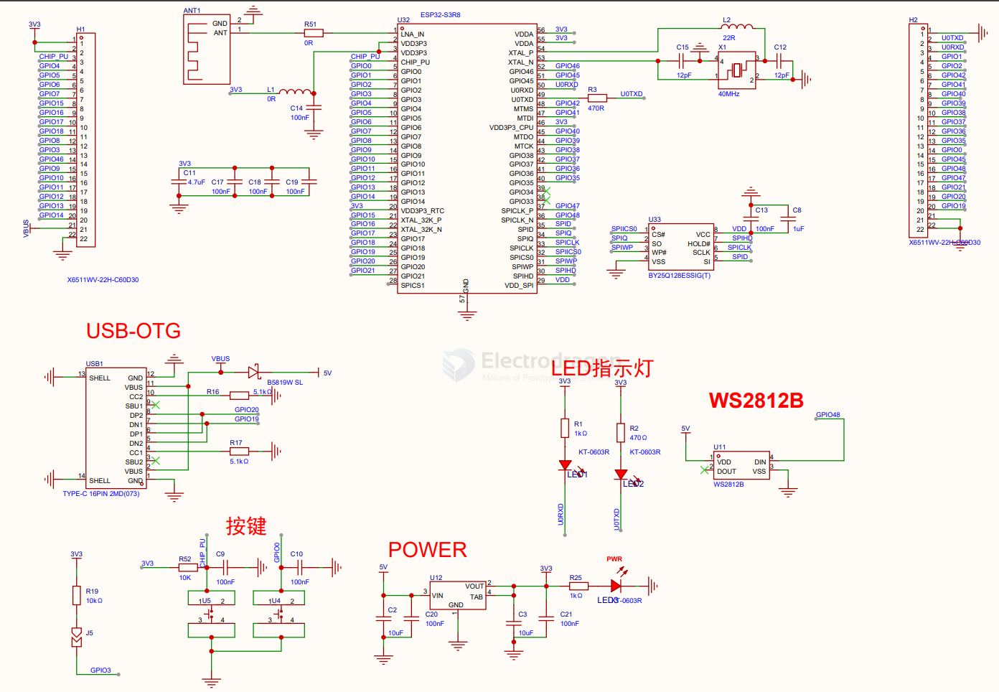

# ESP32-S3-HDK-dat

- [[ESP32-S3-WROOM-1-dat]] - [[ESP32-S3-module-dat]] - [[ESP32-S3-chip-dat]]

- [[ESP32-S3-board-dat]]

- [[ESP32-HDK-dat]] - [[ESP32-S3-HDK-dat]] - [[ESP32-C3-HDK-dat]]

## strap pins 

## build 

- [[SPI-dat]] - [[serial-dat]] - [[ESP32-S3-HDK-dat]] - [[74HC4067-dat]] - [[LED-RGB-dat]]

w/ module 

w/o module 

### common periperhals 

### program 

## pins 

- [[ESP32-S3-chip-DAT]]

- I00
- TXD0/IO1
- 102
- RXD0/103
- 104
- 105
- 1012
- 1013
- 1014
- 1015
- I016
- 1017
- 1018
- 1019
- 1021
- 1022
- 1023
- 1025
- 1026
- 1027
- 1032
- 1033
- 1034
- 1035

## app 

- [[SX1281-dat]] - [[semtech-dat]]

## SCH 

SCH 1 

## ref 

- [[ESP32-S3-dat]]
