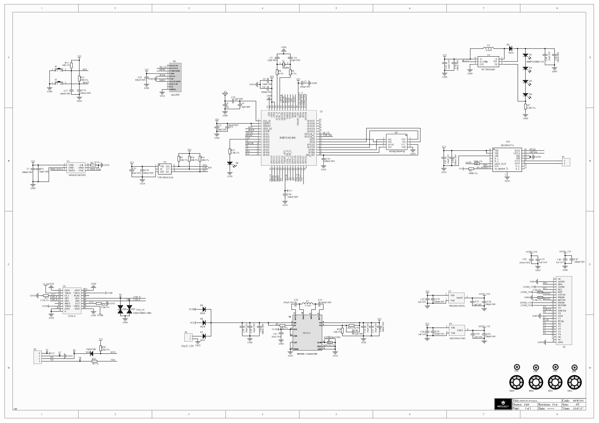
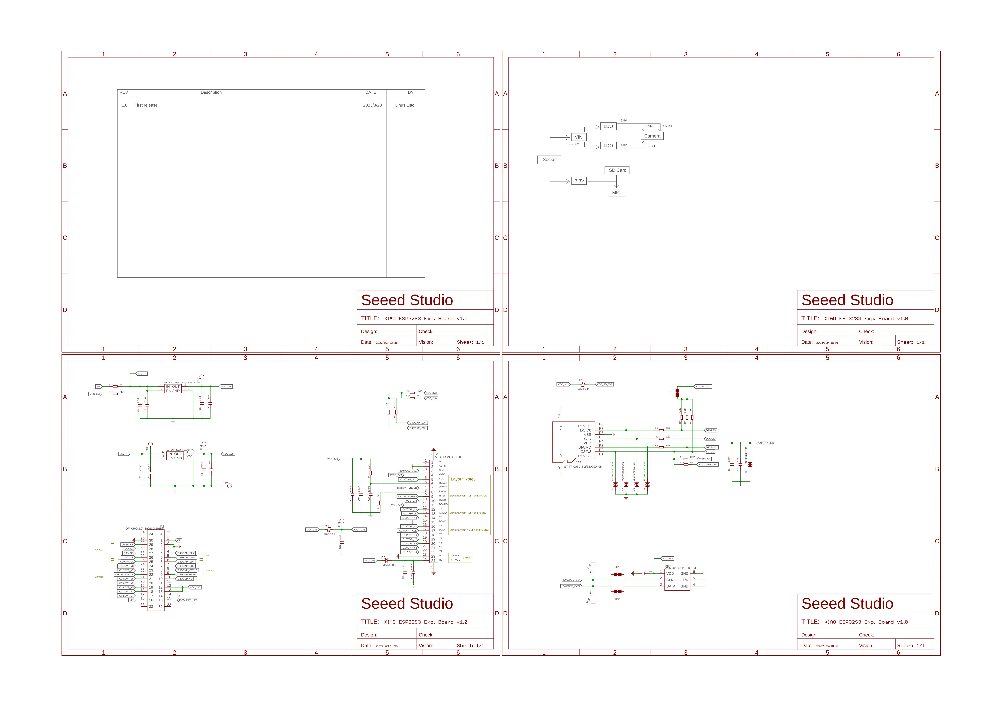
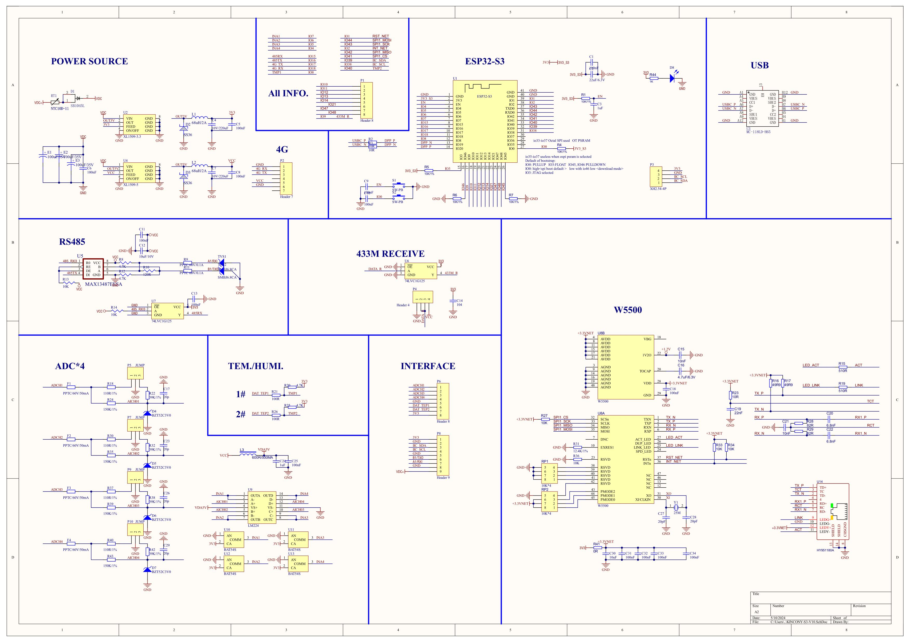

# ESP32-S3-app-DAT

- [[peripherals-dat]]

- [[interface-interactive-dat]]

- [[ESP32-I2S-dat]] - [[ESP32-S3-dat]]

## app boards 

- [[ESP32-S3-eye-dat]] 

## Camera Board 

- [[sensor-camera-dat]]

- [[MAX98357-dat]] - [[MSM261S4030H0R-dat]]

- [[sensor-ambient-light-dat]] - [[led-driver-dat]]

- [[serial-dat]] - [[DVP-camera-dat]]

- [[dcdc-down-dat]]

### SCH 

- [[omnivision-dat]] - [[OV3660-dat]] - [[OV2640-dat]] - [[OV5640-dat]]

## ethernet and ADC read 

- [[ADC-dat]] - [[W5500-dat]]

## ref 

- [[ESP32-S3-app]] - [[ESP32-S3]]