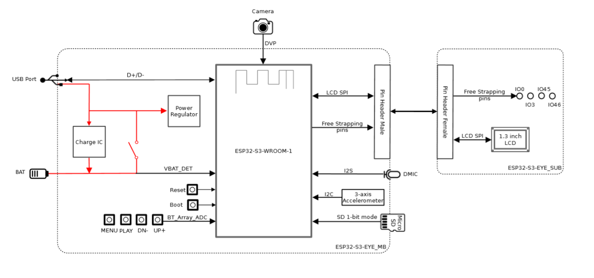
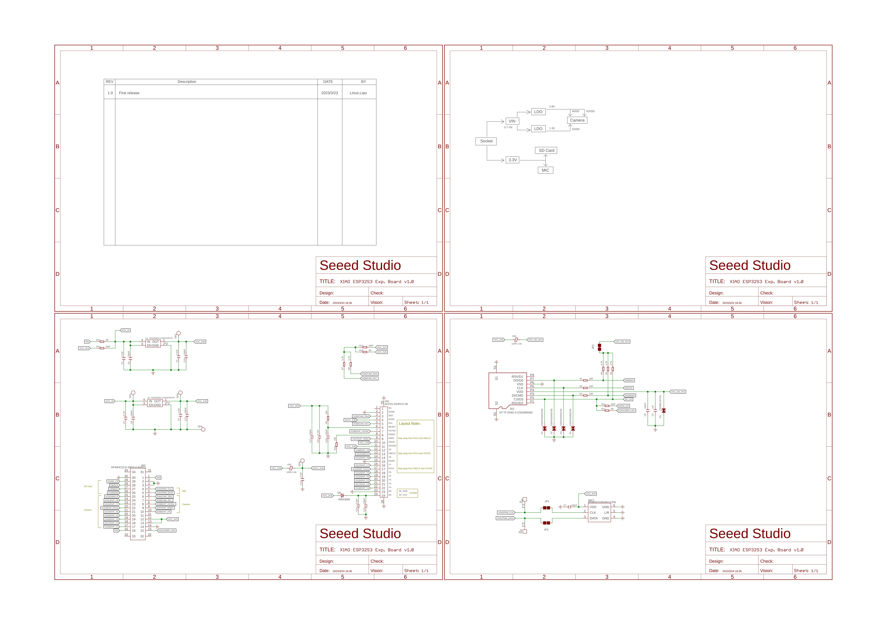
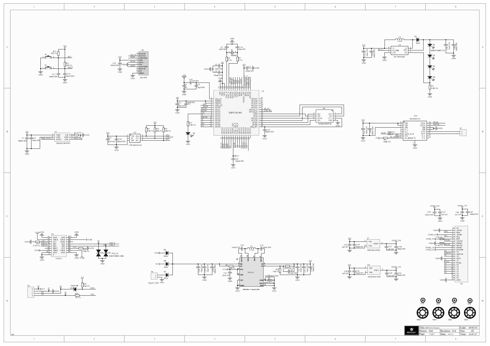
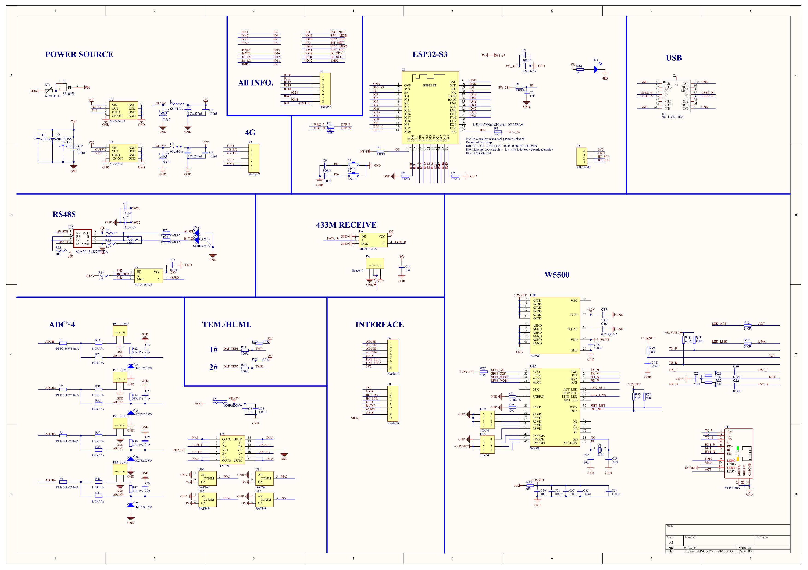

# ESP32-S3-app-DAT

- [[peripherals-dat]]

- [[interface-interactive-dat]]

- [[ESP32-I2S-dat]]

## ESP-EYE 

- [[ESP-EYE-dat]]

- [[SCH_ESP32-S3-EYE-MB_20211201_V2.2.pdf]]

https://github.com/espressif/esp-who/blob/master/docs/en/get-started/ESP32-S3-EYE_Getting_Started_Guide.md

## Camera Board 

- [[MAX98357-dat]] - [[MSM261S4030H0R-dat]]

- [[ambient-light-sensor-dat]] - [[led-driver-dat]]

- [[serial-dat]] - [[DVP-camera-dat]]

- [[dcdc-down-dat]]

## ethernet and ADC read 

- [[ADC-dat]] - [[W5500-dat]]

## ref 

- [[ESP32-S3-app]] - [[ESP32-S3]]