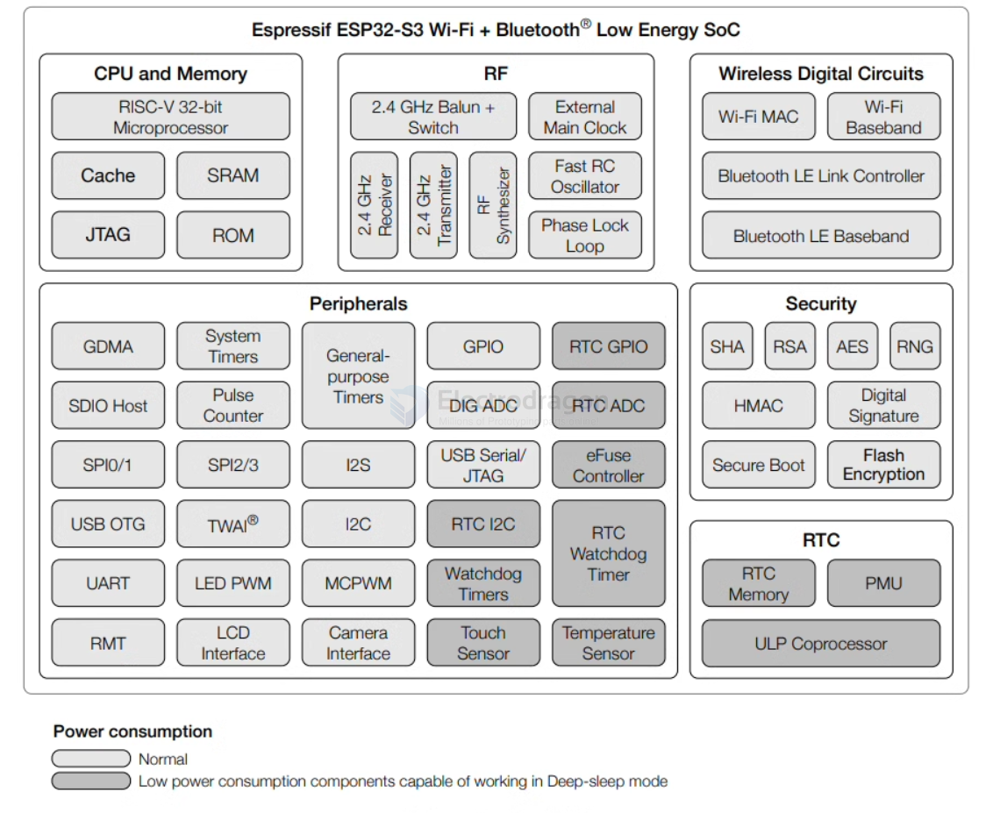

# ESP32-S3-chip-DAT

- [[esp32-s3_datasheet_en.pdf]]

- [[esp32-s3_规格说明书-中文版.pdf]] - [[esp32-s3_技术手册-中文版.pdf]]

## function map 

- [[peripherals-dat]]

## Pin definitions 

| Pin # | Pin Name   | Functions (Typical)      | Note. |
| ----- | ---------- | ------------------------ | ----- |
| 1     | LNA_IN     | RF Input (Antenna)       | x     |
| 2     | VDD3P3     | 3.3V Power Supply        | x     |
| 3     | VDD3P3     | 3.3V Power Supply        | x     |
| 4     | CHIP_PU    | EN                       | x     |
| 5     | GPIO0      | GPIO, Boot, ADC, Touch   | boot  |
| 6     | GPIO1      | GPIO, ADC, Touch         |       |
| 7     | GPIO2      | GPIO, ADC, Touch         |       |
| 8     | GPIO3      | GPIO, ADC, Touch         |       |
| 9     | GPIO4      | GPIO, ADC, Touch         |       |
| 10    | GPIO5      | GPIO, ADC, Touch         |       |
| 11    | GPIO6      | GPIO, ADC, Touch         |       |
| 12    | GPIO7      | GPIO, ADC, Touch         |       |
| 13    | GPIO8      | GPIO, ADC, Touch         |       |
| 14    | GPIO9      | GPIO, ADC, Touch         |       |
| 15    | GPIO10     | GPIO, ADC, Touch         |       |
| 16    | GPIO11     | GPIO, ADC, Touch         |       |
| 17    | GPIO12     | GPIO, ADC, Touch         |       |
| 18    | GPIO13     | GPIO, ADC, Touch         |       |
| 19    | GPIO14     | GPIO, ADC, Touch         |       |
| 20    | VDD3P3_RTC | 3.3V RTC Power Supply    | x     |
| 21    | XTAL_32K_P | 32.768kHz                | 32K   |
| 22    | XTAL_32K_N | 32.768kHz                | 32K   |
| 23    | GPIO17     | GPIO, ADC, Touch         |       |
| 24    | GPIO18     | GPIO, ADC, Touch         |       |
| 25    | GPIO19     | GPIO, ADC, Touch         |       |
| 26    | GPIO20     | GPIO, ADC, Touch         |       |
| 27    | GPIO21     | GPIO, ADC, Touch         |       |
| 28    | SPICS1     | SPI Chip Select 1        |       |
| 29    | VDD_SPI    | 3.3V SPI Power Supply    | x     |
| 30    | SPIHD      | SPI HD                   | x     |
| 31    | SPIWP      | SPI WP                   | x     |
| 32    | SPICS0     | SPI Chip Select 0        | x     |
| 33    | SPICLK     | SPI Clock                | x     |
| 34    | SPIQ       | SPI Q                    | x     |
| 35    | SPID       | SPI D                    | x     |
| 36    | SPICLK_N   | GPIO, SPI Clock Negative |       |
| 37    | SPICLK_P   | GPIO, SPI Clock Positive |       |
| 38    | GPIO33     | GPIO                     |       |
| 39    | GPIO34     | GPIO                     |       |
| 40    | GPIO35     | GPIO                     |       |
| 41    | GPIO36     | GPIO                     |       |
| 42    | GPIO37     | GPIO                     |       |
| 43    | GPIO38     | GPIO                     |       |
| 44    | MTCK       | JTAG Clock, GPIO         |       |
| 45    | MTDO       | JTAG Data Out, GPIO      |       |
| 46    | VDD3P3_CPU | 3.3V CPU Power Supply    | x     |
| 47    | MTMS       | JTAG Mode Select, GPIO   |       |
| 48    | MTDI       | JTAG Data In, GPIO       |       |
| 49    | U0TXD      | UART0 TX, GPIO           | UART0 |
| 50    | U0RXD      | UART0 RX, GPIO           | UART0 |
| 51    | GPIO45     | GPIO                     |       |
| 52    | GPIO46     | GPIO                     |       |
| 53    | XTAL_N     | Crystal_N                | xTAL  |
| 54    | XTAL_P     | Crystal_P                | xTAL  |
| 55    | VDDA       | Analog_PWR               | x     |
| 56    | VDDA       | Analog_PWR               | x     |
| 57    | GND        | Ground                   | x     |

### USB OTG 

When using the on-chip PHY, the differential signal pins USB_D- and USB_D+ of the USB OTG are multiplexed
with GPIO19 ~ GPIO20, RTC_GPIO19 ~ RTC_GPIO20, UART1 interface, and SAR ADC2 interface via IO
MUX.

### UART0 

- | 49    | U0TXD      | UART0 TX, GPIO           | UART0 |
- | 50    | U0RXD      | UART0 RX, GPIO           | UART0 |

## ref 

- [[ESP32-dat]]

