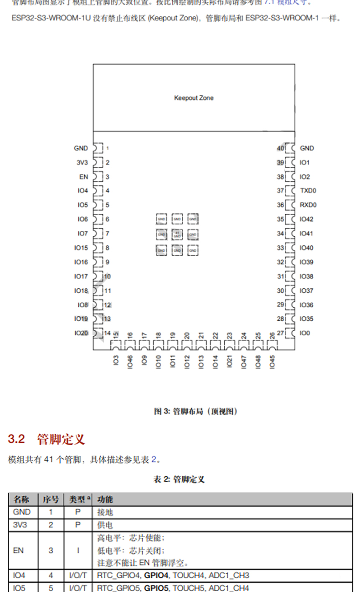
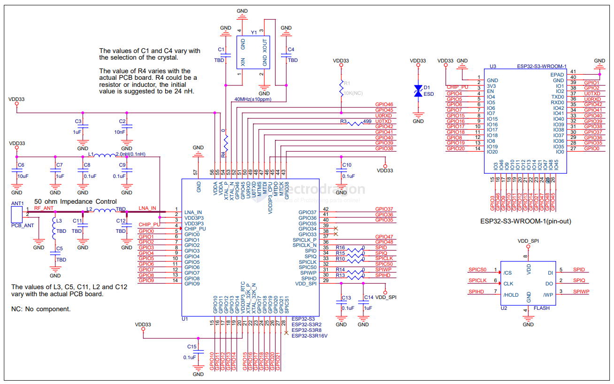
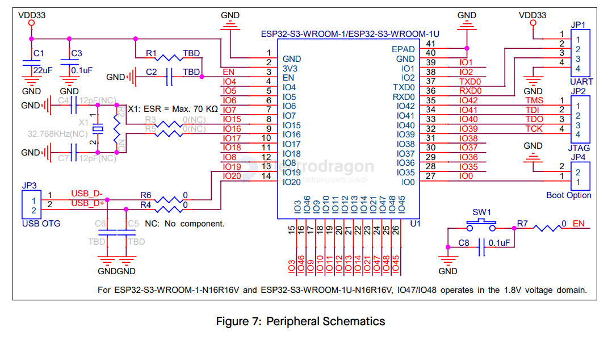

# ESP32-S3-WROOM-1-dat

- ESP32-S3-WROOM-1

- ESP32-S3-WROOM-1 D2N8
- ESP32-S3-WROOM-1 D2N8 R2
- ESP32-S3-WROOM-1 D2N8 R8

https://www.espressif.com.cn/sites/default/files/documentation/esp32-s3-wroom-1_wroom-1u_datasheet_en.pdf

- [[esp32-s3-wroom-1_datasheet.pdf]]

total pins 40

## Module SCH 

## Peripheral Schematics

## pis 

| L    |     | M    |     | R    |     |
| ---- | --- | ---- | --- | ---- | --- |
| GND  |     | 103  |     | GND  |     |
| 3V3  |     | 1046 |     | I01  |     |
| EN   |     | 109  |     | I02  |     |
| 104  |     | 1010 |     | TXDO |     |
| 105  |     | 1011 |     | RXD0 |     |
| 106  |     | 1012 |     | I042 |     |
| 107  |     | 1013 |     | I041 |     |
| 1015 |     | 1014 |     | I040 |     |
| 1016 |     | 1021 |     | I039 |     |
| 1017 |     | 1047 |     | I038 |     |
| 1018 |     | 1048 |     | I037 |     |
| 108  |     | 1045 |     | I036 |     |
| 1019 | USB |      |     | I035 |     |
| 1020 | USB |      |     | I00  |     |

## Pin definitions

- [[ESP32-S3-HDK-dat]]

function template 

| No. | Name | Type  | Functions                                                          | note                   |
| --- | ---- | ----- | ------------------------------------------------------------------ | ---------------------- |
| 1   | GND  | P     | Ground                                                             |                        |
| 2   | 3V3  | P     | Power supply (3.3 V)                                               |                        |
| 3   | EN   | I     | Chip enable (active high). Low: power‑down. Do not leave floating. |                        |
| 4   | IO4  | I/O/T | RTC_GPIO4, GPIO4, TOUCH4, ADC1_CH3                                 |                        |
| 5   | IO5  | I/O/T | RTC_GPIO5, GPIO5, TOUCH5, ADC1_CH4                                 |                        |
| 6   | IO6  | I/O/T | RTC_GPIO6, GPIO6, TOUCH6, ADC1_CH5                                 |                        |
| 7   | IO7  | I/O/T | RTC_GPIO7, GPIO7, TOUCH7, ADC1_CH6                                 |                        |
| 8   | IO15 | I/O/T | RTC_GPIO15, GPIO15, U0RTS, ADC2_CH4, XTAL_32K_P                    |                        |
| 9   | IO16 | I/O/T | RTC_GPIO16, GPIO16, U0CTS, ADC2_CH5, XTAL_32K_N                    |                        |
| 10  | IO17 | I/O/T | RTC_GPIO17, GPIO17, U1TXD, ADC2_CH6                                |                        |
| 11  | IO18 | I/O/T | RTC_GPIO18, GPIO18, U1RXD, ADC2_CH7, CLK_OUT3                      |                        |
| 12  | IO8  | I/O/T | RTC_GPIO8, GPIO8, TOUCH8, ADC1_CH7, SUBSPICS1                      |                        |
| 13  | IO19 | I/O/T | RTC_GPIO19, GPIO19, U1RTS, ADC2_CH8, CLK_OUT2                      | USB_D–                 |
| 14  | IO20 | I/O/T | RTC_GPIO20, GPIO20, U1CTS, ADC2_CH9, CLK_OUT1                      | USB_D+                 |
| 15  | IO3  | I/O/T | RTC_GPIO3, GPIO3, TOUCH3, ADC1_CH2                                 | strap=~                |
| 16  | IO46 | I/O/T | GPIO46                                                             | strap=0                |
| 17  | IO9  | I/O/T | RTC_GPIO9, GPIO9, TOUCH9, ADC1_CH8, FSPIHD, SUBSPIHD               |                        |
| 18  | IO10 | I/O/T | RTC_GPIO10, GPIO10, TOUCH10, ADC1_CH9, FSPICS0, FSPIIO4, SUBSPICS0 |                        |
| 19  | IO11 | I/O/T | RTC_GPIO11, GPIO11, TOUCH11, ADC2_CH0, FSPID, FSPIIO5, SUBSPID     |                        |
| 20  | IO12 | I/O/T | RTC_GPIO12, GPIO12, TOUCH12, ADC2_CH1, FSPICLK, FSPIIO6, SUBSPICLK |                        |
| 21  | IO13 | I/O/T | RTC_GPIO13, GPIO13, TOUCH13, ADC2_CH2, FSPIQ, FSPIIO7, SUBSPIQ     |                        |
| 22  | IO14 | I/O/T | RTC_GPIO14, GPIO14, TOUCH14, ADC2_CH3, FSPIWP, FSPIDQS, SUBSPIWP   |                        |
| 23  | IO21 | I/O/T | RTC_GPIO21, GPIO21                                                 |                        |
| 24  | IO47 | I/O/T | SPICLK_P_DIFF, GPIO47, SUBSPICLK_P_DIFF                            |                        |
| 25  | IO48 | I/O/T | SPICLK_N_DIFF, GPIO48, SUBSPICLK_N_DIFF                            | onboard [[WS2812-dat]] |
| 26  | IO45 | I/O/T | GPIO45                                                             | strap=0                |
| 27  | IO0  | I/O/T | RTC_GPIO0, GPIO0                                                   | strap=1                |
| 28  | IO35 | I/O/T | GPIO35, FSPIIO6, FSPID, SUBSPID                                    | onboard [[LED-dat]]    |
| 29  | IO36 | I/O/T | GPIO36, FSPIIO7, FSPICLK, SUBSPICLK                                |                        |
| 30  | IO37 | I/O/T | GPIO37, FSPIDQS, FSPIQ, SUBSPIQ                                    |                        |
| 31  | IO38 | I/O/T | GPIO38, FSPIWP, SUBSPIWP                                           |                        |
| 32  | IO39 | I/O/T | MTCK, GPIO39, CLK_OUT3, SUBSPICS1                                  |                        |
| 33  | IO40 | I/O/T | MTDO, GPIO40, CLK_OUT2                                             |                        |
| 34  | IO41 | I/O/T | MTDI, GPIO41, CLK_OUT1                                             |                        |
| 35  | IO42 | I/O/T | MTMS, GPIO42                                                       |                        |
| 36  | RXD0 | I/O/T | U0RXD, GPIO44, CLK_OUT2                                            | UART0                  |
| 37  | TXD0 | I/O/T | U0TXD, GPIO43, CLK_OUT1                                            | UART0                  |
| 38  | IO2  | I/O/T | RTC_GPIO2, GPIO2, TOUCH2, ADC1_CH1                                 |                        |
| 39  | IO1  | I/O/T | RTC_GPIO1, GPIO1, TOUCH1, ADC1_CH0                                 |                        |
| 40  | GND  | P     | Ground                                                             |                        |
| 41  | EPAD | P     | Exposed pad, GND                                                   |                        |

## ref 

- [[ESP32-S3-module-dat]]