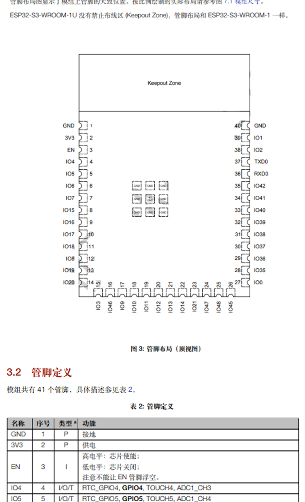
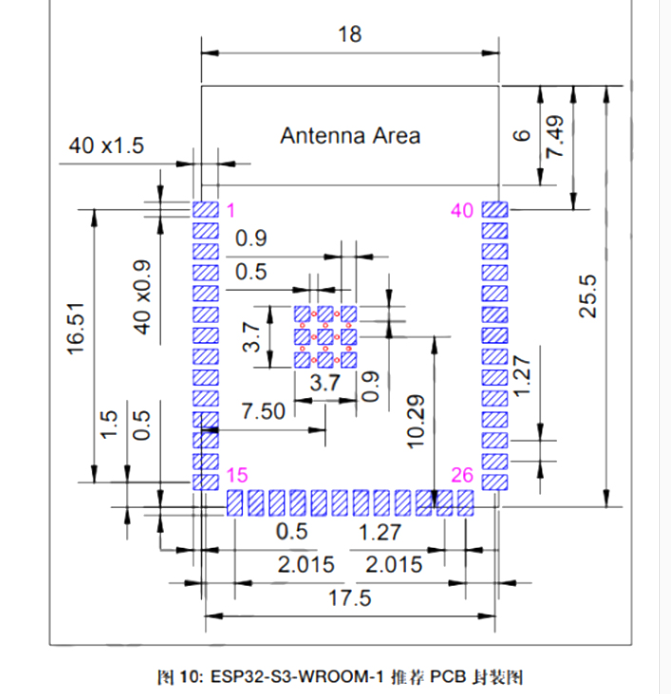
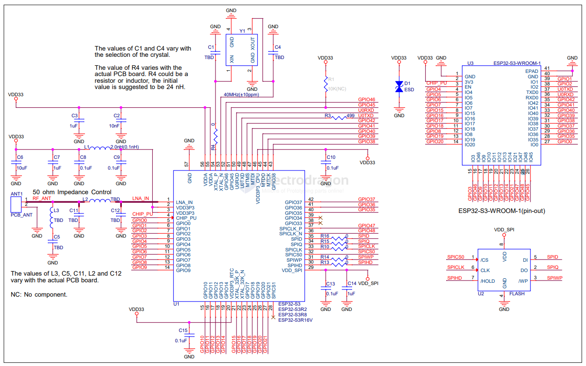
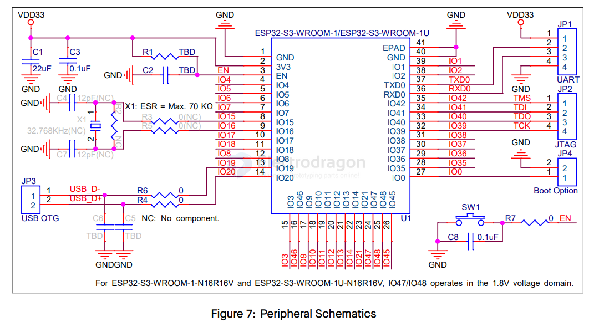

# ESP32-S3-WROOM-1-dat

- [[ESP32-S3-dat]] - [[ESP32-S3-app-dat]]

- ESP32-S3-WROOM-1

- ESP32-S3-WROOM-1 D2N8
- ESP32-S3-WROOM-1 D2N8 R2
- ESP32-S3-WROOM-1 D2N8 R8

https://www.espressif.com.cn/sites/default/files/documentation/esp32-s3-wroom-1_wroom-1u_datasheet_en.pdf

- [[esp32-s3-wroom-1_datasheet.pdf]]

total pins 40

## Module SCH 

## Peripheral Schematics

## pis template 

- [[ESP32-APP-dat]] - [[OV3660-dat]] - chip pin [[ESP32-S3-chip-DAT]]

| L    |       | M    |       | R    |       |
| ---- | ----- | ---- | ----- | ---- | ----- |
| GND  |       | 103  | strap | GND  |       |
| 3V3  |       | 1046 | strap | I01  |       |
| EN   |       | 109  |       | I02  |       |
| 104  |       | 1010 |       | TXDO |       |
| 105  |       | 1011 |       | RXD0 |       |
| 106  |       | 1012 |       | I042 |       |
| 107  |       | 1013 |       | I041 |       |
| 1015 | 32K_P | 1014 |       | I040 |       |
| 1016 | 32K_N | 1021 |       | I039 |       |
| 1017 |       | 1047 |       | I038 |       |
| 1018 |       | 1048 |       | I037 |       |
| 108  |       | 1045 | strap | I036 |       |
| 1019 | USB   |      |       | I035 |       |
| 1020 | USB   |      |       | I00  | flash |

## Pin definitions

- [[ESP32-S3-HDK-dat]]

function template 

| No. | Name | Type  | cam | ADC | SPI          | note                   | Functions                                                          |
| --- | ---- | ----- | --- | --- | ------------ | ---------------------- | ------------------------------------------------------------------ |
| 1   | GND  | P     |     |     |              |                        | Ground                                                             |
| 2   | 3V3  | P     |     |     |              |                        | Power supply (3.3 V)                                               |
| 3   | EN   | I     |     |     |              |                        | Chip enable (active high). Low: power‑down. Do not leave floating. |
| 4   | IO4  | I/O/T | y   | y   |              |                        | RTC_GPIO4, GPIO4, TOUCH4, ADC1_CH3                                 |
| 5   | IO5  | I/O/T | y   | y   |              |                        | RTC_GPIO5, GPIO5, TOUCH5, ADC1_CH4                                 |
| 6   | IO6  | I/O/T | y   | y   |              |                        | RTC_GPIO6, GPIO6, TOUCH6, ADC1_CH5                                 |
| 7   | IO7  | I/O/T | y   | y   |              |                        | RTC_GPIO7, GPIO7, TOUCH7, ADC1_CH6                                 |
| 8   | IO15 | I/O/T | y   | y   |              |                        | RTC_GPIO15, GPIO15, U0RTS, ADC2_CH4, XTAL_32K_P                    |
| 9   | IO16 | I/O/T | y   | y   |              |                        | RTC_GPIO16, GPIO16, U0CTS, ADC2_CH5, XTAL_32K_N                    |
| 10  | IO17 | I/O/T | y   | y   |              |                        | RTC_GPIO17, GPIO17, U1TXD, ADC2_CH6                                |
| 11  | IO18 | I/O/T | y   | y   |              |                        | RTC_GPIO18, GPIO18, U1RXD, ADC2_CH7, CLK_OUT3                      |
| 12  | IO8  | I/O/T | y   | y   | subSPI       |                        | RTC_GPIO8, GPIO8, TOUCH8, ADC1_CH7, SUBSPICS1                      |
| 13  | IO19 | I/O/T |     | y   |              | USB_D–                 | RTC_GPIO19, GPIO19, U1RTS, ADC2_CH8, CLK_OUT2                      |
| 14  | IO20 | I/O/T |     | y   |              | USB_D+                 | RTC_GPIO20, GPIO20, U1CTS, ADC2_CH9, CLK_OUT1                      |
| 15  | IO3  | I/O/T |     | y   |              | strap=~                | RTC_GPIO3, GPIO3, TOUCH3, ADC1_CH2                                 |
| 16  | IO46 | I/O/T |     |     |              | strap=0                | GPIO46                                                             |
| 17  | IO9  | I/O/T | y   |     | subSPI, fSPI |                        | RTC_GPIO9, GPIO9, TOUCH9, ADC1_CH8, FSPIHD, SUBSPIHD               |
| 18  | IO10 | I/O/T |     | y   | subSPI, fSPI |                        | RTC_GPIO10, GPIO10, TOUCH10, ADC1_CH9, FSPICS0, FSPIIO4, SUBSPICS0 |
| 19  | IO11 | I/O/T |     | y   | subSPI, fSPI |                        | RTC_GPIO11, GPIO11, TOUCH11, ADC2_CH0, FSPID, FSPIIO5, SUBSPID     |
| 20  | IO12 | I/O/T |     | y   | subSPI, fSPI |                        | RTC_GPIO12, GPIO12, TOUCH12, ADC2_CH1, FSPICLK, FSPIIO6, SUBSPICLK |
| 21  | IO13 | I/O/T |     | y   | subSPI, fSPI |                        | RTC_GPIO13, GPIO13, TOUCH13, ADC2_CH2, FSPIQ, FSPIIO7, SUBSPIQ     |
| 22  | IO14 | I/O/T | y   | y   | subSPI, fSPI |                        | RTC_GPIO14, GPIO14, TOUCH14, ADC2_CH3, FSPIWP, FSPIDQS, SUBSPIWP   |
| 23  | IO21 | I/O/T | y   |     |              |                        | RTC_GPIO21, GPIO21                                                 |
| 24  | IO47 | I/O/T |     |     | subSPI, SPI  |                        | SPICLK_P_DIFF, GPIO47, SUBSPICLK_P_DIFF                            |
| 25  | IO48 | I/O/T |     |     | subSPI, SPI  | onboard [[WS2812-dat]] | SPICLK_N_DIFF, GPIO48, SUBSPICLK_N_DIFF                            |
| 26  | IO45 | I/O/T |     |     |              | strap=0                | GPIO45                                                             |
| 27  | IO0  | I/O/T |     |     |              | strap=1                | RTC_GPIO0, GPIO0                                                   |
| 28  | IO35 | I/O/T |     |     | subSPI, fSPI | onboard [[LED-dat]]    | GPIO35, FSPIIO6, FSPID, SUBSPID                                    |
| 29  | IO36 | I/O/T |     |     | subSPI, fSPI |                        | GPIO36, FSPIIO7, FSPICLK, SUBSPICLK                                |
| 30  | IO37 | I/O/T |     |     | subSPI, fSPI |                        | GPIO37, FSPIDQS, FSPIQ, SUBSPIQ                                    |
| 31  | IO38 | I/O/T |     |     | subSPI, fSPI |                        | GPIO38, FSPIWP, SUBSPIWP                                           |
| 32  | IO39 | I/O/T |     |     | subSPI       | JTAG                   | MTCK, GPIO39, CLK_OUT3, SUBSPICS1                                  |
| 33  | IO40 | I/O/T |     |     |              | JTAG                   | MTDO, GPIO40, CLK_OUT2                                             |
| 34  | IO41 | I/O/T |     |     |              | JTAG                   | MTDI, GPIO41, CLK_OUT1                                             |
| 35  | IO42 | I/O/T |     |     |              | JTAG                   | MTMS, GPIO42                                                       |
| 36  | RXD0 | I/O/T |     |     |              | UART0                  | U0RXD, GPIO44, CLK_OUT2                                            |
| 37  | TXD0 | I/O/T |     |     |              | UART0                  | U0TXD, GPIO43, CLK_OUT1                                            |
| 39  | IO1  | I/O/T | y   | y   |              |                        | RTC_GPIO1, GPIO1, TOUCH1, ADC1_CH0                                 |
| 38  | IO2  | I/O/T | y   | y   |              |                        | RTC_GPIO2, GPIO2, TOUCH2, ADC1_CH1                                 |
| 40  | GND  | P     |     |     |              |                        | Ground                                                             |
| 41  | EPAD | P     |     |     |              |                        | Exposed pad, GND                                                   |

## ref 

- [[ESP32-S3-module-dat]]