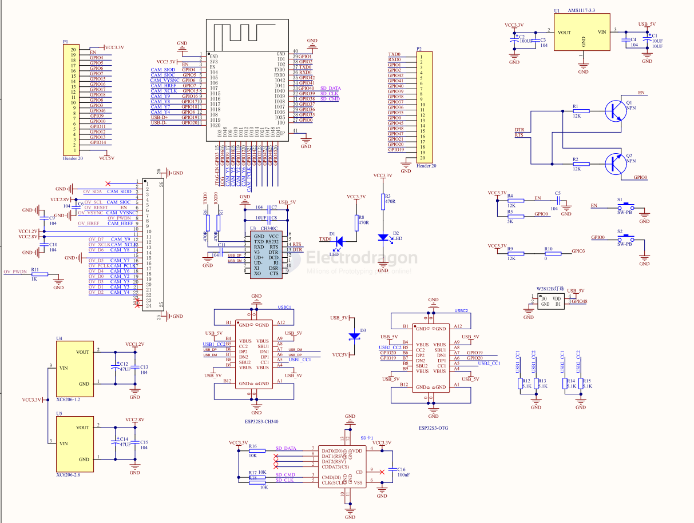
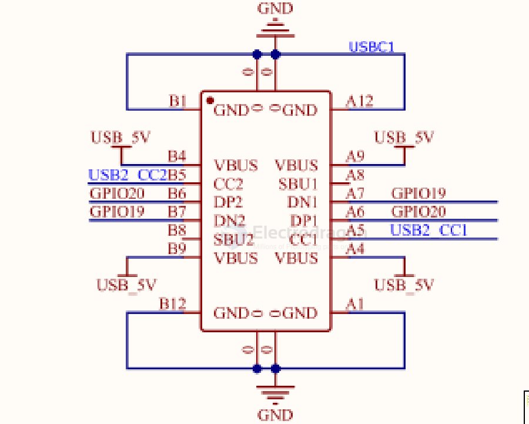
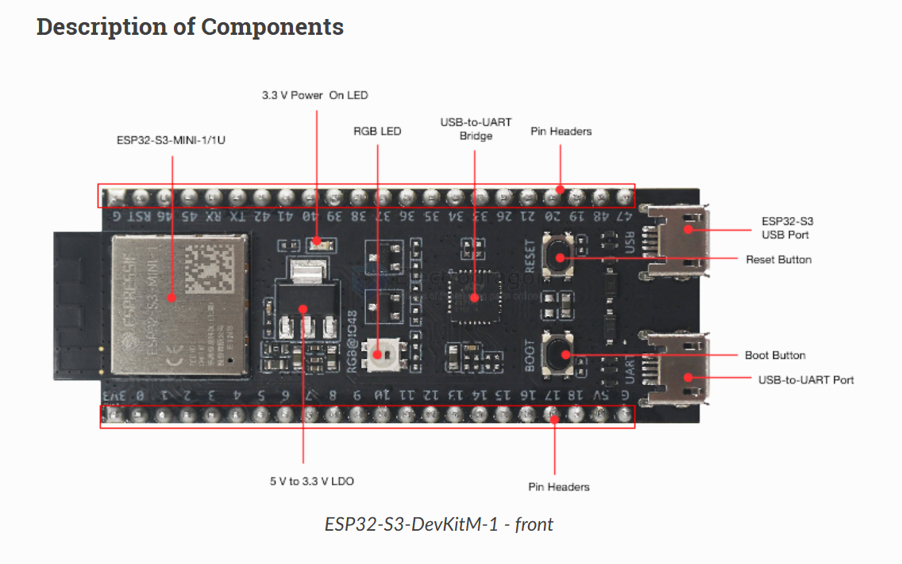
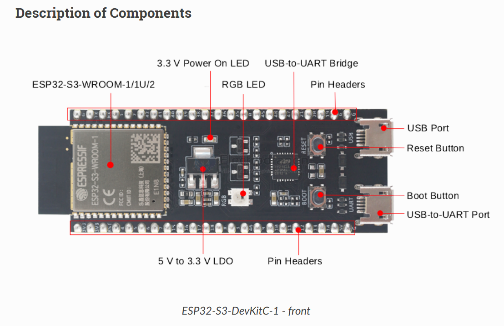
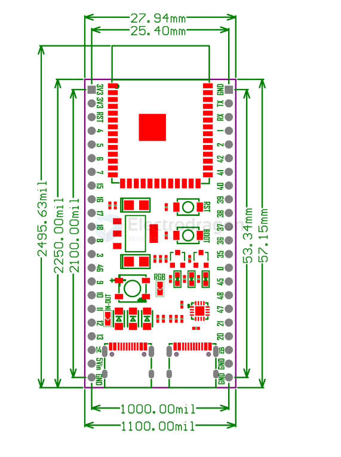

# ESP32-S3-Board-DAT

## Cloned Core Board SCH 

- [[NWI1243-dat]]

## Cloned Core Board SCH with CAM 

- GPIO 3 == pull-up 
- GPIO 35 == LED 
- EN == button, pull-up, filter-cap 
- IO0 == button, pull-up

## peripharals 

- [[WS2812-dat]], - [[USB-dat]]

## USB OTG 

IO19, IO20, CC1 CC2 pull-down 

## dev board 

- [[NWI1243-dat]]

###  official ESP32-S3-DevKitM-1

- pin = 2x22 = 44 pins 
- available GPIOs = 44 - 5 = 39 pins 

###  official ESP32-S3-DevKitC-1

https://docs.espressif.com/projects/esp-dev-kits/en/latest/esp32s3/esp32-s3-devkitc-1/index.html

## Other DEV board for reference 

## ref 

- [[Arduino-ESP32-dat]]