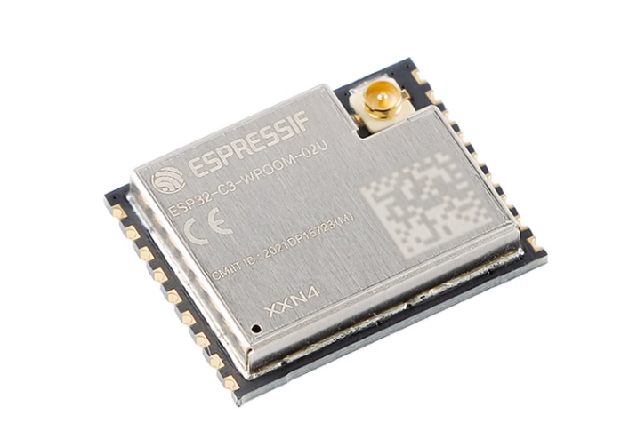
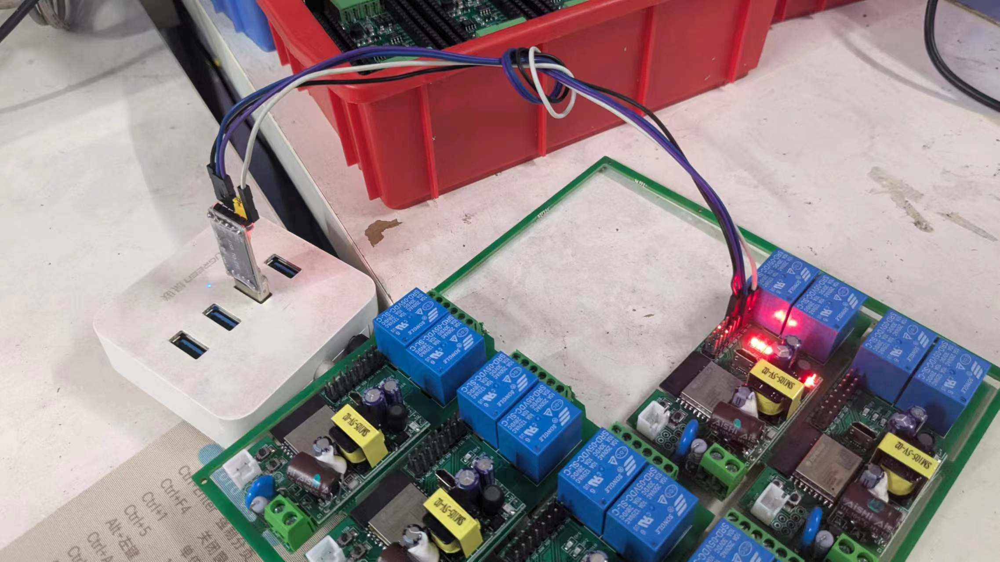
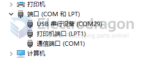
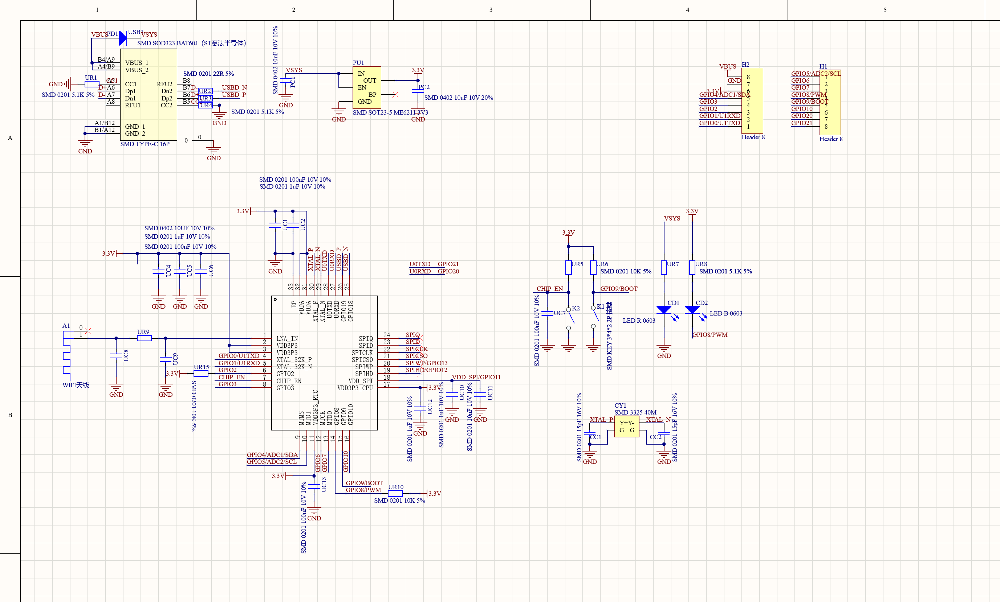
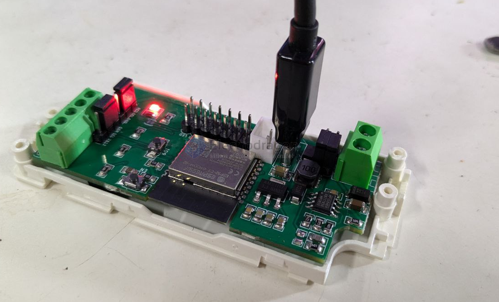

# ESP32-C3 DAT
    - RISC-V 
    - 160MHz 
    - RAM：400KB
    - QFN32_5x5

## Chip 

- ESP32-C3FH4 QFN-32 

- [[ESP32-­C3-­WROOM-0­2-DAT]]

## IPEX Antenna Version 

- information regarding [[conn-IPEX-dat]]
- [[antenna-DAT]]

## ESP32-C3 Chip Info 

- chip page 
- https://www.espressif.com/en/products/socs/esp32-c3
- CN DS
- https://github.com/Edragon/ESP32/blob/master/ESP32-C3/esp32-c3_datasheet_cn.pdf
- EN DS
- https://www.espressif.com/sites/default/files/documentation/esp32-c3_datasheet_en.pdf
- Reference manual
- https://www.espressif.com/sites/default/files/documentation/esp32-c3_technical_reference_manual_en.pdf

## ESP32-C3 Boards 

- [[ESP32-C3-DAT]] 

- [[NWI1239-dat]] - [[ESP32-­C3-­WROOM-0­2-DAT]]
- https://w2.electrodragon.com/gollum/search?q=ESP32-­C3-­WROOM-­02-DAT.md

- [[ESP32-C3-Mini-1-DAT]]

- [[ESP-C3-32S-dat]]

- [[ESP-C3-12F-dat]]

| models             | lifetime | Compatible      |
| ------------------ | -------- | --------------- |
| [[ESP-C3-12F-dat]] | x        | [[ESP-12f-dat]] |

products - 
- [[NWI1126-DAT]]

## Software 

- [[ESP-SDK-dat]]

### Arduino Setup 

* arduino json install 
* IDF - Secondary development SDK source code address：https://github.com/espressif/esp-idf
* Find ESP32-C3 DEV board in development branch version
* Setup board 
  * Board: ESP32C3 DEV Board
  * Upload Speed: 921600
  * CPU Frequency: 160Mhz (WIFI)
  * Flash Frequency: 40Mhz
  * Flash Mode: QIO
  * Flash Size: ?
  * Partion Scheme: Default 4MB with Spiffs
  * Core Debug Level: None

## Open Issues

I2C
* https://github.com/espressif/arduino-esp32/issues/5478

## Boot Log 

If you have a serial USB-TTL bridge board or cable, you can read following debug output from the serial

    ESP32-C3S

    ESP-ROM:esp32c3-api1-20210207
    Build:Feb  7 2021
    rst:0x1 (POWERON),boot:0x7 (DOWNLOAD(USB/UART0/1))
    waiting for download

    ESP32-C3-12F

    ESP-ROM:esp32c3-api1-20210207
    Build:Feb  7 2021
    rst:0x1 (POWERON),boot:0x0 (USB_BOOT)
    wait usb download

## ESP32-C3 Enter into Flash Mode

- Connect wiring first, TXD->RXD, RXD->TXD, 5V, GND
- Hold down IO9 
- Press EN or RST button to restart (re-power) the module
- Now it is enter into flash mode 

## Hardware Flashing 

- notice [[DPR1039-dat]] more stable than common PL2303HX 

## dev board 

- ESP32 C3 super mini 

- [[ESP32-C3-USB-dat]]

## ref 

- [[ESP32-C3]] 