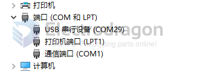

# ESP32-C3-USB-dat

https://stackoverflow.com/questions/77141547/serial-monitoring-esp32c3

After a long debugging session with an ESP32-C3 Supermini, I have the following additional suggestions / information:

- Select this board in the IDE: ESP32C3 dev module
- This should be enabled in the IDE: USB CDC On Boot: "Enabled", however, the JTAG adapter should remain disabled.
- Serial.setTxTimeoutMs(0) may help if no serial monitor is active. See: https://github.com/espressif/arduino-esp32/pull/7583 . This can be used only if USB CDC On Boot is enabled.
- Using Serial.flush may cause the application to hang. See: https://github.com/espressif/arduino-esp32/issues/9172

## USB 

- default as a comm port, and power supplied 

- Flash Using USB
The USB on the ESP32-C3 uses the GPIO19 for D+ and GPIO18 for D-. The ESP32-C3 supports only USB CDC and JTAG. If you are flashing for the first time, you need to get the ESP32-C3 into the download mode manually. To do so, press and hold the BOOT button and then press the RESET button once.

- [[USB-dat]]

- USB console guide - https://docs.espressif.com/projects/esp-idf/en/stable/esp32c3/api-guides/usb-serial-jtag-console.html

The ESP32-C3 supports only USB CDC and JTAG.

If you are flashing for the first time, you need to get the ESP32-C3 into the download mode manually. To do so, press and hold the BOOT button and then press the RESET button once. After that release the BOOT button.
