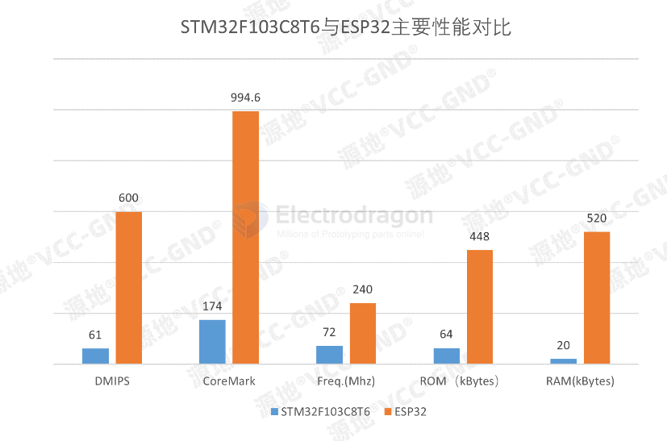
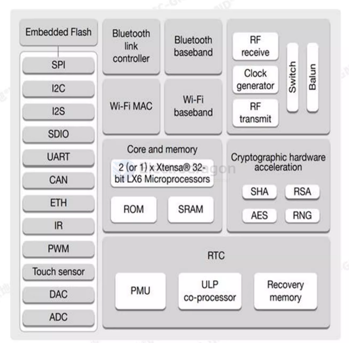

# ESP32 HDK dat

- [[ESP-SDK-dat]]
  
- [[ESP32-modules-dat]] - [[ESP32-WROOM-DAT]]

### RMT

- RMT_SIG_IN0~7
- Any GPIO Pins
- Eight channels for an IR transmitter and
- RMT_SIG_OUT0~7 receiver of various waveforms

- [[infrared-dat]]

### Functions 

- [[interface-dat]]

- use [[PDM-dat]] instead of [[I2S-dat]] on [[ESP32-S3-dat]]

- [[ESP32-DAC-dat]] - [[ESP32-I2C-dat]] - [[esp32-serial-dat]] - [[esp32-gpios-dat]] - [[esp32-usb-dat]] - [[ESP32-SPI-dat]] - [[ESP32-I2S-dat]] - [[sd-dat]]

ref 

- https://electropeak.com/learn/full-guide-to-esp32-pinout-reference-what-gpio-pins-should-we-use/
- https://randomnerdtutorials.com/esp32-pinout-reference-gpios/

## NC Pins 

V3 Chips 
-  Pins GPIO6 to GPIO11 on the ESP32-D0WD-V3/ESP32-D0WDR2-V3 chip are connected to the SPI flash integrated on the module and are not led out.

V2 Chips 
- Pins SCK/CLK, SDO/SD0, SDI/SD1, SHD/SD2, SWP/SD3, and SCS/CMD, i.e. GPIO6 to GPIO11 are used to connect to the module integrated SPI flash, not recommended for other functions.

## Module Compare 

## Diagram 

## boot mode 

### Table 3-1. Default Configuration of Strapping Pins

- from esp32 chip datasheet 

| Strapping Pin | note | Default Configuration Bit | Value |
| ------------- | ---- | ------------------------- | ----- |
| GPIO0         | 0    | Pull-up                   | 1     |
| GPIO2         | 2    | Pull-down                 | 0     |
| MTDI          | 12   | Pull-down                 | 0     |
| MTDO          | 15   | Pull-up                   | 1     |
| GPIO5         | 5    | Pull-up                   | 1     |

### Table 6: Chip Boot Mode Control

- from esp32 wroom module datasheet 
  
| Boot Mode                | GPIO0 | GPIO2     |
| ------------------------ | ----- | --------- |
| SPI Boot Mode            | 1     | Any value |
| Joint Download Boot Mode | 0     | 0         |

## documentas 

- [[esp32_technical_reference_manual_en_v5.2.pdf]]

- [[ESP32_Series_datasheet_v4.7.pdf]]

## ref

- [[BTB-dat]]

- [[ESP32-HDK]]

EMAC = Ethernet 