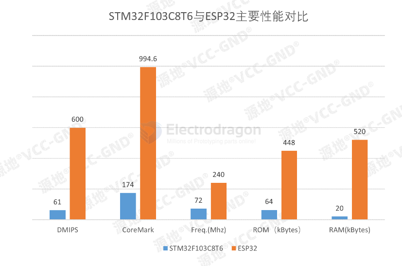
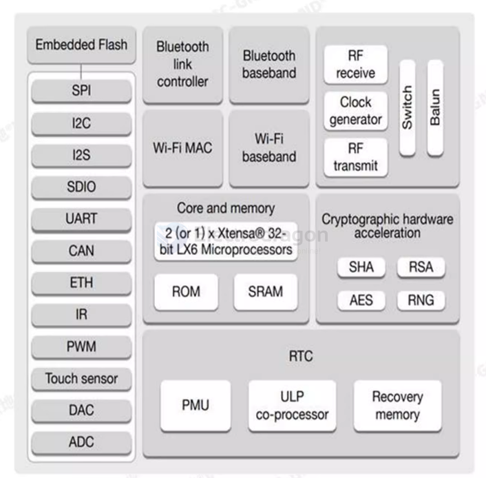
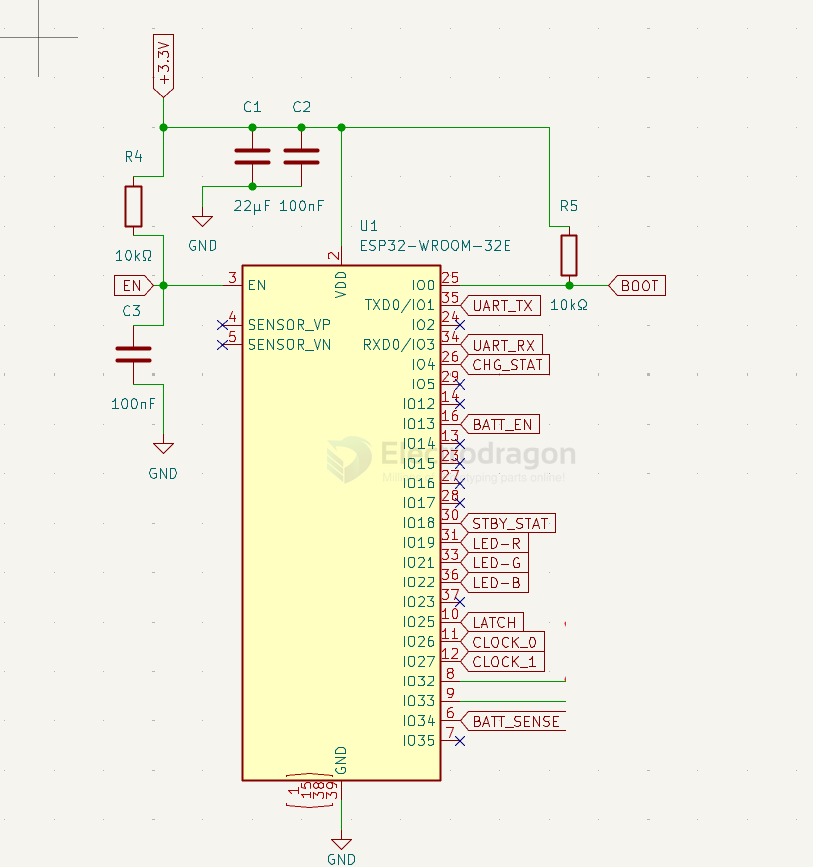

# ESP32-HDK-dat

- [[ESP-SDK-dat]]
  
- [[ESP32-modules-dat]] - [[ESP32-board-dat]]

- [[ESP32-chip-error-dat]]

- [[ESP-prog-dat]]

- [[ESP32-ADC-dat]] - [[ESP32-DAC-dat]] - [[ESP32-I2C-dat]] - [[esp32-serial-dat]] - [[esp32-gpios-dat]] - [[esp32-usb-dat]] - [[ESP32-SPI-dat]] - [[ESP32-I2S-dat]] - [[ESP32-PDM-dat]] 

- [[ESP32-dat]] - [[HDK-dat]] - [[peripherals-dat]] - [[ADC-dat]] - [[DAC-dat]] - [[I2C-dat]] - [[serial-dat]] - [[gpio-dat]] - [[usb-sdk-dat]] - [[SPI-dat]] - [[I2S-dat]] - [[PDM-dat]] - [[DMA-dat]] - [[ISR-dat]]

- [[GPIO-dat]]

## hardware design guidelines 

- [esp-hardware-design-guidelines](https://docs.espressif.com/projects/esp-hardware-design-guidelines/en/latest/esp32s3/schematic-checklist.html#overview)

## pins 

- EN
- SVP
- SVN

- IO0 - `strapping!`
- TXD
- IO2
- RXD
- IO4
- IO5
GPIO6–11: used for flash
- IO12 - `strapping!` - ADC2_CH5 / Touch Sensor 5 / HSPI-Q / MTDI
- IO13 - ADC2_CH4 / Touch Sensor 4 / JTAG_MTCK
- IO14 - ADC2_CH6 / Touch Sensor 6 / JTAG_MTMS
- IO15 - `strapping!` / MTDO 
- IO16
- IO17
    - IO16, IO17 — on some modules, these are used for PSRAM chip select signals.
- IO18
- IO19
- IO21
- IO22
    - IO22, IO21 — commonly used for I2C (SDA/SCL) on many dev boards.
- IO23
    - IO18 (HSPI_CLK), IO19 (HSPI_MISO), IO23 (HSPI_MOSI) — be aware of SPI bus conflicts if using external SPI devices.
- IO25 - DAC1
- IO26 - DAC2
- IO27
    - IO12, IO13, IO14, IO15, IO16, IO17, IO18, IO19, IO21, IO22, IO23, IO25, IO26, IO27 are all `ADC2` channels.
    - `ADC2` cannot be used when WiFi is enabled — the WiFi subsystem takes over the ADC2 peripheral.
    - If you need analog readings while WiFi is active, use `ADC1` pins (IO32–IO39) instead.
- IO32 - 32.768 kHz `XTAL` in/out
- IO33 - 32.768 kHz `XTAL` in/out
- IO34 - ADC1_CH6 
- IO35 - ADC1_CH7 
    - IO34, IO35 (also IO36, IO37, IO38, IO39) — input-only pins with no internal pull-up/pull-down resistors.
    - Cannot be used as outputs (e.g., cannot drive an LED or act as SCL).
    - If used as inputs, add external pull-up/pull-down resistors if needed.

### RMT

- RMT_SIG_IN0~7
- Any GPIO Pins
- Eight channels for an IR transmitter and
- RMT_SIG_OUT0~7 receiver of various waveforms

- [[infrared-dat]]

### Functions 

- [[interface-dat]]

- use [[PDM-dat]] instead of [[I2S-dat]] on [[ESP32-S3-dat]]

- [[ESP32-DAC-dat]] - [[ESP32-I2C-dat]] - [[esp32-serial-dat]] - [[ESP32-GPIOs-dat]] - [[esp32-usb-dat]] - [[ESP32-SPI-dat]] - [[ESP32-I2S-dat]] - [[sd-dat]]

## RAM 

### ESP32 DRAM Configuration

ESP32 has **520 KB SRAM** split into multiple regions:

- **DRAM0**: 192 KB - Main data RAM for variables and heap
- **DRAM1**: 128 KB - Instruction RAM cache (can be used as data RAM)  
- **DRAM2**: 200 KB - Used by WiFi/Bluetooth stack and DMA buffers

**Key Points:**
- **Internal DRAM**: Fast access, used for critical data and stack
- **External PSRAM**: Optional 4-8MB external RAM (via SPI)
- **DMA Capable**: Some regions support DMA operations
- **Shared Memory**: WiFi/BT libraries consume significant DRAM

**Memory Management:**
- Heap allocation uses internal DRAM first
- Large buffers should use PSRAM when available
- Use `esp_get_free_heap_size()` to monitor usage

- [[memory-dat]]

## Module Compare 

## Diagram 

## boot mode 

### Table 3-1. Default Configuration of Strapping Pins

- from esp32 chip datasheet 

| Strapping Pin | note | Default Configuration Bit | Value |
| ------------- | ---- | ------------------------- | ----- |
| GPIO0         | 0    | Pull-up                   | 1     |
| GPIO2         | 2    | Pull-down                 | 0     |
| MTDI          | 12   | Pull-down                 | 0     |
| MTDO          | 15   | Pull-up                   | 1     |
| GPIO5         | 5    | Pull-up                   | 1     |

### Table 6: Chip Boot Mode Control

- from esp32 wroom module datasheet 
  
| Boot Mode                | GPIO0 | GPIO2     |
| ------------------------ | ----- | --------- |
| SPI Boot Mode            | 1     | Any value |
| Joint Download Boot Mode | 0     | 0         |

## documentas 

- [[esp32_technical_reference_manual_en_v5.2.pdf]]

- [[ESP32_Series_datasheet_v4.7.pdf]]

### Shields (stack boards) 
- [[NWI1245-dat]]

### In Development
- [[ESP32-ISO-dat]]

## APP SCH 

build 1 

## ref

## Chip Info 

### datasheet

- chip datasheet
- https://www.espressif.com.cn/sites/default/files/documentation/esp32_datasheet_en.pdf

- esp32 technical_reference_manual CN
- https://www.espressif.com/sites/default/files/documentation/esp32_technical_reference_manual_cn.pdf

- ESP32 Chip Revision v3.0 - User Guid
- https://www.espressif.com/sites/default/files/documentation/esp32_chip_revision_v3_0_user_guide_en.pdf

- [[BTB-dat]]

- [[ESP32-HDK]]

EMAC = Ethernet 

## ref 

- https://electropeak.com/learn/full-guide-to-esp32-pinout-reference-what-gpio-pins-should-we-use/
- https://randomnerdtutorials.com/esp32-pinout-reference-gpios/

