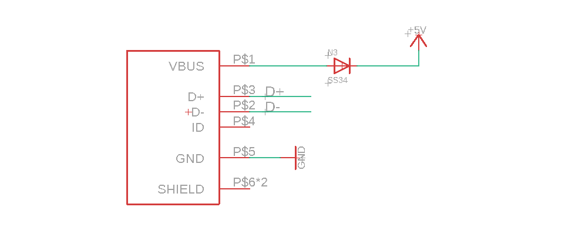

# ESP32-USB-dat

- [[USB-OTG-dat]]

## USB pins 

## Arduino Code tested with [[ESP32-­C3-­WROOM-­02-DAT]] 
- not working
- maybe hardware problem, or code problem, or need further test
- consider it is not working if you buy.

## Arduino Code tested with [[ESP32-S2]] 
- working

## Boards 

- [[NWI1119-DAT]]
- [[NWI1126-DAT]]
- [[NWI1235-DAT]] - [[ESP32-S2]]

