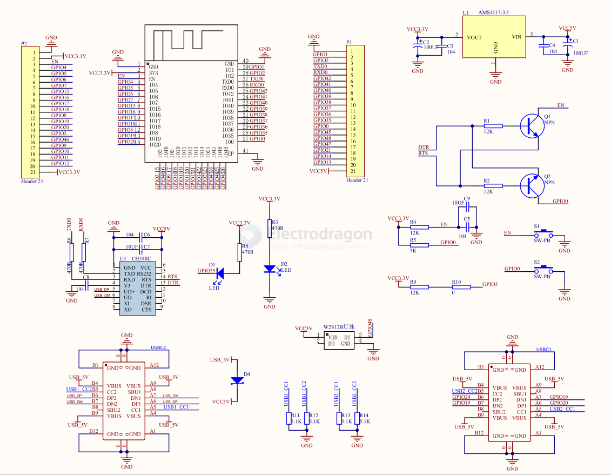
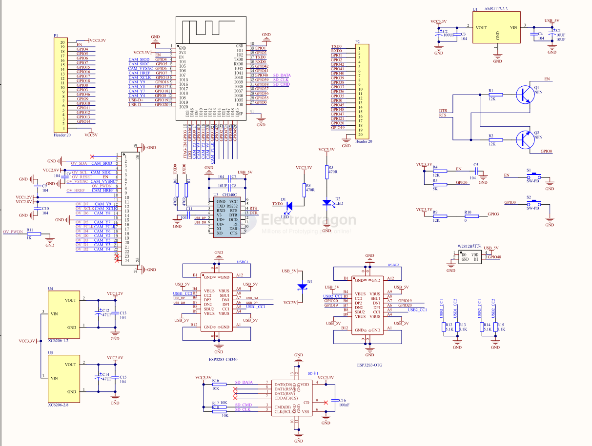
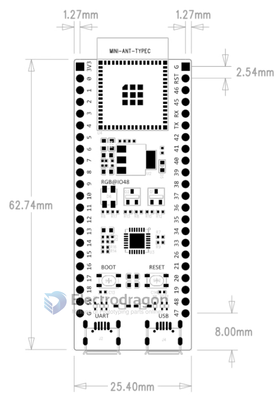

# ESP32-S3-Board-DAT

## Cloned Core Board SCH 

## Cloned Core Board SCH with CAM 

## dev board 

- [[NWI1243-dat]]

###  official ESP32-S3-DevKitM-1

- pin = 2x22 = 44 pins 
- available GPIOs = 44 - 5 = 39 pins 

