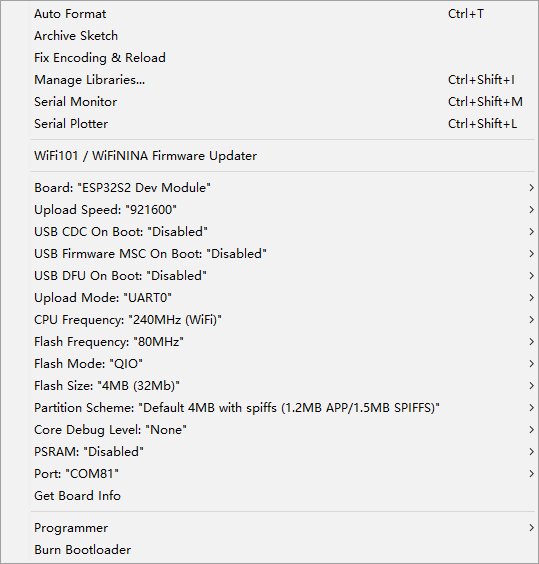
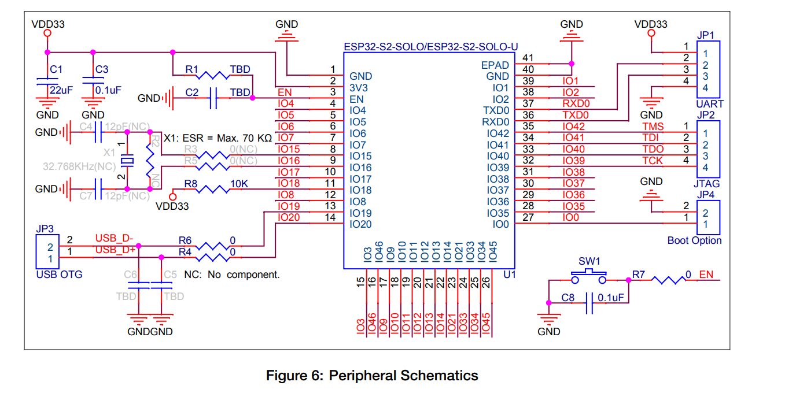

# ESP32-S2-dat

- single core

- ESP32-S2FH4

 Ordering CodeEmbedded FlashEEmbedded PSRAM Ambient Temperature (°C)
| Ordering Code   | Embedded Flash | Embedded PSRAM | Ambient Temperature (°C) |
|----------------|----------------|---------------|-------------------------|
| ESP32-S2       |                |               | 40~105                  |
| ESP32-S2FH2    | 2MB            |               | 40~105                  |
| ESP32-S2FH4    | 4MB            |               | 40~105                  |
| ESP32-S2FN4R2  | 4MB            | 2MB           | 40~85                   |
| ESP32-S2R2     |                | 2MB           | 40~85                   |

## Common module

Official
- ESP32-S2-SOLO
- ESP32-S2-SOLO-2

EOL 

- ESP32-S2-WROOM
- ESP32-S2-WROOM-I
* [ESP32-S2-WROOM DS](https://www.espressif.com/sites/default/files/documentation/esp32-s2-wroom_esp32-s2-wroom-i_datasheet_cn.pdf)
* [ESP32-S2-WROVER DS](https://www.espressif.com/sites/default/files/documentation/esp32-s2-wrover_esp32-s2-wrover-i_datasheet_cn.pdf)

* ESP32-S2-SOLO (old? )
* ESP32-S2-MINI (old? )

* Module Compare Guide - https://www.espressif.com/zh-hans/products/modules

Other

- [[ESP-12K-dat]] - [[NWI1226-dat]]

## Compare ESP32 VS ESP32-S2

| Module                | ESP32                                     | ESP32-S2                                                             |
| --------------------- | ----------------------------------------- | -------------------------------------------------------------------- |
| Microcontroller       | Xtensa dual-core 32-bit LX6               | Xtensa single-core 32-bit LX7                                        |
| Clock Frequency       | 160/240 MHz                               | 160/240 MHz                                                          |
| Co-processor          | ULP                                       | ULP (RISC-V)                                                         |
| SRAM                  | 520 KB                                    | 320 KB                                                               |
| ROM                   | 448 KB                                    | 128 KB                                                               |
| RTC Memory            | 16 KB                                     | 16 KB                                                                |
| External SPIRAM       | Up to 16MB                                | Up to 128MB                                                          |
| External Flash        | No                                        | Up to 1G                                                             |
| Wi-Fi (802.11 b/g/n)  | HT20                                      | HT20                                                                 |
| ESP-MESH              | Yes                                       | Yes                                                                  |
| Bluetooth             | BT 4.2 BR/EDR & BLE                       | No                                                                   |
| Ethernet              | 10/100 Mbps                               | No                                                                   |
| CAN                   | 2.0                                       | No                                                                   |
| Time of Flight        | No                                        | 43                                                                   |
| GPIO (total)          | 34                                        | No                                                                   |
| Touch Sensors         | 10                                        | 14                                                                   |
| SPI                   | 4                                         | 4 (OSPI)                                                             |
| I2C                   | 2                                         | 2                                                                    |
| I2S                   | 2                                         | 1                                                                    |
| UART                  | 3                                         | 2                                                                    |
| ADC                   | 18 (12-bit)                               | 20 (12-bit)                                                          |
| DAC                   | 2 (8-bit)                                 | 2 (8-bit)                                                            |
| PWM (soft)            | 16                                        | 8                                                                    |
| SDMMC                 | Yes                                       | No                                                                   |
| RMT (remote control)  | Yes                                       | Yes                                                                  |
| USB OTG               | No                                        | Yes                                                                  |
| LCD Interface         | No                                        | Yes                                                                  |
| Camera Interface      | No                                        | Yes                                                                  |
| Temperature sensor    | Yes                                       | Yes                                                                  |
| Hall sensor           | Yes                                       | No                                                                   |
| Security              | Secure boot Flash encryption 1024-bit OTP | Secure boot Flash encryption 4096-bit OTP                            |
| Crypto                | AES, SHA-2, RSA, ECC, RNG                 | AES-128/192/256, SHA-2, RSA, RNG, HMAC, Digital Signature            |
| Low Power Consumption | 10uA deep sleep                           | Automatic RF power management 5uA in idle mode 24uA at 1% duty cycle |

## Prog info

## dev boards

- [ESP32-S2-Kaluga-1](https://docs.espressif.com/projects/esp-idf/zh_CN/latest/esp32s2/hw-reference/esp32s2/user-guide-esp32-s2-kaluga-1-kit.html)

- [[NWI1235-dat]] retired

## ref esp32-s2-solo-u

https://www.espressif.com.cn/sites/default/files/documentation/esp32-s2-solo_esp32-s2-solo-u_datasheet_en.pdf

## ref Documents

[esp32-s2 get-started](https://docs.espressif.com/projects/esp-idf/en/latest/esp32s2/get-started/)
* [esp32-s2 info](https://www.espressif.com/zh-hans/products/socs/esp32-s2)
* Datasheet - https://www.espressif.com/sites/default/files/documentation/esp32-s2_datasheet_en.pdf
* Technical reference manual - https://www.espressif.com/sites/default/files/documentation/esp32-s2_technical_reference_manual_en.pdf

- [[ESP-IDF-dat]] - [[ESP-SDK-dat]]

## SDK arduino manual update 

* Arduino github branch ESP32-S2 https://github.com/espressif/arduino-esp32/tree/esp32s2
* update by tools/get.exe
* copy whole folder into Arduino\hardware\espressif\arduino-esp32-esp32s2
