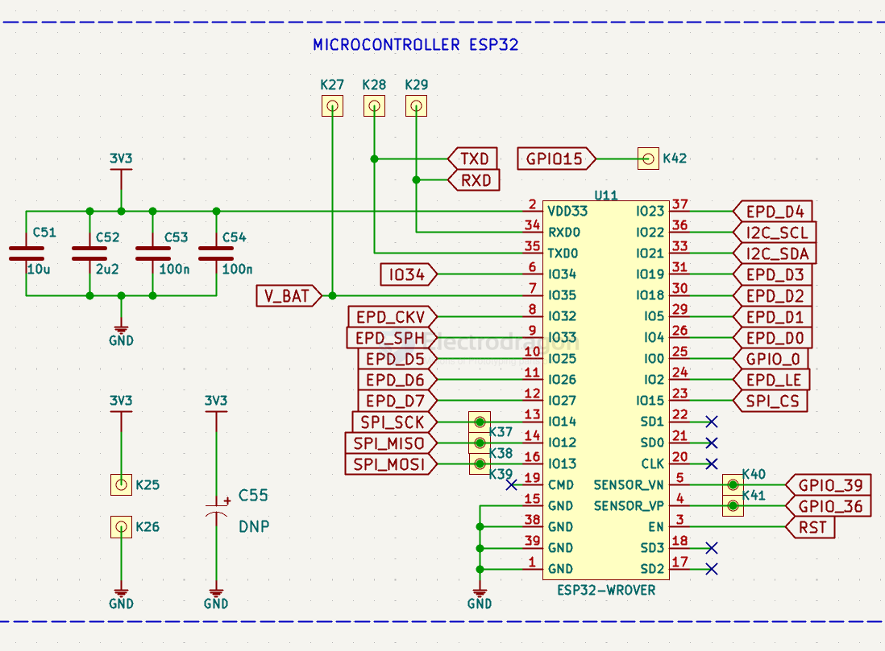
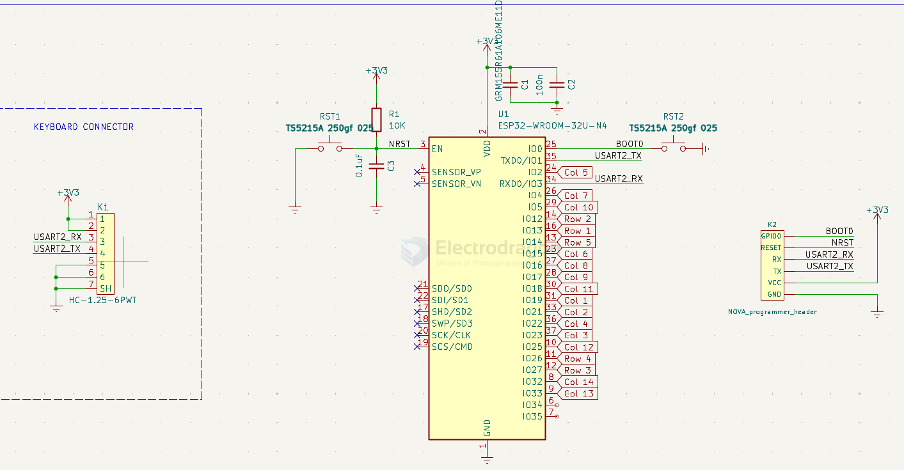

# ESP32-dat 

- [[motor-driver-dat]] - [[motor-driver-design-dat]] - [[logic-level-shifter-dat]] - [[PWM-dat]] - [[ESP32-S3-dat]] - [[ESP32-dat]]

- [[esp32-projects-dat]] - [[esp32-dat]] - [[projects-dat]]

## new chip info 

- [[ESP32-S3-dat]] - [[ESP32-S2-dat]] 

- [[ESP32-C6-dat]] - [[ESP32-C3-dat]] - [[ESP32-C2-dat]] 

- [[ESP32-P4-dat]]

and more at [[espressif-dat]]

- [[ESP32-dat]]

## hardware 

- [[ESP32-dat]] - [[MCU-dat]] - [[peripherals-dat]]

- [[ESP32-HDK-dat]] - [[ESP32-serial-dat]] - [[ESP32-ADC-dat]] - [[ESP32-DAC-dat]] - [[ESP32-I2C-dat]] - [[esp32-serial-dat]] - [[esp32-gpios-dat]] - [[esp32-usb-dat]] - [[ESP32-SPI-dat]] - [[ESP32-I2S-dat]] - [[ESP32-PDM-dat]] - [[ESP32-ISR-dat]] - [[ESP32-DMA-dat]] - [[DMA-dat]]

## ESP32 chip 

- [[ESP32-chip-dat]] - [[ESP32-compare-dat]] - [[ESP32-old-dat]] - [[ESP32-chip-error-dat]]
  
- [[ESP-SDK-dat]] - [[ESP32-SDK-dat]]

- [[ESP32-modules-dat]] - [[ESP32-board-dat]] - [[ESP32-WROOM-dat]] - SCH in [[ESP32-WROOM-32E-dat]] - [[ESP32-module-clone-dat]] - [[ESP32-WROVER-dat]]

## Boards and APP 

- [[IDD1023-dat]] - [[SCM1030-dat]] - [[ESP1000-dat]]

DEV Baords 

- [[NWI1103-dat]] - [[NWI1102-dat]] - [[NWI1101-dat]] - [[NWI1100-dat]] - [[NWI1145-dat]] - [[NWI1206-dat]] 

- [[ESP32-S3-dat]] == [[NWI1243-dat]]

- [[SCM1030-dat]]

- [[LCD-dat]] - [[NWI1241-dat]]

[[epaper-dat]] 

matrix keypad - [[keypad-dat]] - [[PC-dat]] - [[ESP32-dat]] output - [[serial-dat]]

## ref 

- [[ESP32-FAQ-dat]]

- [[esp8266-dat]] - [[ESP8266-SDK-dat]] 

- [[ESP32]]