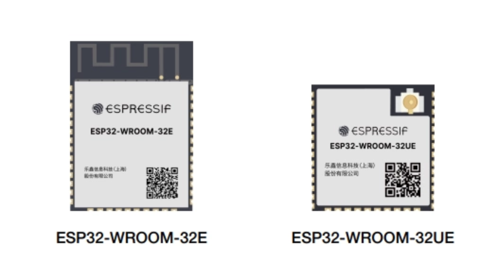
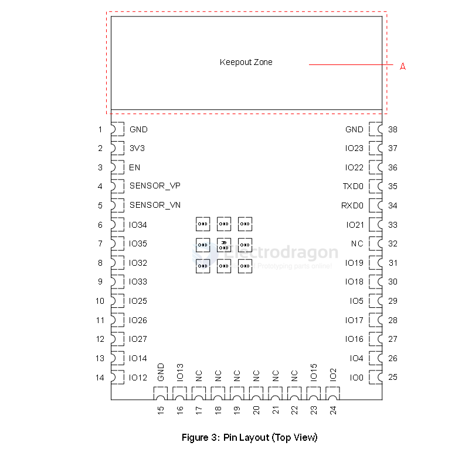

# ESP32-WROOM-32E-dat

- [ESP32-WROOM-32E-DAT EN](https://www.espressif.com/sites/default/files/documentation/esp32-wroom-32e_esp32-wroom-32ue_datasheet_en.pdf)

- [[esp32-wroom-32e_esp32-wroom-32ue_datasheet_en_v1.7.pdf]]

## pin definitions 

| L_Pin     | Func                          | Note | R_Pin | Func      | Note |
| --------- | ----------------------------- | ---- | ----- | --------- | ---- |
| GND       |                               |      | GND   |           |      |
| 3V3       |                               |      | IO23  | HS1, VSPI |      |
| EN        |                               |      | IO22  | VSPI      |      |
| Sensor_VP | adc,                          | I    | TXD0  |           |      |
| Sensor_VN | adc,                          | I    | RXD0  |           |      |
| 34        | adc,                          | I    | IO21  | VSPI      |      |
| 35        | adc,                          | I    | --    |           |      |
| 32        | adc, TP,                      |      | IO19  |           |      |
| 33        | adc, TP, X32                  |      | IO18  | HS1, VSPI |      |
| 25        | adc, DAC                      |      | IO5   | HS1, VSPI |      |
| 26        | adc, DAC                      |      | IO17  | HS1,      |      |
| 27        | adc, TP,                      |      | IO16  | HS1,      |      |
| 14        | adc, TP, HS2, HSPI,           |      | IO4   | adc, HSPI |      |
| 12        | adc, TP, HS2, HSPI, strapping |      | IO0   | adc       |      |
| GND2      |                               |      |
| IO13      | adc, TP, HS2, HSPI            |      |
| x_SD2     | SPI, x_HS1                    |      |
| x_SD3     | SPI, x_HS1                    |      |
| x_CMD     | SPI, x_HS1                    |      |
| x_CLK     | SPI, x_HS1                    |      |
| x_SD0     | SPI, x_HS1                    |      |
| x_SD1     | SPI, x_HS1                    |      |
| IO15      | adc, TP, HS2, HSPI            |      |
| IO2       | adc, TP, HS2, HSPI            |      |
|           |                               |      |
|           |                               |      |
|           |                               |      |
|           |                               |      |

The standard VSPI (default SPI bus) pins for the ESP32 are:

- IO23: VSPI MOSI (Master Out Slave In)
- IO19: VSPI MISO (Master In Slave Out)
- IO18: VSPI SCK (Serial Clock)
- IO5: VSPI CS (Chip Select)

alternative IO22, IO21

The standard HSPI (second SPI bus) pins for the ESP32 are:

- IO13: HSPI MOSI (Master Out Slave In)
- IO12: HSPI MISO (Master In Slave Out)
- IO14: HSPI SCK (Serial Clock)
- IO15: HSPI CS (Chip Select)

Your table also marks IO4 and IO2 with "HSPI," which can be used for alternate HSPI functions. These pins are typically used for SPI communication on the HSPI bus.

On the ESP32-WROOM-32E module, IO6, IO7, IO8, IO9, IO10, and IO11 are typically reserved for the internal SPI flash memory and are not available for general-purpose I/O. 

8-bit spi flash 

The pins HS1_STROBE, HS1_DATA4, HS1_DATA5, HS1_DATA6, and HS1_DATA7 on the ESP32-WROOM-32E are related to the internal SPI flash interface (sometimes called "HSPI" or "HS1" in Espressif documentation). Specifically:

- HS1_STROBE: This is the SPI clock signal for the internal flash (sometimes labeled as CLK).
- HS1_DATA4 to HS1_DATA7: These are data lines used for the SPI flash memory interface, supporting quad-SPI (QIO) mode for faster data transfer.

- [[spi-flash-dat]]

## Module Schematic 32E 

### updates 

internal flash memory 

Pins GPIO6 to GPIO11 on the ESP32-D0WD-V3/ESP32-D0WDR2-V3 chip are connected to the SPI flash integrated on the module and are not led out.

