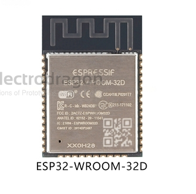
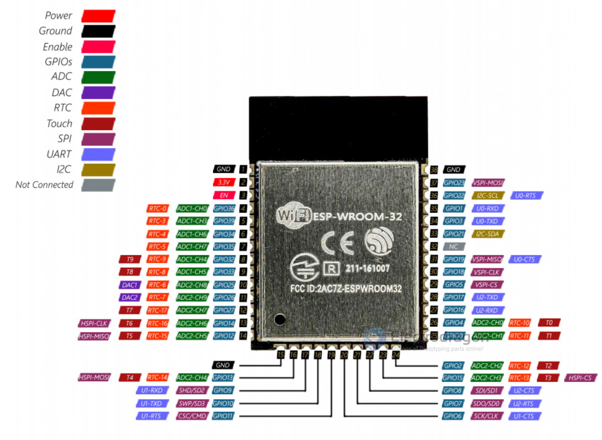

# ESP32-WROOM-DAT

https://www.electrodragon.com/product/wroom-32/

## Version compare 32E / 32D / 32U

The latest version among ESP32-WROOM-32D, ESP32-WROOM-32, ESP32-WROOM-32E, and ESP32-WROOM-32U is the ESP32-WROOM-32E. It uses the newest V3 silicon, offers improved RF performance, and is recommended for new designs.

- [[ESP32-WROOM-32E-dat]]

### ESP32-WROOM-32E and 32UE vs ESP32-WROOM-32D

The ESP32-WROOM-32E is an upgraded version of the ESP32-WROOM-32D. The main differences are:

The 32E uses new V3 silicon, fixing some bugs found in the 32D.

The 32E offers improved RF (Radio Frequency) performance, with better sensitivity, range, and signal stability.

For new purchases, the 32E is recommended, while the 32D is considered obsolete.

Both modules are functionally very similar and pin-to-pin compatible.

### ESP32-WROOM-32D vs ESP32-WROOM-32

The main difference between ESP32-WROOM-32 and ESP32-WROOM-32D is that the 32D is an updated version of the original 32 module. 

ESP32-WROOM-32D features improved RF performance, bug fixes, and is pin-to-pin compatible with the original ESP32-WROOM-32. 

If you are buying new, the 32D is recommended, as the original 32 is considered obsolete. Functionally, they are very similar for most applications.

### 32D 

### 32E 

The ESP32-WROOM-32E and ESP32-WROOM-32D are both modules based on the ESP32 system-on-a-chip (SoC) by Espressif Systems. They are very similar in terms of features and capabilities but have a few key differences.

The main difference between the ESP32-WROOM-32E and ESP32-WROOM-32D lies in their RF (Radio Frequency) performance.

The ESP32-WROOM-32E offers improved RF performance compared to the ESP32-WROOM-32D. It provides better sensitivity, range, and signal stability, making it suitable for applications requiring reliable wireless communication.

If you are looking for more detailed technical specifications and information about the ESP32-WROOM-32E and ESP32-WROOM-32D, you can refer to the official Espressif documentation:
https://www.espressif.com/en/support/documents/technical-documents

The E is the latest WROOM version, using the new V3 silicon. It is a direct upgrade to the 32D that fixes some bugs.

If you're buying new, get the 32E and consider the 32D obsolete. If you're already using 32D, it's going to be functionally identical in every way that likely matters to you so don't worry about it. (ie. It's not worth 'upgrading' to the E unless there is a specific issue you're facing.) See this guide for more info: https://www.espressif.com/sites/default/files/documentation/ESP32_ECO_V3_User_Guide__EN.pdf

### 32U 

The ESP32-WROOM-32U is a version of the ESP32-WROOM-32 series that features a connector for an external antenna (Ipex). This allows for improved wireless performance in certain applications compared to the standard PCB antenna found on other versions. Functionally, it is similar to the 32D, but with the option for an external antenna.

ESP32-WROOM-32U is different from ESP32-WROOM-32D in that ESP32-WROOM-32U integrates a connector to connect an external antenna. 

## Module List 

| version             | Flash        | Suffix | SKU             | Antenna  | Note |
| ------------------- | ------------ | ------ | --------------- | -------- | ---- |
| ESP32-WROOM-32      | 4MB = 32Mb   | --     | [[NWI1110-dat]] | PCB      | end  |
| ESP32-WROOM-32D-N4  | 4MB = 32Mb   | N4     | [[NWI1155-dat]] | PCB      |      |
| ESP32-WROOM-32D-N8  | 8MB = 64Mb   | N8     | [[NWI1194-dat]] | PCB      |      |
| ESP32-WROOM-32D-N16 | 16MB = 128Mb | N16    | [[NWI1195-dat]] | PCB      |      |
| ESP32-WROOM-32U-N4  | 4MB = 32Mb   | N4     | [[NWI1157-dat]] | [[Ipex]] |      |
| ESP32-WROOM-32U-N8  | 8MB = 64Mb   | N8     | [[NWI1196-dat]] | [[Ipex]] |      |
| ESP32-WROOM-32U-N16 | 16MB = 128Mb | N16    | [[NWI1197-DAT]] | [[Ipex]] |      |

- ESP-WROOM-32D/U are compatible with former ESP-WROOM-32, pin-to-pin compatible.

## Functions 

Module interfaces
- SD card, UART, SPI, SDIO, I2C, LED PWM, Motor PWM,
- I2S, IR, pulse counter, GPIO, capacitive touch sensor, ADC,
- DAC, Two-Wire Automotive Interface (TWAI®), compatible
- with ISO11898-1 (CAN Specification 2.0)
- Integrated crystal 40 MHz crystal
- Integrated SPI flash 4 MB

## SCH periperhals 

## Pin Definitions 

ESP32-WROOM-32D

| L_Pin | Func       | Note | M_Pin | Func | Note | R_Pin | Func | Note |
| ----- | ---------- | ---- | ----- | ---- | ---- | ----- | ---- | ---- |
| GND   |            |      | GND2  |      |      | GND   |      |      |
| 3V3   |            |      | IO13  |      |      | IO23  |      |      |
| EN    |            |      | SD2   |      |      | IO22  |      |      |
| 36    | Sensor_VP  | I    | SD3   |      |      | TXD0  |      |      |
| 39    | Sensor_VN  | I    | CMD   |      |      | RXD0  |      |      |
| 34    |            | I    | CLK   |      |      | IO21  |      |      |
| 35    |            | I    | SD0   |      |      | --    |      |      |
| 32    |            |      | SD1   |      |      | IO19  |      |      |
| 33    | XTAL_32K_N |      | IO15  |      |      | IO18  |      |      |
| 25    | DAC        |      | IO2   |      |      | IO5   |      |      |
| 26    | DAC        |      |       |      |      | IO17  |      |      |
| 27    |            |      |       |      |      | IO16  |      |      |
| 14    |            |      |       |      |      | IO4   |      |      |
| 12    | strapping  |      |       |      |      | IO0   |      |      |

## obseleted info 

ESP32-WROOM-32

## Datasheet 

obseleted 
- [ESP32-WROOM-32-DAT EN](https://www.espressif.com.cn/sites/default/files/documentation/esp32-wroom-32_datasheet_en.pdf)

- [ESP32-WROOM-32D-DAT CN](https://www.espressif.com/sites/default/files/documentation/esp32-wroom-32d_esp32-wroom-32u_datasheet_cn.pdf)

6 Peripheral Schematics

## Based Design 

- [[NWI1245-dat]] - [[NWI1206-dat]] - [[NWI1100-dat]]

## ref 

- [[esp-dat]] - [[ESP32-dat]] - [[ESP8266-dat]]

- forum - http://esp32.net/

- [Legacy Wiki Pages ](https://w.electrodragon.com/w/Category:ESP32)

