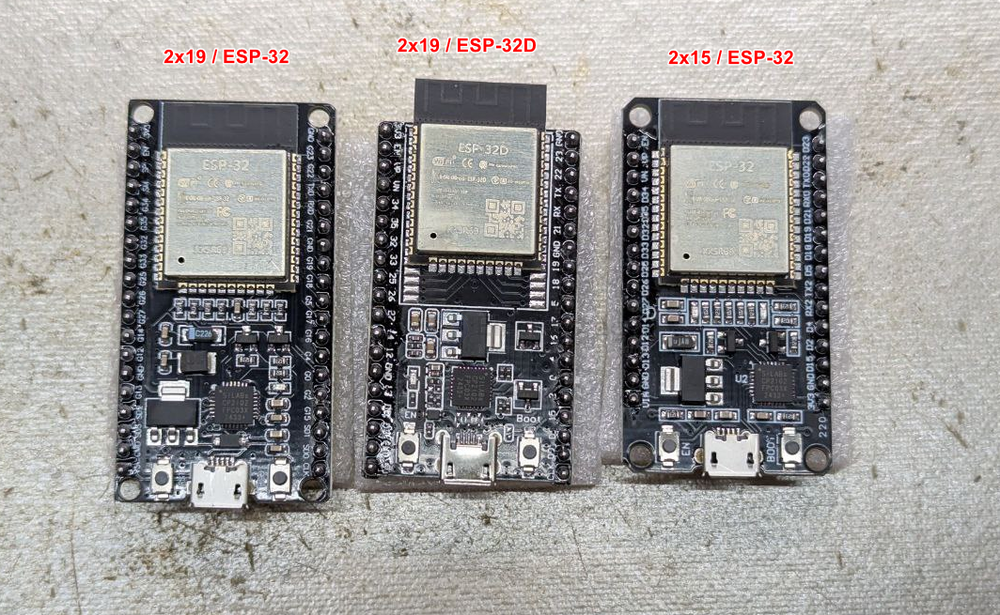

# ESP32-module-clone-dat

- XXSR69



- middle == ESP32-D0WD-V3 (revision v3.1)

- right == ESP32-D0WD-V3 (revision v3.1)

```
Connected to ESP32 on COM31:
Chip type:          ESP32-D0WD-V3 (revision v3.1)
Features:           Wi-Fi, BT, Dual Core + LP Core, 240MHz, Vref calibration in eFuse, Coding Scheme None   
Crystal frequency:  40MHz
MAC:                20:e7:c8:9f:30:3c

Stub flasher running.

Warning: ESP32 has no chip ID. Reading MAC address instead.
MAC:                20:e7:c8:9f:30:3c

Hard resetting via RTS pin...
```

- left == unreadable == 
```
Connected to ESP32 on COM31:

A fatal error occurred: Invalid head of packet (0x65): Possible serial noise or corruption.
```
- [[esptool-dat]]

- [[ESP32-chip-dat]]