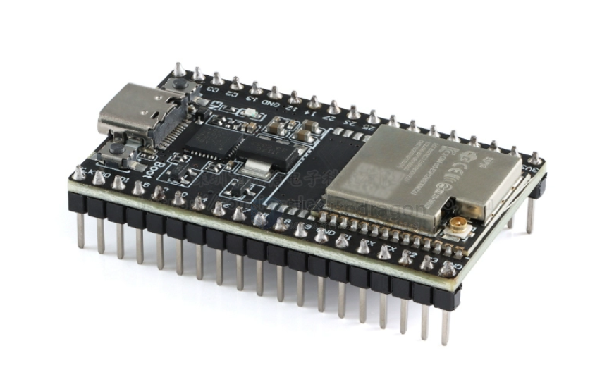
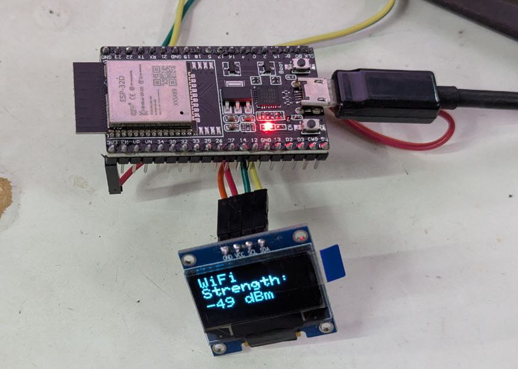
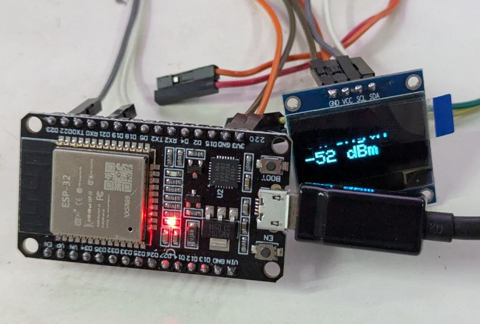
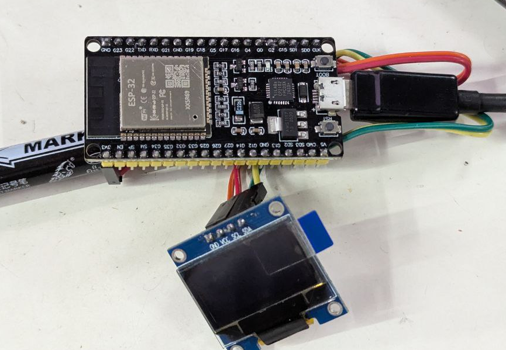
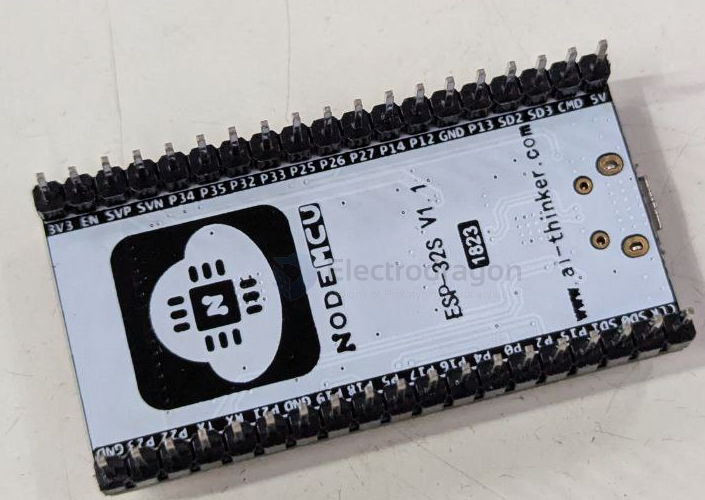
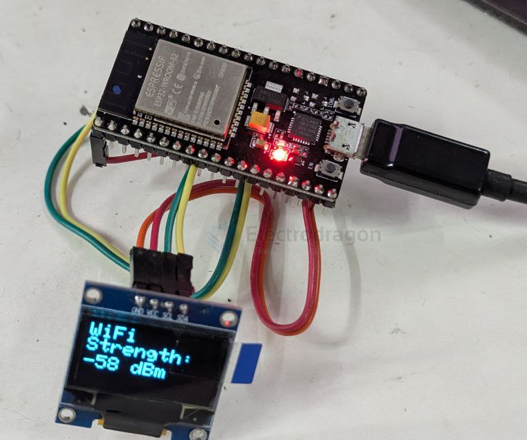
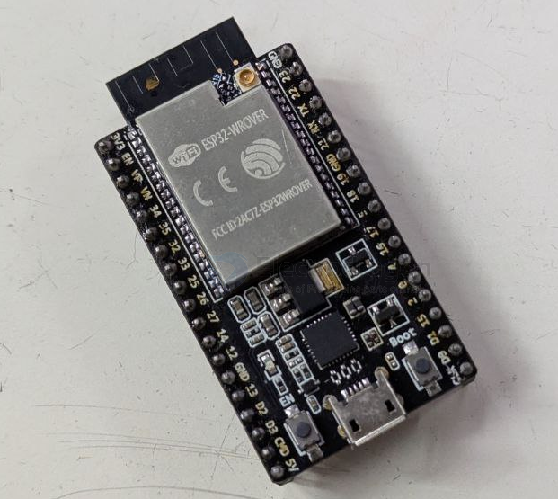
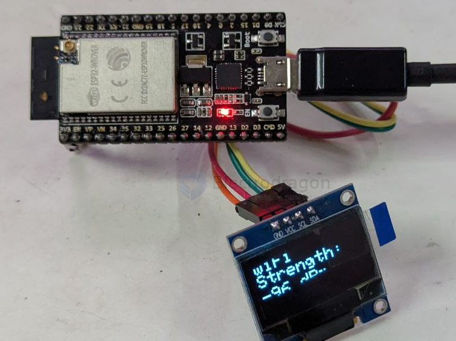
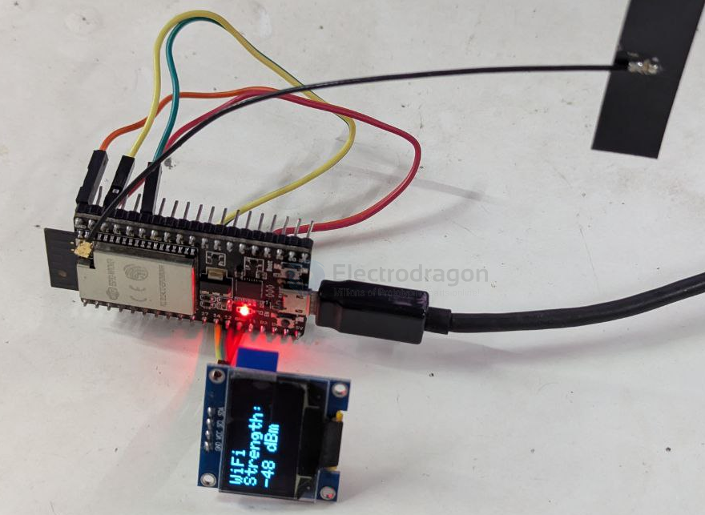
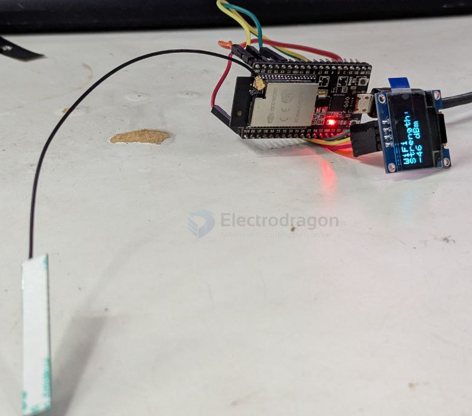

# ESP32-module-clone-dat

all RSSI test run in 3 meters wifi connection distance, same environment.


## stock board 

test code [[I2C-dat]] is not running properly for [[ESP32-S3-dat]]

- [[NWI1249-dat]] - [[NWI1243-dat]]


## XXSR series External antenna U version RSSI test



## XXSR69 series RSSI test


### middle == ESP32-D0WD-V3 (revision v3.1)



- 49 Dbm

### right == ESP32-D0WD-V3 (revision v3.1)

```
Connected to ESP32 on COM31:
Chip type:          ESP32-D0WD-V3 (revision v3.1)
Features:           Wi-Fi, BT, Dual Core + LP Core, 240MHz, Vref calibration in eFuse, Coding Scheme None   
Crystal frequency:  40MHz
MAC:                20:e7:c8:9f:30:3c

Stub flasher running.

Warning: ESP32 has no chip ID. Reading MAC address instead.
MAC:                20:e7:c8:9f:30:3c

Hard resetting via RTS pin...
```



- 52 ~ 53 Dbm

### left == unreadable == defective unit == can not upload code 

```
Connected to ESP32 on COM31:

A fatal error occurred: Invalid head of packet (0x65): Possible serial noise or corruption.
```




### close look 


## other more old versions 

X1 




- 58 Dbm 




X2 





- 93 ~ 96 Dbm 

add external antenna 



- 48 ~ 53 Dbm 



- 44 - 50 Dbm


## ref 


- test code [[arduino-dat]]

- [[NWI1100-dat]] - [[esp32-modules-dat]]

- [[signal-dat]] - [[RSSI-dat]]

- [[oled-dat]]


- [[esptool-dat]]

- [[ESP32-chip-dat]]

