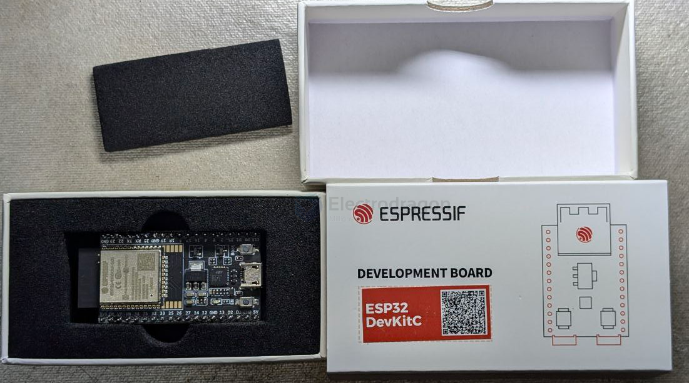

# ESP32-modules-dat.md

- [[ESP32-dat]] - [[ESP32-modules-dat]] - [[ESP32-WROOM-dat]]

## modules

- [[ESP32-WROOM-dat]] - [[ESP32-WROVER-dat]] - [[ESP32-module-clone-dat]]

Models selector 选型工具 
- https://products.espressif.com/#/product-selector?language=zh&names=
- https://products.espressif.com/#/product-selector?language=en

- [[ESP32-C3-dat]] - [[ESP32-S3-dat]]

## specs

- N4(4M Flash)
- N8(8M Flash)
- N16(16M Flash)

## pins Template

- [[ESP32-WROOM-dat]] - [[ESP32-WROOM-32E-dat]]

- [[ESP32-wrover-dat]] - [[ESP32-WROVER-32E-dat]]

## other 

- [[AIT-ESP32-modules-dat]]

## genius modules packaging 

## ref 

- [[ESP32-modules]] - [[ESP32]]

- [[espressif-dat]]