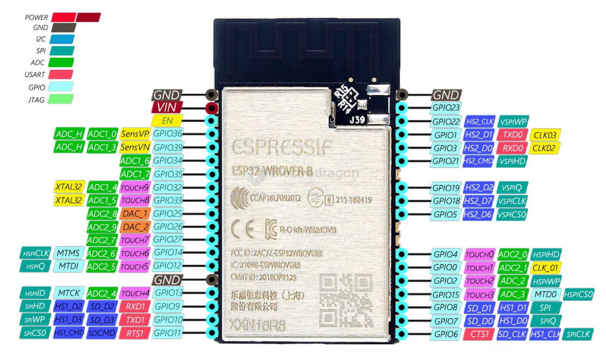

# ESP32-WROVER-DAT

https://www.electrodragon.com/product/esp32-wrover-v4-module-based-esp32/

- development board - [[NWI1100-dat]] by swaping the module

## sale version 

IPEX-ANT
[[NWI1137-dat]] - Default RVI: ESP-WROVER-I, IPEX-ANT, 4MB
[[NWI1192-dat]] - RVI: ESP-WROVER-I, IPEX-ANT, 8MB - [[Board-stock-out]]
[[NWI1193-dat]] - RVI: ESP-WROVER-I, IPEX-ANT, 16MB

PCB-ANT
[[NWI1136-dat]] - Default RVB: ESP-WROVER, PCB-ANT, 4MB 
[[NWI1190-dat]] - RVB: ESP-WROVER, PCB-ANT, 8MB
[[NWI1191-dat]] - RVB: ESP-WROVER, PCB-ANT, 16MB

## Pin map 

19x19 

## Chip Version 

About ESP32 chips and modules Espressif company's recommendation description

| Module         | model built-in ESP32 chip model | built-in sram | built-in rom | Espressif recommended status        |
| -------------- | ------------------------------- | ------------- | ------------ | ----------------------------------- |
| ESP32-WROVER-B | ESP32-D0WD                      | 512K          | 448K         | Not recommended for new designs     |
| ESP32-WR0VER-E | ESP32-D0WD-V3                   | 512K          | 448K         | Recommended for new designs in 2024 |

| Board Link      | Description               |          | Memory | Notes               |
| :-------------- | :------------------------ | -------- | ------ | :------------------ |
| [[NWI1137-dat]] | Default RVI: ESP-WROVER-I | IPEX-ANT | 4MB    |                     |
| [[NWI1192-dat]] | RVI: ESP-WROVER-I         | IPEX-ANT | 8MB    | [[Board-stock-out]] |
| [[NWI1193-dat]] | RVI: ESP-WROVER-I         | IPEX-ANT | 16MB   |                     |
| [[NWI1136-dat]] | Default RVB: ESP-WROVER   | PCB-ANT  | 4MB    |                     |
| [[NWI1190-dat]] | RVB: ESP-WROVER           | PCB-ANT  | 8MB    |                     |
| [[NWI1191-dat]] | RVB: ESP-WROVER           | PCB-ANT  | 16MB   |                     |

## new version 

ESP32-WROVER-E 和 ESP32-WROVER-IE 是两款通用型 Wi-Fi+BT+BLE MCU 模组，功能强大，用途广泛，可以用于低功耗传感器网络和要求极高的任务，例如语音编码、音频流和 MP3 解码等。ESP32-WROVER-E 采用 PCB 板载天线，ESP32-WROVER-IE 采用 IPEX 天线。两款模组均配置了 4 MB (还有 8 MB, 16 MB两种规格) SPI flash和 8 MB SPI PSRAM。

ESP32-WROVER-E 和 ESP32-WROVER-IE 采用的芯片是 ESP32 系列的 ESP32-D0WD-V3。具有可扩展、自适应的特点。两个 CPU 核可以被单独控制。时钟频率的调节范围为 80 MHz 到 240 MHz。模组集成了传统蓝牙、低功耗蓝牙和 Wi-Fi，组具有行业领先的技术规格，在高集成度、无线传输距离、功耗以及网络联通等方面性能佳。

