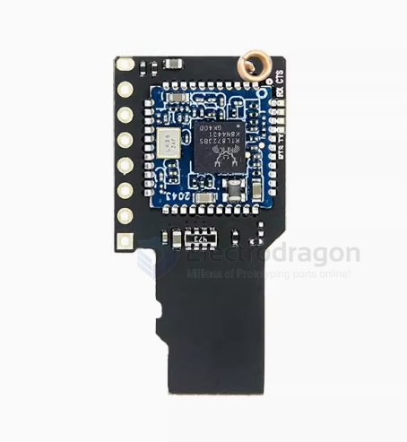
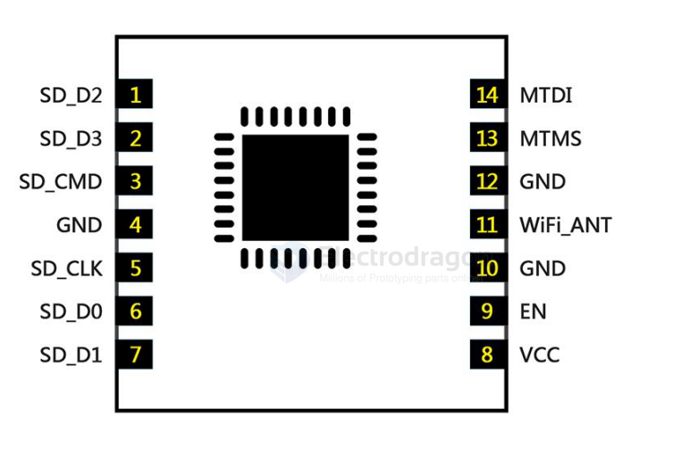
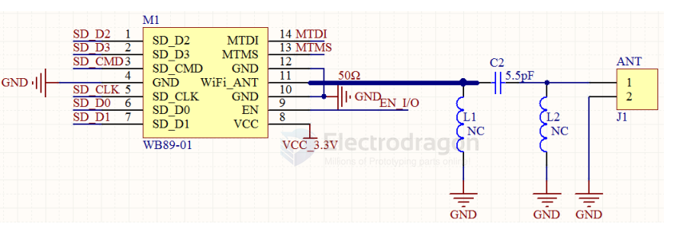

# ESP8089 Module Data Sheet

The ESP8089 module supports standard IEEE802.11 b/g/n protocols and a complete TCP/IP protocol stack. Hardware-wise, developers only need to communicate with an external MCU via the SPI/SDIO interface or the CPU AHB bridge interface.

The module supports energy-saving VoLP for fast switching between sleep/wake modes, adaptive wireless bias for low-power operation, front-end signal processing, fault isolation, and wireless coexistence features to eliminate interference from cellular/Bluetooth/802.11. It is widely used in home automation, security, smart appliances, wearables and remote controls, drones, OTT boxes, and industrial IoT.

---

## Features

- Supports standard IEEE802.11 b/g/n protocols
- Supports Wi-Fi Direct (P2P), Miracast, SoftAP
- Built-in TCP/IP protocol stack
- Integrated TR switch, balun, LNA, power amplifier, and network matching
- Integrated PLL, voltage regulator, and power management components
- Up to +19dBm output power in 802.11b mode
- Leakage current less than 10uA
- Supports SDIO 2.0 and SPI interfaces
- STBC, 1x1 MIMO, 2x1 MIMO
- Frame aggregation with A-MPDU, A-MSDU, and 0.4us guard interval
- Wake, connect, and transmit packets within 22ms
- Standby power consumption less than 1.0mW (DTIM3)

---

## Board Features

### PCB Specifications

- Layers: 4
- Dimensions: 13.5 × 13 × 1.8 mm
- Interface: Standard 1.5mm half-hole stamp pins, for direct PCB mounting
- Material: RF-specialized, high dielectric constant, low-loss substrate

### Module Functional Characteristics

- Operating Voltage: 2.5V—3.6V
- Operating Temperature: -20℃ to 85℃
- Wi-Fi Version: 802.11 b/g/n
- Antenna: Stamp hole antenna interface
- Transmit Power: Up to +19dBm in 802.11b mode
- Communication Interface: SDIO
  - 4-bit 25MHz SDIO v1.1
  - 4-bit 50MHz SDIO v2.0

---

## Module Pinout

| Pin | Name      | Description                                              |
|-----|-----------|----------------------------------------------------------|
| 1   | SD_D2     | SDIO_DATA_2                                              |
| 2   | SD_D3     | SDIO_DATA_3                                              |
| 3   | SD_CMD    | SDIO_CMD                                                 |
| 4   | GND       | Ground (must be connected to external controller GND)    |
| 5   | SD_CLK    | SDIO_CLK                                                 |
| 6   | SD_D0     | SDIO_DATA_0                                              |
| 7   | SD_D1     | SDIO_DATA_1                                              |
| 8   | VCC       | Power supply DC: 2.5V—3.6V (recommend 3.3V, ≥500mA)      |
| 9   | EN        | Enable pin, active high (default pulled up), can be MCU controlled |
| 10  | GND       | Ground                                                   |
| 11  | Wi-Fi_ANT | Antenna pin, for external antenna                        |
| 12  | GND       | Ground                                                   |
| 13  | MTMS      | General-purpose GPIO                                     |
| 15  | MTDI      | General-purpose GPIO                                     |

---

## PCB Layout Guidelines

1. Pin 11 (WiFi_ANT) output impedance is 50Ω. No matching required for the module, but it is recommended to reserve a π-type matching network for antenna tuning.
2. Pin 9 (EN) is active high. Refer to the recommended circuit, or control via MCU I/O.
3. Keep SDIO traces as short as possible.
4. Avoid routing traces under the Wi-Fi module on the main board, and keep away from sensitive components (crystals, cameras, etc.).
5. After soldering the module, perform antenna matching and RF performance testing.

---

## Reference

- [[ESP8089-Verification-Report.pdf]]