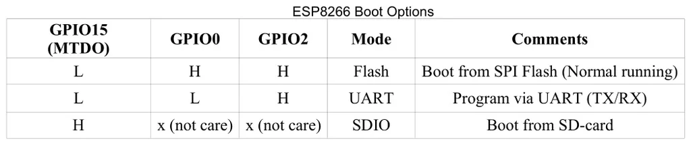

# ESP8266 

find modules here - [[esp8266-modules-dat]]

## chip info 

- DS [[0a-esp8266ex_datasheet_en.pdf]]

### common pins 

| pin   | name   | GPIO | function | Note    | note                                  |
| ----- | ------ | ---- | -------- | ------- | ------------------------------------- |
| 25    | U0_RXD | 3    | IO3      |         | I/O UART Rx during flash programming  |
| 26    | U0_TXD | 1    | IO1      | SPI_CS1 | I/O UART TX during flash programming; |
| 14    | IO2    | 2    | U1_TXD   |         | Flash debug output                    |
| 13    | MTDO   | 15   | U0_RTS   | HSPI_CS |                                       |
| 18~23 | SDIO   |

### bootstrap

| pin    | default boot         | Against Mode        | [[ESP-12F-dat]] | [[ESP-12S-dat]] | func              |
| ------ | -------------------- | ------------------- | --------------- | --------------- | ----------------- |
| RESET  | pull up + cap 0.1 UF | Reboot              | ext.            | int.            |                   |
| EN     | pull up              | Reboot              | ext.            | int.            |                   |
| IO0    | pull up              | Flash Mode          | ext.            | int.            | Boot mode control |
| IO2    | pull up              |                     | pull-up w/LED   | pull-up w/LED   | on-module LED     |
| GPIO15 | pull down            | Fail into SDIO Mode | ext.            | int.            | MTDO              |

- reference from chip datasheet section "Pin Definitions" Note part

## programmer and programming 

- [[DPR1150-dat]] - [[NWI1070-dat]] for ESP-01/01S 

- Batch Brogramming for ESP8266 modules, use [[OPM1095-dat]] and [[DPR1120-dat]] - https://t.me/electrodragon3/331

## ref 

- design guidelines - [[esp8266_hardware_design_guidelines_en.pdf]]

- Module datasheet please see here: https://github.com/Edragon/ESP8266-HDK/tree/master/MOD

## Modules and Boards 

- [[NWI1086-dat]] - [[NWI1077-dat]] - [[NWI1059-dat]] - [[NWI1075-dat]]

- [[ESP-12F-dat]] - [[ESP-12S-dat]] - [[ESP-01-dat]] - [[ESP-01S-dat]]

- [[ESP8266-dat]] - [[ESP32-dat]] - [[ESP-dat]]

- [[ESP8266]]

