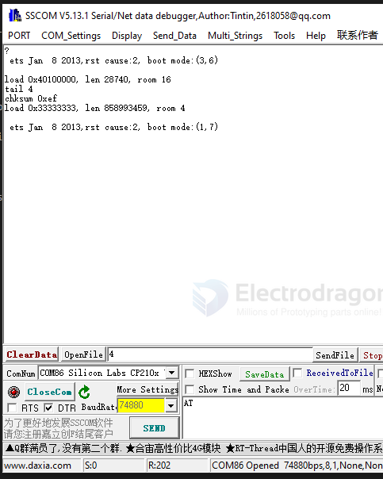

# ESP8266-HDK-dat.md

## chip info 

- DS [[0a-esp8266ex_datasheet_en.pdf]]

## common pins 

| pin   | name   | GPIO | function | Note    | note                                  |
| ----- | ------ | ---- | -------- | ------- | ------------------------------------- |
| 25    | U0_RXD | 3    | IO3      |         | I/O UART Rx during flash programming  |
| 26    | U0_TXD | 1    | IO1      | SPI_CS1 | I/O UART TX during flash programming; |
| 14    | IO2    | 2    | U1_TXD   |         | Flash debug output                    |
| 13    | MTDO   | 15   | U0_RTS   | HSPI_CS |                                       |
| 18~23 | SDIO   |      |          |         |                                       |

## bootstrap

| pin    | default boot         | Against Mode        | [[ESP-12F-dat]] | [[ESP-12S-dat]] | func              |
| ------ | -------------------- | ------------------- | --------------- | --------------- | ----------------- |
| RESET  | pull up + cap 0.1 UF | Reboot              | ext.            | int.            |                   |
| EN     | pull up              | Reboot              | ext.            | int.            |                   |
| IO0    | pull up              | Flash Mode          | ext.            | int.            | Boot mode control |
| IO2    | pull up              |                     | pull-up w/LED   | pull-up w/LED   | on-module LED     |
| GPIO15 | pull down            | Fail into SDIO Mode | ext.            | int.            | MTDO              |

- reference from chip datasheet section "Pin Definitions" Note part

Baud rate 74880 is what the ESP8266 bootloader uses. The apps on top of the Espressif SDK (e.g. Arduino sketch) talk at 115200 if not specified otherwise.

the normal reset boot 

    ets Jan  8 2013,rst cause:2, boot mode:(3,6)

    load 0x40100000, len 28740, room 16 
    tail 4
    chksum 0xef
    load 0x33333333, len 858993459, room 4 

the prog mode boot 

    ets Jan  8 2013,rst cause:2, boot mode:(1,7)

## ADC

(4. Peripheral Interface)

Hardware Design - The input voltage range is 0 to 1.0 V when **TOUT** is connected to external circuit.

## Schematic 

The ESP8266EX schematics include seven aspects: 

• Power supply 
• Power-on sequence and reset 
• Flash 
• Crystal oscillator 
• RF 
• External resistor 
• UART

## peripherals 

- [[serial-dat]] - [[LDO-dat]]

## ref 

- design guidelines - [[esp8266_hardware_design_guidelines_en.pdf]]

- [[ESP8266-dat]]