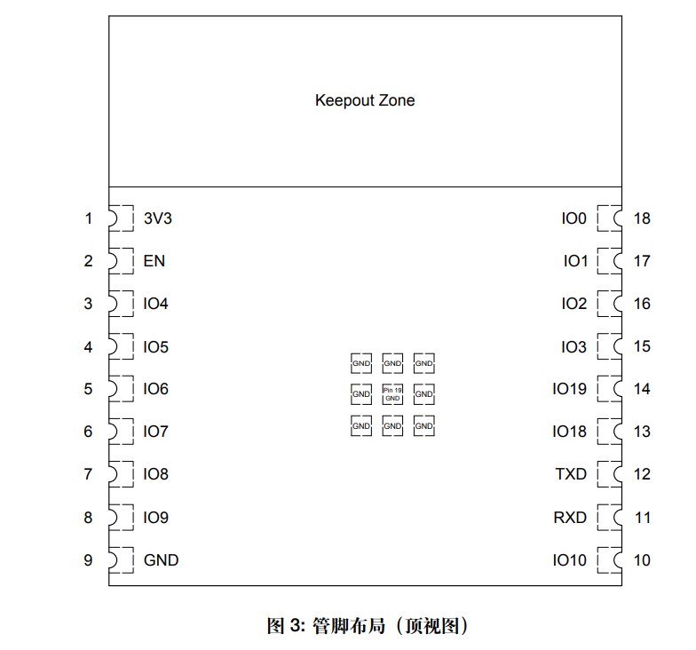

# ESP32-C3-WROOM-02 dat

## Versions

- ESP32-C3-WROOM-02-H4 - 105C
- ESP32-C3-WROOM-02-N4 - normal temp.
- ESP32-C3-WROOM-02U-H4
- ESP32-C3-WROOM-02U-N4 - ipex antenna 

## Dimensions 

## Pin Definitions 

## datasheet 
https://www.espressif.com.cn/sites/default/files/documentation/esp32-c3-wroom-02_datasheet_cn.pdf

## peripheral design 

page 24. 

## Flash 

- [[flash-download-tool]] - [[arduino-esp32-dat]]

https://docs.espressif.com/projects/esp-idf/en/stable/esp32c3/get-started/establish-serial-connection.html#:~:text=Flash%20Using%20USB&text=The%20USB%20on%20the%20ESP32,D%2B%20and%20GPIO18%20for%20D%2D.&text=The%20ESP32%2DC3%20supports%20only,press%20the%20RESET%20button%20once.

## ref 

- [[ESP32-C3]] - [[ESP-SDK-dat]] - [[ESP32-dat]]

