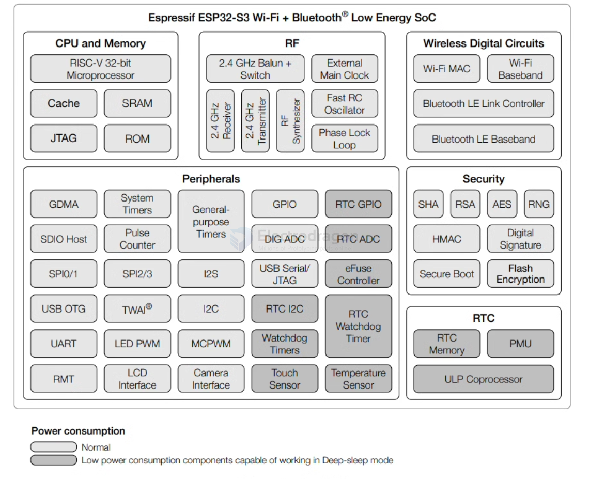

# ESP32-S3-dat 

## function map 

## module 

- [[ESP32-S3-WROOM-1-dat]]

## dev board 

- [[NWI1243-dat]]

###  official ESP32-S3-DevKitM-1

- pin = 2x22 = 44 pins 
- available GPIOs = 44 - 5 = 39 pins 

## ref 

- [[ESP32-S3]]