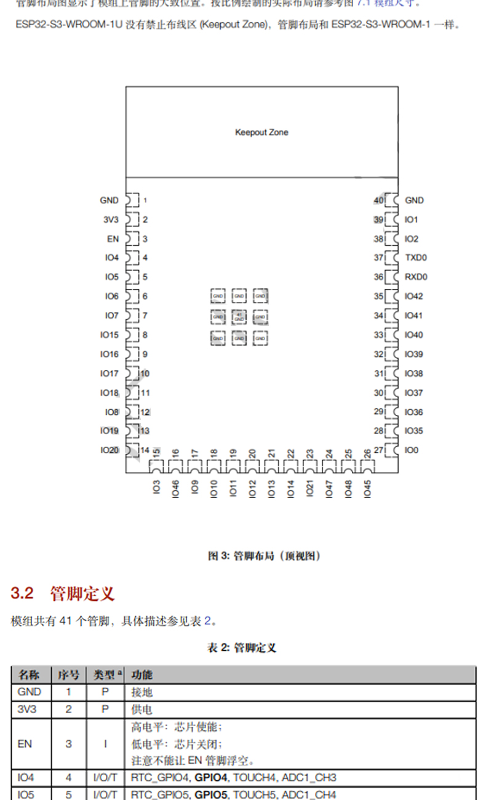

# ESP32-S3-dat 

## module 

### ESP32-S3-WROOM-1

- ESP32-S3-WROOM-1

- ESP32-S3-WROOM-1 D2N8
- ESP32-S3-WROOM-1 D2N8 R2
- ESP32-S3-WROOM-1 D2N8 R8

https://www.espressif.com.cn/sites/default/files/documentation/esp32-s3-wroom-1_wroom-1u_datasheet_en.pdf

total pins 40

## dev board 

###  ESP32-S3-DevKitM-1

- pin = 2x22 = 44 pins 
- available GPIOs = 44 - 5 = 39 pins 

## ref 

- [[ESP32-S3]]