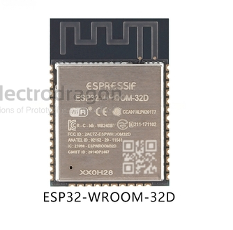
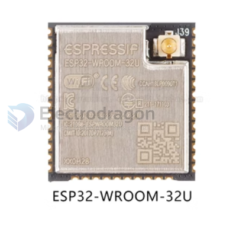
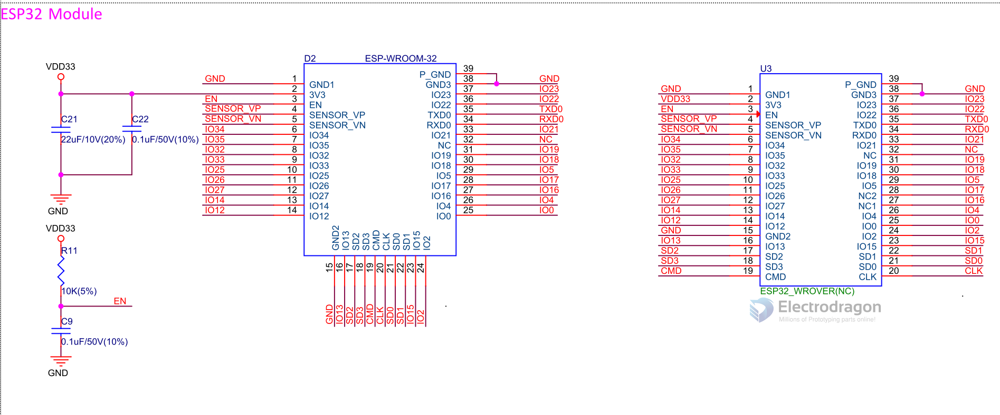
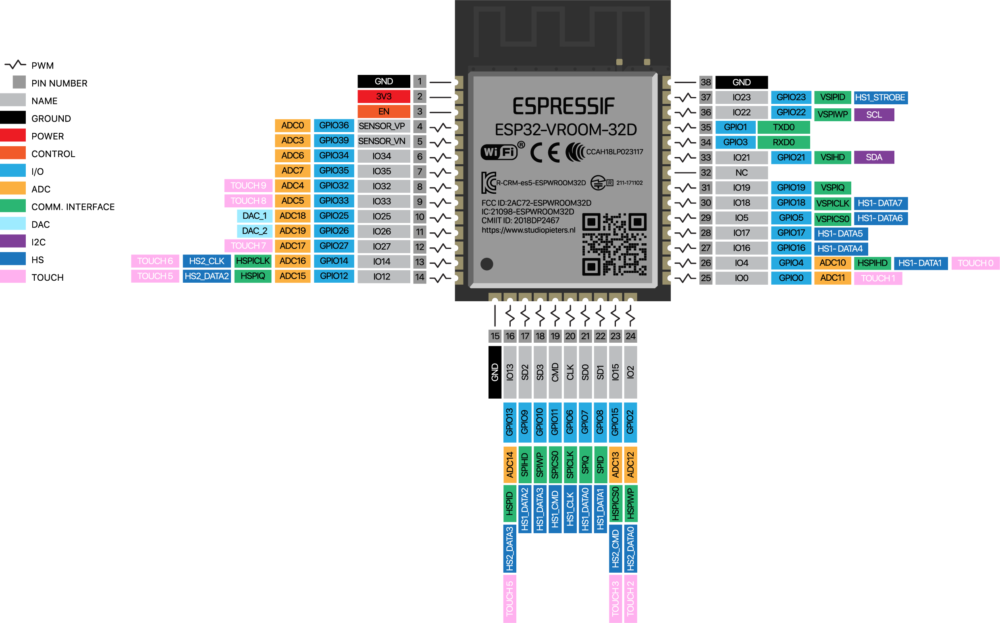
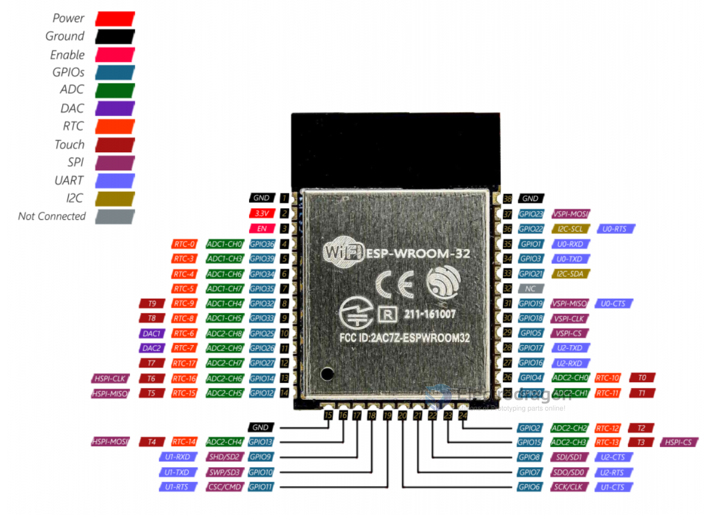
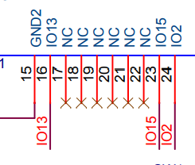

# ESP32-WROOM-DAT

https://www.electrodragon.com/product/wroom-32/

## Version compare 32E / 32D / 32U

### 32D 

### 32E 
The ESP32-WROOM-32E and ESP32-WROOM-32D are both modules based on the ESP32 system-on-a-chip (SoC) by Espressif Systems. They are very similar in terms of features and capabilities but have a few key differences.

The main difference between the ESP32-WROOM-32E and ESP32-WROOM-32D lies in their RF (Radio Frequency) performance.

The ESP32-WROOM-32E offers improved RF performance compared to the ESP32-WROOM-32D. It provides better sensitivity, range, and signal stability, making it suitable for applications requiring reliable wireless communication.

If you are looking for more detailed technical specifications and information about the ESP32-WROOM-32E and ESP32-WROOM-32D, you can refer to the official Espressif documentation:
https://www.espressif.com/en/support/documents/technical-documents

The E is the latest WROOM version, using the new V3 silicon. It is a direct upgrade to the 32D that fixes some bugs.

If you're buying new, get the 32E and consider the 32D obsolete. If you're already using 32D, it's going to be functionally identical in every way that likely matters to you so don't worry about it. (ie. It's not worth 'upgrading' to the E unless there is a specific issue you're facing.) See this guide for more info: https://www.espressif.com/sites/default/files/documentation/ESP32_ECO_V3_User_Guide__EN.pdf

### 32U 
ESP32-WROOM-32U is different from ESP32-WROOM-32D in that ESP32-WROOM-32U integrates a connector to connect an external antenna. 

## Module List 

| version             | Flash        | Suffix | SKU             | Antenna  | Note |
| ------------------- | ------------ | ------ | --------------- | -------- | ---- |
| ESP32-WROOM-32      | 4MB = 32Mb   | --     | [[NWI1110-dat]] | PCB      | end  |
| ESP32-WROOM-32D-N4  | 4MB = 32Mb   | N4     | [[NWI1155-dat]] | PCB      |      |
| ESP32-WROOM-32D-N8  | 8MB = 64Mb   | N8     | [[NWI1194-dat]] | PCB      |      |
| ESP32-WROOM-32D-N16 | 16MB = 128Mb | N16    | [[NWI1195-dat]] | PCB      |      |
| ESP32-WROOM-32U-N4  | 4MB = 32Mb   | N4     | [[NWI1157-dat]] | [[Ipex]] |      |
| ESP32-WROOM-32U-N8  | 8MB = 64Mb   | N8     | [[NWI1196-dat]] | [[Ipex]] |      |
| ESP32-WROOM-32U-N16 | 16MB = 128Mb | N16    | [[NWI1197-DAT]] | [[Ipex]] |      |

- ESP-WROOM-32D/U are compatible with former ESP-WROOM-32, pin-to-pin compatible.

## Functions 

Module interfaces
- SD card, UART, SPI, SDIO, I2C, LED PWM, Motor PWM,
- I2S, IR, pulse counter, GPIO, capacitive touch sensor, ADC,
- DAC, Two-Wire Automotive Interface (TWAI®), compatible
- with ISO11898-1 (CAN Specification 2.0)
- Integrated crystal 40 MHz crystal
- Integrated SPI flash 4 MB

## SCH

## Pin Definitions 

ESP32-WROOM-32D

ESP32-WROOM-32

## Legacy Wiki Pages 

- https://w.electrodragon.com/w/Category:ESP32

- [[ESP32-DAT]]

## Datasheet 

- [ESP32-WROOM-32E-DAT EN new1](https://www.espressif.com.cn/sites/default/files/documentation/esp32-wroom-32e_esp32-wroom-32ue_datasheet_en.pdf)

obseleted 
- [ESP32-WROOM-32-DAT EN](https://www.espressif.com.cn/sites/default/files/documentation/esp32-wroom-32_datasheet_en.pdf)

- [ESP32-WROOM-32E-DAT EN](https://www.espressif.com/sites/default/files/documentation/esp32-wroom-32e_esp32-wroom-32ue_datasheet_en.pdf)

- [ESP32-WROOM-32D-DAT CN](https://www.espressif.com/sites/default/files/documentation/esp32-wroom-32d_esp32-wroom-32u_datasheet_cn.pdf)
- 
6 Peripheral Schematics

### updates 

## ref 

- [[esp-dat]]
- [[ESP8266-dat]]

forum - http://esp32.net/

