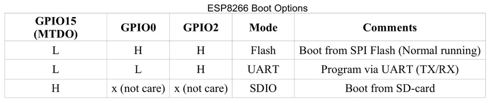

# ESP8266 

### common pins 

| pin    | setup | func                                  | Note    |
| ------ | ----- | ------------------------------------- | ------- |
| U0_RXD | GPIO3 | I/O UART Rx during flash programming  |         |
| U0_TXD | GPIO1 | I/O UART TX during flash programming; | SPI_CS1 |

serial1 = 

### bootstrap

| pin    | setup                | func          |
| ------ | -------------------- | ------------- |
| RESET  | pull up + cap 0.1 UF |               |
| EN     | pull up              |               |
| IO0    | pull up              |               |
| IO2    | pull up              | on-module LED |
| GPIO15 | pull down            |               |

## Modules 
- [[ESP-01-DAT]] - [[ESP-07S-DAT]] - [[ESP-12F-DAT]] - [[ESP-12S-DAT]]

## ref 
- [[ESP8266]]