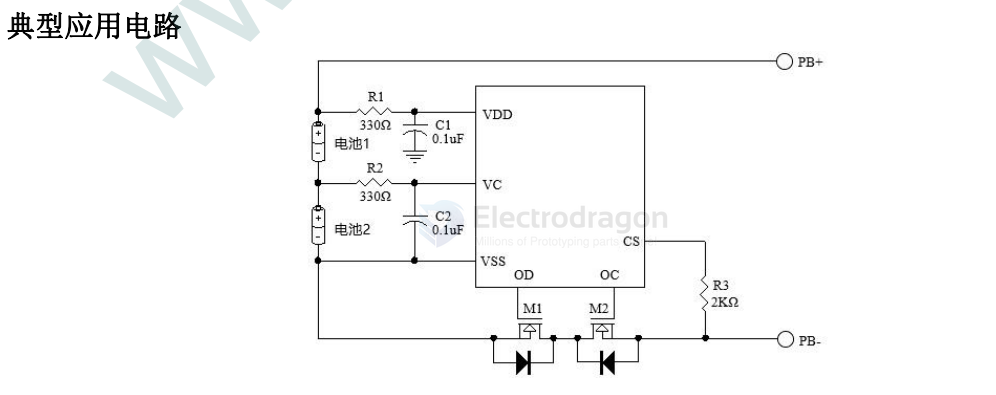
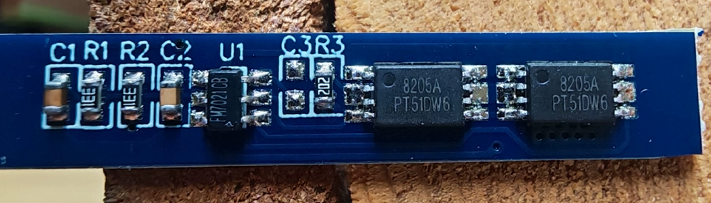

# FM-dat.md

== fine made 

- 锂电池电压平衡控制IC
- 高精度单节保护系列
- 普通单节保护系列
- 单节保护二合一系列
- 双节&多节保护系列

## Multiple-series protector (translated table)

| Model           | Package  | Overcharge Protect V (V) | Overcharge Recover V (V) | Overdischarge Protect V (V) | Overdischarge Recover V (V) | Discharge OCP Detect (mV) | Charge OCP Detect (mV) | Short-circuit Detect V (V) | Other features                           |  Cell count |
| --------------- | -------- | -----------------------: | -----------------------: | --------------------------: | --------------------------: | ------------------------: | ---------------------: | -------------------------: | ---------------------------------------- | ----------: |
| TC2120-CB       | SOT23-6  |              4.28 ±0.025 |               4.08 ±0.05 |                  2.90 ±0.08 |                  3.00 ±0.10 |                   200 ±30 |               -210 ±30 |                   1.0 ±0.4 | 0V charge / sleep function               |     2 cells |
| TC2120-DB       | SOT23-6  |              4.28 ±0.025 |               4.08 ±0.05 |                  2.25 ±0.08 |                  2.95 ±0.10 |                   200 ±30 |               -210 ±30 |                   1.0 ±0.4 | 0V charge / sleep function               |     2 cells |
| TC2120-HB       | SOT23-6  |              4.40 ±0.025 |               4.18 ±0.05 |                  3.00 ±0.08 |                  3.10 ±0.10 |                   200 ±30 |               -210 ±30 |                   1.0 ±0.4 | 0V charge / sleep function               |     2 cells |
| TC2120-LB       | SOT23-6  |             4.225 ±0.025 |               4.10 ±0.05 |                  2.50 ±0.08 |                  3.00 ±0.10 |                   200 ±30 |               -170 ±30 |                   1.0 ±0.4 | 0V charge / sleep function               |     2 cells |
| TC2120-FB       | SOT23-6  |              4.30 ±0.025 |               4.10 ±0.05 |                  2.90 ±0.08 |                  3.00 ±0.10 |                   200 ±30 |               -210 ±30 |                   1.0 ±0.4 | 0V charge / sleep function               |     2 cells |
| TC2120-NB       | SOT23-6  |              4.28 ±0.025 |               4.08 ±0.05 |                  2.80 ±0.08 |                  3.00 ±0.10 |                   200 ±30 |               -210 ±30 |                   1.0 ±0.4 | 0V charge / auto over‑discharge recovery |     2 cells |
| FM702A          | SOT23-6  |              4.35 ±0.025 |               4.15 ±0.05 |                  2.30 ±0.08 |                  3.00 ±0.10 |                   200 ±30 |               -150 ±30 |                   1.2 ±0.4 | 0V charge / auto over‑discharge recovery |         N/A |
| FM7021CB        | SOT23-6  |              4.28 ±0.025 |               4.08 ±0.05 |                  2.90 ±0.08 |                  3.00 ±0.10 |                   200 ±30 |               -170 ±50 |                   1.0 ±0.4 | 0V charge / auto over‑discharge recovery |         N/A |
| FM7021DB        | SOT23-6  |              4.28 ±0.025 |               4.08 ±0.05 |                  2.25 ±0.08 |                  2.95 ±0.10 |                   200 ±30 |               -170 ±50 |                   1.0 ±0.4 | 0V charge / auto over‑discharge recovery |         N/A |
| FM7021NB        | SOT23-6  |              4.28 ±0.025 |               4.08 ±0.05 |                  2.80 ±0.08 |                  3.00 ±0.10 |                   200 ±30 |               -170 ±50 |                   1.0 ±0.4 | 0V charge / auto over‑discharge recovery |         N/A |
| FM7021HB        | SOT23-6  |              4.40 ±0.025 |               4.18 ±0.05 |                  3.00 ±0.08 |                  3.10 ±0.10 |                   200 ±30 |               -170 ±50 |                   1.0 ±0.4 | 0V charge / auto over‑discharge recovery |         N/A |
| FM7021LB        | SOT23-6  |             4.225 ±0.025 |               4.10 ±0.05 |                  2.50 ±0.08 |                  3.00 ±0.10 |                   200 ±30 |               -170 ±50 |                   1.0 ±0.4 | 0V charge / auto over‑discharge recovery |         N/A |
| FM8254AAV       | TSSOP-16 |              4.25 ±0.025 |               4.15 ±0.08 |                  2.70 ±0.08 |                  3.00 ±0.10 |                   200 ±25 |                      / |                   1.1 ±0.3 | 0V charge / sleep function               |   3/4 cells |
| FM3450C         | SOP-8    |              4.25 ±0.025 |               4.10 ±0.08 |                  2.70 ±0.08 |                  3.00 ±0.10 |                   100 ±10 |                      / |                0.450 ±0.10 | None                                     |     3 cells |
| FM03CA          | SOP-8    |              4.25 ±0.025 |               4.10 ±0.08 |                  2.70 ±0.08 |                  3.00 ±0.10 |                   100 ±10 |                -50 ±15 |                0.450 ±0.10 | Sleep function                           |     3 cells |
| 3452D           | SOP-16   |              4.25 ±0.025 |               4.10 ±0.08 |                  2.70 ±0.08 |                  3.00 ±0.10 |                   100 ±15 |                -50 ±15 |                  0.8 ±0.16 | Sleep function                           |     3 cells |
| FM03S           | TSSOP-16 |              4.25 ±0.025 |               4.10 ±0.08 |                  2.70 ±0.08 |                  3.00 ±0.10 |                   100 ±15 |                -50 ±15 |                  0.8 ±0.16 | Sleep function                           |     3 cells |
| TC3451T (FM04S) | TSSOP-16 |              4.25 ±0.025 |               4.10 ±0.05 |                  2.80 ±0.08 |                  3.00 ±0.10 |                   100 ±15 |                -50 ±15 |                  0.8 ±0.16 | Sleep function                           |     4 cells |
| FM05S-16S       | TSSOP-16 |              4.25 ±0.025 |               4.16 ±0.05 |                  2.50 ±0.08 |                  2.90 ±0.10 |                   100 ±15 |                -50 ±15 |                  0.8 ±0.16 | Sleep function                           |     5 cells |
| FM05S-16        | SOP-16   |              4.25 ±0.025 |               4.16 ±0.05 |                  2.50 ±0.08 |                  2.90 ±0.10 |                   100 ±15 |                -50 ±15 |                  0.8 ±0.16 | Sleep function                           |     5 cells |
| FM3551          | TSSOP-20 |              4.25 ±0.025 |               4.10 ±0.05 |                  2.80 ±0.08 |                  3.00 ±0.10 |                   100 ±15 |                -50 ±15 |                  0.8 ±0.16 | Reduced sense resistor                   |   4/5 cells |
| FM3551R         | TSSOP-20 |              4.25 ±0.025 |               4.10 ±0.05 |                  2.80 ±0.08 |                  3.00 ±0.10 |                   100 ±15 |                -50 ±15 |                  0.4 ±0.10 | Cascadeable                              |   4/5 cells |
| FM3551-S14A     | SOP-14   |              4.25 ±0.025 |               4.10 ±0.05 |                  2.80 ±0.08 |                  3.00 ±0.10 |                   100 ±15 |                -50 ±15 |                  0.8 ±0.16 | Reduced sense resistor                   |     5 cells |
| FM3551-S16A     | SOP-16   |              4.25 ±0.025 |               4.10 ±0.05 |                  2.80 ±0.08 |                  3.00 ±0.10 |                   100 ±15 |                -50 ±15 |                  0.8 ±0.16 | Reduced sense resistor                   |     5 cells |
| FM3551-T14A     | TSSOP-14 |              4.25 ±0.025 |               4.10 ±0.05 |                  2.80 ±0.08 |                  3.00 ±0.10 |                   100 ±15 |                -50 ±15 |                  0.8 ±0.16 | Reduced sense resistor                   |     5 cells |
| FM3551-T16A     | TSSOP-16 |              4.25 ±0.025 |               4.10 ±0.05 |                  2.80 ±0.08 |                  3.00 ±0.10 |                   100 ±15 |                -50 ±15 |                  0.8 ±0.16 | Reduced sense resistor                   |     5 cells |
| FM05S           | TSSOP-20 |              4.25 ±0.025 |               4.10 ±0.05 |                  2.80 ±0.08 |                  3.00 ±0.10 |                   100 ±15 |                -50 ±15 |                  0.8 ±0.16 | Sleep function                           |   4/5 cells |
| FM05PF          | TSSOP-20 |              3.75 ±0.025 |               3.60 ±0.07 |                  2.20 ±0.08 |                  2.40 ±0.10 |                   100 ±15 |                -50 ±15 |                  0.4 ±0.10 | Sleep function                           |   4/5 cells |
| FM06S           | SSOP-24  |              4.25 ±0.025 |               4.10 ±0.05 |                  2.80 ±0.08 |                  3.00 ±0.10 |                   100 ±15 |                -50 ±15 |                  0.8 ±0.16 | Sleep function                           |     6 cells |
| FM07S           | SSOP-24  |              4.25 ±0.025 |               4.10 ±0.05 |                  2.80 ±0.08 |                  3.00 ±0.10 |                   100 ±15 |                -50 ±15 |                  0.8 ±0.16 | Sleep function                           |     7 cells |
| FM10S           | SSOP-24  |              4.25 ±0.025 |               4.10 ±0.05 |                  2.80 ±0.08 |                  3.00 ±0.10 |                   100 ±15 |                -50 ±15 |                  0.8 ±0.16 | Sleep function                           |    10 cells |
| FM15S           | QFN-48   |              4.25 ±0.025 |               4.10 ±0.05 |                  2.80 ±0.08 |                  3.00 ±0.10 |                   100 ±15 |                -50 ±15 |                  0.8 ±0.16 | Sleep function                           | 12–15 cells |
| FM15L           | QFN-48   |              3.85 ±0.025 |               3.75 ±0.05 |                  2.00 ±0.08 |                  2.50 ±0.10 |                   100 ±15 |                -50 ±15 |                  0.8 ±0.16 | Sleep function                           | 12–15 cells |
| FM20S           | QFN-64   |              4.25 ±0.025 |               4.10 ±0.05 |                  2.80 ±0.08 |                  3.00 ±0.10 |                   100 ±15 |                -50 ±15 |                  0.8 ±0.16 | Sleep function                           | 16–20 cells |
| FM3757          | TSSOP-16 |              4.25 ±0.015 |               4.15 ±0.05 |                  2.70 ±0.05 |                  3.00 ±0.08 |                     50 ±5 |                 -25 ±5 |                  0.2 ±0.04 | With balancing                           |     7 cells |
| FM3754          | TSSOP-16 |              4.25 ±0.015 |               4.15 ±0.05 |                  2.70 ±0.05 |                  3.00 ±0.08 |                     50 ±5 |                 -25 ±5 |                  0.2 ±0.04 | With balancing                           |     4 cells |
| FM3755          | TSSOP-16 |              4.25 ±0.015 |               4.15 ±0.05 |                  2.70 ±0.05 |                  3.00 ±0.08 |                     50 ±5 |                 -25 ±5 |                  0.2 ±0.04 | With balancing                           |     5 cells |
| FM3756          | TSSOP-16 |              4.25 ±0.015 |               4.15 ±0.05 |                  2.70 ±0.05 |                  3.00 ±0.08 |                     50 ±5 |                 -25 ±5 |                  0.2 ±0.04 | With balancing                           |     6 cells |
| FM3551R-S16A    | SOP-16   |              4.25 ±0.025 |               4.10 ±0.05 |                  2.80 ±0.08 |                  3.00 ±0.10 |                   100 ±15 |                -50 ±15 |                  0.4 ±0.10 | Cascadeable                              |   4/5 cells |
| FM6022          | SOP-10   |                    4.225 |                    4.025 |                       2.700 |                       3.000 |                     0.100 |                 -0.100 |                  0.4 ±0.10 | /                                        |     2 cells |
| FM03DB          | SOP-8    |                    4.250 |                    4.050 |                       2.700 |                       3.000 |                     0.100 |                 -0.065 |                      0.400 |                                          |     3 cells |
| FM8254B         | TSSOP-16 |              4.25 ±0.025 |               4.15 ±0.08 |                  2.70 ±0.08 |                    3.0 ±0.1 |                   200 ±25 |                      / |                   1.1 ±0.3 | 0V charge / sleep function               |   3/4 cells |
| TC2135          | SOP-10   |             4.225 ±0.025 |               4.10 ±0.05 |                 2.700 ±0.08 |                  3.00 ±0.10 |                    100 ±5 |                      / |                0.200 ±0.04 | /                                        |     5 cells |

## FM7021 

FM7021 是一款内置高精度电压检测电路和延时电路，适用于 2 节串联锂离子/锂聚合物可再充电电池的保护 IC。

此 IC 适合于对 2 节串联可再充电锂离子/锂聚合物电池的过充电、过放电、过电流、负载短路进行保护。

应用领域
-  2 节串联锂离子可再充电电池组
-  2 节串联锂聚合物可再充电电池组

real board 

## ref 

- [[battery-protector-dat]] - [[battery-protector]]