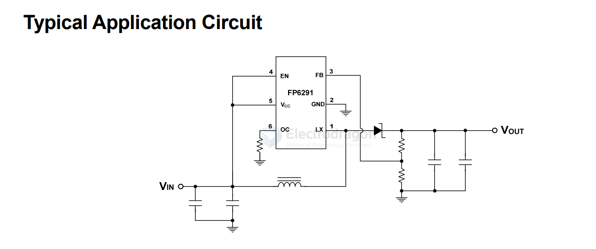
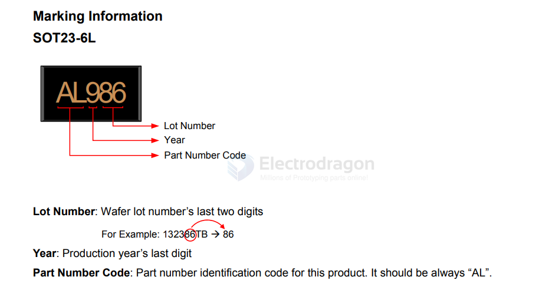
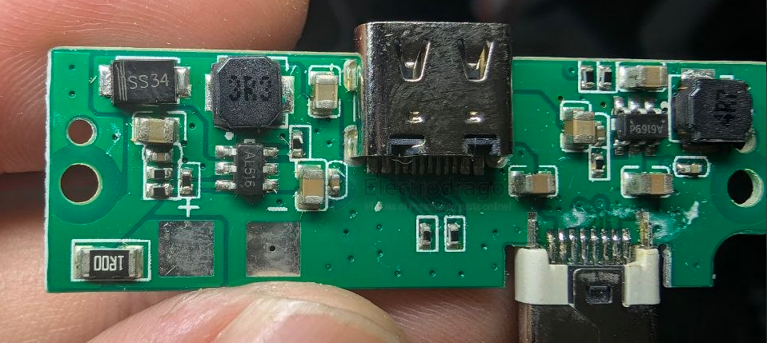
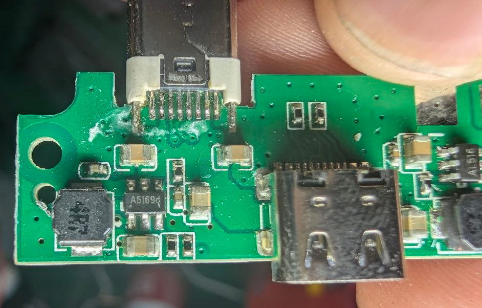
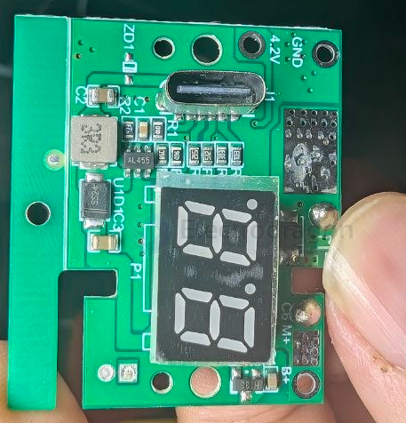
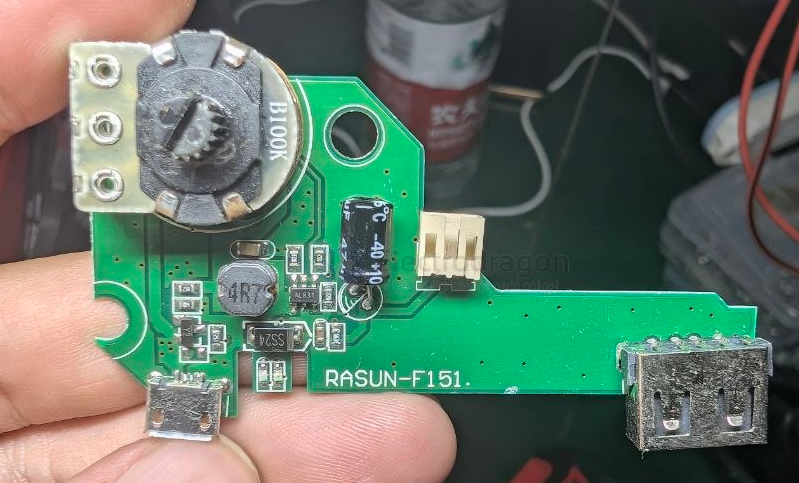

# FP6291-dat.md

- [[Feeling-Technology-dat]] - [[FP6291-dat]] - [[dcdc-boost-dat]]

## SCH 

## marking 

## build 

- [[CONN-USB-dat]] - [[SD8942-dat]] [[shouding-dat]] [[dcdc-down-dat]] - [[Feeling-Technology-dat]] - main [[FP6291-dat]] - [[dcdc-boost-dat]]

AL516 

AL455

- [[Feeling-Technology-dat]] - [[FP6291-dat]] - [[mosfet-power-dat]] - [[fuman-dat]]

AL831 

- [[Feeling-Technology-dat]] - [[FP6291-dat]]

## ref 

- [[FP6291-ds.pdf]]